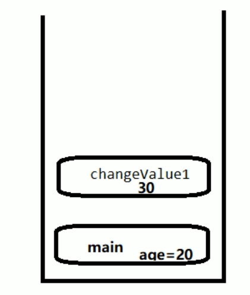

## java面试题
## 1、线程和进程

    .进程：是操作系统进行资源分配和调度的的基本概念，比如我们打开的这个idea。可以在资源管理器中看到这个进程的信息。
    .线程：线程也叫做轻量级进程，它是一个cpu执行单元，它是比进程更小的能独立运行的基本单元。一个进程可能包含1个
    或者多个进程。

## 2、并行和并发

    .并发：多个线程同时去争抢一个cpu资源，在多个任务之间进行切换，然后提高cpu的使用效率。
         多线程的存在不是为了提供程序的执行速度，而是为了提高应用程序的使用率。程序的执行其实都是在抢cpu的执行权。
         
    .并行：在多个处理器下，多个线程并行的执行任务。

## 3、谈谈对volatile的理解？

    volatile是Java提供的一种非常轻量级的同步机制：volatile有三比较重要的点，第一可以保证可见性、第二不能保证原子性、第三禁止指令的重排序。
    那么volatile的可见性是如何体现的呢？ 这个要从Java的内存模型来理解。说到java内存那么就要知道 处理器、高速缓存、主内存间的关系。
    在了解java虚拟机并发相关知识前，我们要先了解下物理计算机中的并发问题。

###  3.1、物理计算机中的并发问题

​    

    a.在物理计算机中要 让计算机并发的执行若干个任务来 充分的利用计算机资源，这看似很好，但是实际上它们没有想象的那么简单
    其中一个复杂性来源是绝大多数的运算任务都不可能只靠处理器"计算"就能完成，处理器至少要与内存交互，如读取运算数据、存储
    运算结果等，这个I/O操作是很难消除的(无法仅依靠寄存器来完成所有运算任务)。由于计算机的存储设备和处理器的运算速度有几个数量级的差距，
    所以现代计算机系统不得不加入一层读写速度尽可能接近处理器运算速度的高速缓存来作为内存与处理器之间的缓冲，
    将运算需要的数据复制到缓存中，让运算能快速进行，当运算结束后再从缓存同步回内存中，这样处理器就不用等待缓慢的内存读写了。
    
    b.不同的处理器都有自己的高速缓存，当多个处理的运算任务都涉及同一个主内存时，将导致各自的缓存数据不一致。
    那么在同步数据到主内存时以谁的缓存数据为准呢？为了解决缓存一致性问题，需要各个处理器都遵循缓存一致性协议，
    这些协议有MSI、MESI、MOSI、Synapse、FireFly、Dragon Protocol等。
    
    c.除了加入了高速缓存外，为了使得处理器内部的运算单元能尽量被充分利用，处理器可能会对输入代码进行乱序执行优化，
    处理器会在计算之后将乱序执行的结果重组，保证该结果与顺序执行的结果是一致的，但并不保证程序中各个语句计算的先后顺序与输入代码的顺序一致。

####   3.1.1、下图是：处理器、高速缓存、主内存间的关系。

  

####   3.1.2、缓存一致性，因为在计算机中的数据传输效率是 ：磁盘< 内存 < cache < 寄存器

    * 存储器的顶层是CPU的寄存器，它们用和CPU一样的材料制成，所有和CPU一样快。程序必须在软件中自行管理这些寄存器。
    CPU是寄存器的集合体。
  

####   3.1.3、 MESI

​    

     当CPU写数据时，如果发现操作的变量是共享变量，即在其它CPU中也存在该变量的副本，会发出信号通知其它CPU将该内存变量的缓存行设置为无效，因此当其它CPU读取这个变量的时，发现自己缓存该变量的缓存行是无效的，那么它就会从内存中重新读取。
####   3.1.4、 总线嗅探 

​    

     那么是如果发现数据是否失效呢？
     这里是用到了总线嗅探技术，就是每个处理器通过嗅探在总线上传播的数据来检查自己缓存值是否过期了，当处理器发现自己的缓存行对应的内存地址被修改，就会将当前处理器的缓存行设置为无效状态，当处理器对这个数据进行修改操作的时候，会重新从内存中把数据读取到处理器缓存中。

####   3.1.5、 总线风暴

​    

     总线嗅探技术有哪些缺点？
     由于Volatile的MESI缓存一致性协议，需要不断的从主内存嗅探和CAS循环，无效的交互会导致总线带宽达到峰值。
     因此不要大量使用volatile关键字，至于什么时候使用volatile、什么时候用锁以及Syschonized都是需要根据实际场景的。    

  


  简单了解了物理计算机中并发问后,我们现在来看看JMM。

### 3.2、JMM(java JAVA Memory models)

```
 JMM(JAVA内存模型JAVA Memory model)本身是一种抽象的概念并不真实存在，它描述的是一种规则或规范，通过这组规范定义了程序中各个变量的访问方式。
```
#### 3.2.1、JMM规定变量的操作：

​    

   * 所以的变量都存储在主内存中
   * 每个线程还有自己的工作内存，线程的工作内存中保存了被改线程使用的变量的主内存副本。
   * 线程对变量的所有操作都必须在工作内存中进行，而不能直接读写主内存中的数据。

    不同的线程之间也无法之间访问对方工作内存中的变量。线程间变量的传递均需要通过主内存来完成。
####  3.2.2、JMM同步的规定

​    

    1、线程解锁前，必须把共享变量的值刷新回主内存
    2、线程加锁前，必须读取主内存的最新值到自己的工作内存
    3、加锁解锁是同一把锁

####  3.2.3、线程之间的通信图

   
    

### 3.3、简单了解JMM之后，我们来看volatile的可见性

####   3.3.1、volatile是如何保证可见性的？ chapter1--VolatileDemo类

    通过JMM(java内存模式)来解决了可见性问题，因为所有的变量都存储在内存中共享，而线程不能对主内存数据进行读写操作，而是通过将主内存的变量拷贝一份到自己的工作内存中(共享变量的副本)，这样每一个线程都有这个变量的副本。
    如果一个线程都这个副本进行了修改，那么就将这个修改了的值刷新到主内存中去。并且通知其它线程来读取，这样变量修改之后的值其它线程也就知道了。从而使前一个操作的结果对后续操作是可见的。这样就保证了volatile的可见性

####   3.3.2、验证volatile可见性,首先不加入volatile关键字的情况

 ```java
package com.learn.interview.chapter1;

import java.util.concurrent.TimeUnit;

/**
 * Volatile Java虚拟机提供的轻量级同步机制
 *
 * 可见性（及时通知）
 * 不保证原子性
 * 禁止指令重排
 * @ClassName: VolatileDemo
 * @Description:
 * @Author: lin
 * @Date: 2020/9/7 15:06
 * History:
 * @<version> 1.0
 */
public class VolatileDemo {

    public static void main(String[] args) {
        MyData myData = new MyData();

        new Thread(()->{
            System.out.println(Thread.currentThread().getName() + "\t come in");

            // 线程睡眠3秒，假设在进行运算
            try {
                TimeUnit.SECONDS.sleep(3);
            } catch (InterruptedException e) {
                e.printStackTrace();
            }
            // 修改number的值
            myData.addTo60();

            // 输出修改后的值
            System.out.println(Thread.currentThread().getName() + "\t update number value:" + myData.number);

        }, "AAA").start();

        while(myData.number == 0) {
            // main线程就一直在这里等待循环，直到number的值不等于零
        }

        // 按道理这个值是不可能打印出来的，因为主线程运行的时候，number的值为0，所以一直在循环
        // 如果能输出这句话，说明AAA线程在睡眠3秒后，更新的number的值，重新写入到主内存，并被main线程感知到了
        System.out.println(Thread.currentThread().getName() + "\t mission is over");
   
        /**
         * 最后输出结果：
         * AAA	 come in
         * AAA	 update number value:60
         * 最后线程没有停止，并行没有输出  mission is over 这句话，
            说明没有用volatile修饰的变量，是没有可见性
         */

    }
}


class MyData {

    int number = 0;

    public void addTo60() {
        this.number = 60;
    }
}
 ```
 * 可以看到程序一直在执行，没有停止
     

  最后线程没有停止，并行没有输出 mission is over 这句话，说明没有用volatile修饰的变量，是没有可见性

  * 当修改MyData类，然后给变量加入volatile关键字修饰  

 ```java
class MyData {

  /**
   volatile 修饰的关键字，是为了增加 主线程和线程之间的可见性，
   只要有一个线程修改了内存中的值，其它线程也能马上感知
   */
   volatile int number = 0;

    public void addTo60() {
        this.number = 60;
    }
}
 ```
  加入volatile关键字之后，可以看到执行结果
   

  可以看到加入volatile关键字以后，程序能够正常运行完，并且打印出了main	 mission is over。这说明了在线程对变量修改之后，
  主线程可以看到这个变量修改后的值。

### 3.4、volatile 不保证原子性 ---chapter1-VolatileDemo2类

  在前面的JMM中有了解到，各个线程对变量的操作都是从主内存拷贝变量的副本到各自的工作内存来进行修改，在修改之后在同步到主内存中去。

  * 对于原子性，就是一个操作不可分割要保证器其完整性，不能再其执行的过程中插入其它操作。要么同时成功，要么同时失败。

####   3.4.1、测试

我们在 MyData中创建20个线程，然后每个线程循环一千次。并创建一个方法来进行number++;

测试代码如下
    

 ```java
package com.learn.interview.chapter1;

import java.util.concurrent.TimeUnit;

/**
 * Volatile Java虚拟机提供的轻量级同步机制
 *
 * 可见性（及时通知）
 * 不保证原子性
 * 禁止指令重排
 * @ClassName: VolatileDemo
 * @Description:
 * @Author: lin
 * @Date: 2020/9/7 15:06
 * History:
 * @<version> 1.0
 */
public class VolatileDemo2 {

    public static void main(String[] args) {
        MyData2 myData = new MyData2();

        // 创建10个线程，线程里面进行1000次循环
        int threadCount =20 ;
        int processCount = 1000;
        for (int i = 0; i < threadCount; i++) {
            new Thread(() -> {
                // 里面
                for (int j = 0; j < processCount; j++) {
                    myData.addPlusPlus();
                }
            }, String.valueOf(i)).start();
        }

        // 需要等待上面20个线程都计算完成后，在用main线程取得最终的结果值
        // 这里判断线程数是否大于2，为什么是2？因为默认是有两个线程的，一个main线程，一个gc线程
        while(Thread.activeCount() > 2) {
            // yield表示不执行
            Thread.yield();
        }

        // 查看最终的值
        // 假设volatile保证原子性，那么输出的值应该为：  20 * 1000 = 20000
        System.out.println(Thread.currentThread().getName() + "\t finally number value: " + myData.number);
    }
}


class MyData2 {

//    int number = 0;
    /**
     * volatile 修饰的关键字，是为了增加 主线程和线程之间的可见性，只要有一个线程修改了内存中的值，其它线程也能马上感知
     */
    volatile  int number =0;


    public void addTo60() {
        this.number = 60;
    }

    /**
     * 注意，此时number 前面是加了volatile修饰
     */
    public void addPlusPlus() {
        number ++;
    }
}
 ```
####  3.4.2、可以看到执行结果，正常情况下这个值应该是20000，每一次执行的值都不一致，这说明了volatile不保证原子性。

   

 * 那么为什么会出现这种数据计算不准确的问题。 是因为多个线程下，如线程1和线程2两个线程同时修改各自工作内存中的内容，因为可见性
    需要重写入，但是线程1在写入的时候，线程2也在写入，这就导致了线程1的写入被挂起，线程2将内容写回到主内存后，这时线程1
    获取到执行权将内容写回主内存这样就造成原来的数据被覆盖了，从而造成了数据丢失。

  

  为了更好的了解这个原子性，我们写一个简单的demo来看看这个number++是怎么一回事。
  ```java
package com.learn.interview.chapter1;

/**
 * @ClassName: Test1
 * @Description:
 * @Author: lin
 * @Date: 2020/9/7 17:06
 * History:
 * @<version> 1.0
 */
public class Test1 {

    public static void main(String[] args) {
        System.out.println("=====");
    }

    volatile  int number =0;
    public  void add(){
        number ++ ;
    }
}
  ```
####  3.4.3、然后将其转换成字节码文件后

 ```
public class com.learn.interview.chapter1.Test1 {
  volatile int count;

  public com.learn.interview.chapter1.Test1();
    Code:
       0: aload_0
       1: invokespecial #1                  // Method java/lang/Object."<init>":()V
       4: aload_0
       5: iconst_0
       6: putfield      #2                  // Field count:I
       9: return

  public static void main(java.lang.String[]);
    Code:
       0: getstatic     #3                  // Field java/lang/System.out:Ljava/io/PrintStream;
       3: ldc           #4                  // String =====
       5: invokevirtual #5                  // Method java/io/PrintStream.println:(Ljava/lang/String;)V
       8: return

  public void add();
    Code:
       0: aload_0
       1: dup
       2: getfield      #2                  // Field count:I
       5: iconst_1
       6: iadd
       7: putfield      #2                  // Field count:I
      10: return
}
 ```
####  3.4.4、我们可以看到这个add()方法中这个count++操作，它不是一个1个指令，而是被拆分成了3个指令

​    

   * 执行getfield 从主内存拿到原始count
   * 执行iadd 进行加1操作
   * 执行putfileld 把累加后的值写回主内存
```
 那么在使用synchronized关键的情况下，如果有三个线程同时通过getfield命令，拿到主内存中的number值，然后三个线程在各自
 的工作内存中进行加1操作，但在并发进行iadd命令的时候，因为只能一个进行写，所以其它操作会被挂起，假设线程1，先进行写操作，
 在写完后,volatile的可见性，应该需要通知其它两个线程，主内存中的值已经被修改了，但是因为太快了，其它两个线程，陆续执行iadd命令，进行写入操作，这就造成了其它线程没有接受到主内存number值的变化，从而覆盖了原来的值，出现写丢失，从而让最终的结果少于20000。
```

#### 3.4.5、如何解决这个问题？

  在多线程情况下，count++操作是不安全的。那么有那些解决方法呢?

  * 在方法上加入synchronized 来进行同步，这样可以解决number++不能保证原子性问题。
  ```
  /**
   * 注意，此时number 前面是加了volatile修饰
   */
   public synchronized   void addPlusPlus() {
       number ++;
   }
  ```
 
在加入synchronized关键字后，可以看到执行结果已经正常。

  * 上述方法加入synchronized关键字后，虽然可以解决原子性问题，但是为了解决number++，引入重量级同步机制，这样就意味着
    在同一时间内只能一个线程进行方法。这感觉有点大材小用的感觉。那么除了使用synchronized来解决这个问题，还可以使用JUC下面的原子包装类
    来解决这个原子性问题。添加一个方法然后然后使用AtomicInteger来代替synchronized来解决原子性问题。
 ``` 
   /**
     *  创建一个原子Integer包装类，默认为0
     */
    AtomicInteger atomicInteger = new AtomicInteger();

    public void addAtomic() {
        // 相当于 atomicInter ++
        atomicInteger.getAndIncrement();
    }
 ```
在循环中调用这个方法
```
// 创建10个线程，线程里面进行1000次循环
        int threadCount =20 ;
        int processCount = 1000;
        for (int i = 0; i < threadCount; i++) {
            new Thread(() -> {
                // 里面
                for (int j = 0; j < processCount; j++) {
                    myData.addPlusPlus();
                    myData.addAtomic();
                }
            }, String.valueOf(i)).start();
        }
```
执行结果如下，可以看到使用AtomicInteger也可以保证原子性。
 
    
字节码指令表： https://segmentfault.com/a/1190000008722128

### 3.5、volatile禁止指令重排序

 计算机在执行程序时，为了提高性能，编译器和处理器常常会对指令重排，一般分为以下三种：

    源代码 -> 编译器优化的重排 -> 指令并行的重排 -> 内存系统的重排 -> 最终执行指令 

 单线程环境里面确保最终执行结果和代码顺序的结果一致

 处理器在进行重排序时，必须要考虑指令之间的数据依赖性
 多线程环境中线程交替执行，由于编译器优化重排的存在，两个线程中使用的变量能否保证一致性是无法确定的，结果无法预测。   
    

####  3.5.1、指令重排序-example 

 ```java
package com.learn.interview.chapter1;

/**
 * @ClassName: ProhibitionCommand
 * @Description: volatile禁止指令重排序
 * @Author: lin
 * @Date: 2020/9/7 22:39
 * History:
 * @<version> 1.0
 */
public class ProhibitionCommand {
   public static void main(String[] args) {
        prohibition();
    }
    public static void  prohibition(){
        int x = 11;//1
        int y = 12;//2
        x = x + 5;//3
        y = x * x;//4
    }
}
 ```
上面代码中prohibition方法，按照单线程环境执行是从上往下1,2,3,4 但是在多线程环境下可能出以下顺序。

  * 2,1,3,4  

  * 1,3,2,4
上述过程就是当做指令的重排，即内部执行顺序和代码的执行顺序不一样。
但是指令重排也有限制，在上述的代码中 不可能出现 4,3,2,1这种顺序。 因为处理器在进行重排序的时候，必须考虑到指令之间的数据依赖性。
 在步骤4中，需要依赖y的声明以及x的声明，故存在数据依赖问题，无法首先执行。

 * 例子 
 int a,b,x,y=0;
    
    线程1	线程2
    x = a;	y = b;
    b = 1;	a = 2;
    x = 0;    y = 0	
上面的代码中，不存在数据的依赖，因此编译器可能对数据进行重排处理
   
    线程1	线程2
    b = 1;	a = 2;
    x = a;	y = b;
    x = 2;    y = 1	  

 这样造成的结果，和最开始的就不一致了，这就是导致重排后，结果和最开始的不一样，因此为了防止这种结果出现，volatile就规定禁止指令重排，为了保证数据的一致性  

####  3.5.2、指令重排-2

```java
package com.learn.interview.chapter1;

/**
 * @ClassName: ResortSeqDemo
 * @Description:
 * @Author: lin
 * @Date: 2020/9/7 23:00
 * History:
 * @<version> 1.0
 */
public class ResortSeqDemo {
    int a= 0;
    boolean flag = false;

    public void method01() {
        a = 1;
        flag = true;
    }

    public void method02() {
        if(flag) {
            a = a + 5;
            System.out.println("reValue:" + a);
        }
    }
}

```
 按照正常的顺序，分别调用method01() 和 method02() 那么，最终输出就是 a = 6
 但是如果在多线程环境下，因为方法1 和 方法2，他们之间不能存在数据依赖的问题，因此原先的顺序可能是

```
a = 1;
flag = true;

a = a + 5;
System.out.println("reValue:" + a);
```
 但是在经过编译器，指令，或者内存的重排后，可能会出现这样的情况  
``` 
flag = true;

a = a + 5;
System.out.println("reValue:" + a);

a = 1;
```
也就是先执行 flag = true后，另外一个线程马上调用方法2，满足 flag的判断，最终让a + 5，结果为5，这样同样出现了数据不一致的问题

为什么会出现这个结果：多线程环境中线程交替执行，由于编译器优化重排的存在，两个线程中使用的变量能否保证一致性是无法确定的，结果无法预测。

这样就需要通过volatile来修饰，来保证线程安全性。

####  3.5.3、volatile针对指令重排做了啥

 volatile实现禁止指令重排优化，从而避免了多线程环境下程序出现乱序执行的现象
 首先了解一个概念，内存屏障（Memory Barrier）又称内存栅栏，是一个CPU指令，它的作用有两个：

```
  保证特定操作的顺序
  保证某些变量的内存可见性（利用该特性实现volatile的内存可见性）
```
由于编译器和处理器都能执行指令重排的优化，如果在指令间插入一条Memory Barrier则会告诉编译器和CPU，不管什么指令都不能和这条Memory Barrier指令重排序，
也就是说 通过插入内存屏障禁止在内存屏障前后的指令执行重排序优化。 内存屏障另外一个作用是刷新出各种CPU的缓存数，因此任何CPU上的线程都能读取到这些数据的最新版本。

 在volatile的写和读的时候加入屏障，防止出现指令重排

 * 线程安全获得保证
 工作内存与主内存同步延迟现象导致的可见性问题

* 可通过synchronized或volatile关键字解决，他们都可以使一个线程修改后的变量立即对其它线程可见

 对于指令重排导致的可见性问题和有序性问题

* 可以使用volatile关键字解决，因为volatile关键字的另一个作用就是禁止重排序优化


### 3.6、volatile的应用

  * 在单例模式下的使用,在不加入volatile关键字的单例模式下，单线程情况下
  ```java
  package com.learn.interview.chapter1;
  
  /**
   * volatile在单例模式下的使用
   * @ClassName: SingletonDemo1
   * @Description:
   * @Author: lin
   * @Date: 2020/9/8 8:20
   * History:
   * @<version> 1.0
   */
  public class SingletonDemo1 {
  
      private static SingletonDemo1 instance = null;
  
      private SingletonDemo1(){}
  
      public static SingletonDemo1 getInstance(){
          if(null == instance){
              instance = new SingletonDemo1();
          }
          return  instance;
      }
  
      public static void main(String[] args) {
          // 这里的 == 是比较内存地址
          System.out.println(SingletonDemo1.getInstance() == SingletonDemo1.getInstance());
          System.out.println(SingletonDemo1.getInstance() == SingletonDemo1.getInstance());
          System.out.println(SingletonDemo1.getInstance() == SingletonDemo1.getInstance());
          System.out.println(SingletonDemo1.getInstance() == SingletonDemo1.getInstance());
      }
  }
  ```
执行结果如下


 如果上述代码在多线程情况下，是怎样的结果呢？
```java
package com.learn.interview.chapter1;

/**
 * volatile在单例模式下的使用
 * @ClassName: SingletonDemo1
 * @Description:
 * @Author: lin
 * @Date: 2020/9/8 8:20
 * History:
 * @<version> 1.0
 */
public class SingletonDemo1 {

    private static SingletonDemo1 instance = null;

    private SingletonDemo1(){
        System.out.println(Thread.currentThread().getName() + "\t 我是构造方法SingletonDemo");
    }

    public static SingletonDemo1 getInstance(){
        if(null == instance){
            instance = new SingletonDemo1();
        }
        return  instance;
    }

    public static void main(String[] args) {
        for (int i = 0; i < 10; i++) {
            new Thread(() -> {
                SingletonDemo1.getInstance();
            }, String.valueOf(i)).start();
        }
    }
}

```
多线程执行结果如下，可以看创建了多个对象。那么在多线程情况下该，单例模式该如何保证呢？


#### 3.6.1、解决方法1

  在方法上加入synchronized关键字，来确保多线程情况下单例模式的正确性

```
  public static synchronized SingletonDemo1 getInstance(){
        if(null == instance){
            instance = new SingletonDemo1();
        }
        return  instance;
    }
```
不过虽然加入了synchronized关键字可以解决单例在多线程问题下只创建一个实例的情况。但是synchronized属于重量级的同步机制，
它只允许一个线程同时访问获取实例的方法，但是为了保证数据一致性，而减低了并发性，因此采用的比较少

#### 3.6.2、解决方法2

通过引入DCL Double Check Lock 双端检锁机制，就是在进来和出去的时候，进行检测

```
  public static  SingletonDemo1 getInstance(){
         if(null == instance){
             // 同步代码段的时候，进行检测
             synchronized (SingletonDemo1.class){
                 if(null == instance){
                     instance = new SingletonDemo1();
                 }
             }
         }
         return  instance;
     }
```
最后输出结果可以看到，这种情况下创建的实例对象只有一个

从输出结果来看，确实能够保证单例模式的正确性，但是上面的方法还是存在问题的

DCL（双端检锁）机制不一定是线程安全的，原因是有指令重排的存在，加入volatile可以禁止指令重排，
原因是在某一个线程执行到第一次检测的时候，读取到 instance 不为null，instance的引用对象可能没有完成实例化。
因为 instance = new SingletonDemo1()；可以分为以下三步进行完成：

      memory = allocate(); // 1、分配对象内存空间
      instance(memory); // 2、初始化对象
      instance = memory; // 3、设置instance指向刚刚分配的内存地址，此时instance != null
但是我们通过上面的三个步骤，能够发现，步骤2 和 步骤3之间不存在 数据依赖关系，而且无论重排前 还是重排后，
程序的执行结果在单线程中并没有改变，因此这种重排优化是允许的。    
     
     memory = allocate(); // 1、分配对象内存空间
     instance = memory; // 3、设置instance指向刚刚分配的内存地址，此时instance != null，但是对象还没有初始化完成
     instance(memory); // 2、初始化对象
这样就会造成什么问题呢？
也就是当我们执行到重排后的步骤2，试图获取instance的时候，会得到null，因为对象的初始化还没有完成，
而是在重排后的步骤3才完成，因此执行单例模式的代码时候，就会重新在创建一个instance实例。

 对上面问题的举一个简单的例子：比如一个班级要新来一个插班生，但是这个学生还没有来，而班主任会将一个空位置给确认了，
 这里会有一个新的同学来坐这个位置。给这个还没有到的新同学分配了一个位置。不过呢这个学生还木有来，这个位置只是被锁定了。
 也就是没有实际的内容。只有当同学真正的坐到这个位置，才算是有真实的内容。

``` 
指令重排只会保证串行语义的执行一致性（单线程），但并不会关系多线程间的语义一致性
```
所以当一条线程访问instance不为null时，由于instance实例未必已初始化完成，这就造成了线程安全的问题

所以需要引入volatile，来保证出现指令重排的问题，从而保证单例模式的线程安全性    

    private static volatile SingletonDemo instance = null;

完整代码
```java
package com.learn.interview.chapter1;

/**
 * volatile在单例模式下的使用
 * @ClassName: SingletonDemo1
 * @Description:
 * @Author: lin
 * @Date: 2020/9/8 8:20
 * History:
 * @<version> 1.0
 */
public class SingletonDemo1 {

    private static volatile SingletonDemo1 instance = null;

    private SingletonDemo1(){
        System.out.println(Thread.currentThread().getName() + "\t 我是构造方法SingletonDemo");
    }

    public static  SingletonDemo1 getInstance(){
        if(null == instance){
            // 同步代码段的时候，进行检测
            synchronized (SingletonDemo1.class){
                if(null == instance){
                    instance = new SingletonDemo1();
                }
            }
        }
        return  instance;
    }

    public static void main(String[] args) {
        // 这里的 == 是比较内存地址
//        System.out.println(SingletonDemo.getInstance() == SingletonDemo.getInstance());
//        System.out.println(SingletonDemo.getInstance() == SingletonDemo.getInstance());
//        System.out.println(SingletonDemo.getInstance() == SingletonDemo.getInstance());
//        System.out.println(SingletonDemo.getInstance() == SingletonDemo.getInstance());

        for (int i = 0; i < 10; i++) {
            new Thread(() -> {
                SingletonDemo1.getInstance();
            }, String.valueOf(i)).start();
        }
    }
}
```
#### 3.6.3、不过对于上述的单例模式不是更好的，还有其它的方式来事项单例模式

```java
package com.learn.interview.chapter1;

/**
 * @ClassName: SingletonDemo2
 * @Description:
 * @Author: lin
 * @Date: 2020/9/8 9:43
 * History:
 * @<version> 1.0
 */
public class SingletonDemo2 {

    private SingletonDemo2(){
        System.out.println(Thread.currentThread().getName() + "\t 我是构造方法SingletonDemo2");
    }

    /**
     * 静态内部类
     */
    public  static  class InstanceHolder{
        //这对像是类对象，所以只在jvm中只有一个
         private static final SingletonDemo2 INSTANCE = new SingletonDemo2();
    }

    public static SingletonDemo2 getInstance(){
        return  InstanceHolder.INSTANCE;
    }

    public static void main(String[] args) {
        for (int i = 0; i < 10; i++) {
            new Thread(() -> {
                SingletonDemo2.getInstance();
            }, String.valueOf(i)).start();
        }
    }
}
```

## 4、谈谈CAS底层原理

###   4.1、概念

  CAS的全称是Compare-And-Swap，它是CPU并发原语，它的功能是判断内存某个位置的值是否为预期值，
  如果是则更改为新的值，这个过程是原子的
  CAS并发原语体现在Java语言中就是sun.misc.Unsafe类的各个方法。调用UnSafe类中的CAS方法，
  JVM会帮我们实现出CAS汇编指令，这是一种完全依赖于硬件的功能，通过它实现了原子操作，再次强调，
  由于CAS是一种系统原语，原语属于操作系统用于范畴，是由若干条指令组成，用于完成某个功能的一个过程，
  并且原语的执行必须是连续的，在执行过程中不允许被中断，也就是说CAS是一条CPU的原子指令，
  不会造成所谓的数据不一致的问题，也就是说CAS是线程安全的。     

  * 使用juc中AtomicInteger来创建一个实例
  ```
     AtomicInteger atomicInteger = new AtomicInteger(5); 
  ```
  * 然后调用CAS方法，企图将主内存中的值改为2020，这里有两个参数，一个是5，表示期望值，第二个就是我们要更新的值
  ```
    atomicInteger.compareAndSet(5, 2020); 
  ```
  * 然后再次使用了一个方法，同样将值改成1024
  ```
   atomicInteger.compareAndSet(5, 1024)  
  ```
* 全部代码如下
```java
package com.learn.interview.chapter2;

import java.util.concurrent.atomic.AtomicInteger;

/**
 * @ClassName: CasDemo
 * @Description:
 * @Author: lin
 * @Date: 2020/9/8 10:00
 * History:
 * @<version> 1.0
 */
public class CasDemo {
    public static void main(String[] args) {
        //这个初始值是5，也就是主物理内存中的是5，拷贝到main线程的工作内存中去做修改处理。
        //希望将主物理内存的5，改为2020
        AtomicInteger atomicInteger = new AtomicInteger(5);
        //期望值5，如果初始值是5，那么线程会将这个值快照和主物理内存的值进行比较,
        // 然后将工作内存的值写回到主物理内存时 希望主物理内存的值，不被其它线程修改过，这就说明
        // 没有其它线程与其争抢，那么就将值修改为2020
        System.out.println(atomicInteger.compareAndSet(5, 2020) + "\t current data: " + atomicInteger.get());
        System.out.println(atomicInteger.compareAndSet(5, 1024) + "\t current data: " + atomicInteger.get());
    }
}

```
执行结果,可以看到第一次执行的结果，期望值和内存值是一样的那么就将内存值改为2020，
但是第二个执行结果表明，期望值和内存不一样 是因主内存值被上一个操作已经修改为2020，所有第二个返回的是false。

第二个出现的原因如下，是在将值往主内存回写的时候，主内存值已经被修改了

这个就好比我们使用git版本控制类似，如果在同一个分支上大家都修改了代码,这个时候一起提交代码就会出现冲突。

### 4.2、CAS底层原理

首先我们先看看 atomicInteger.getAndIncrement()方法的源码  

从这里能够看到，底层又调用了一个unsafe类的getAndAddInt方法，那么我们看看unsafe是什么。

#### a、unsafe类


``` 
这个valueOffset获取的是这个对象地址在内存上面的偏移量。并且这个value是被volatile修饰的，如果这个值一变化其它线程都可见
 valueOffset = unsafe.objectFieldOffset
                (AtomicInteger.class.getDeclaredField("value"));
```

Unsafe是CAS的核心类，由于Java方法无法直接访问底层系统，需要通过本地（Native）方法来访问，Unsafe相当于一个后门，
基于该类可以直接操作特定的内存数据。Unsafe类存在sun.misc包中，
其内部方法操作可以像C的指针一样直接操作内存，因为Java中的CAS操作的执行依赖于Unsafe类的方法。

```
注意Unsafe类的所有方法都是native修饰的，也就是说unsafe类中的方法都直接调用操作系统底层资源执行相应的任务 
```
这就是为什么Atomic修饰的包装类，能够保证原子性，依靠的就是底层的unsafe类。

#### b、变量valueOffset

表示该变量值在内存中的偏移地址，因为Unsafe就是根据内存偏移地址获取数据的。

从这里我们能够看到，通过valueOffset，直接通过内存地址，获取到值，然后进行加1的操作

#### c、变量value用volatile修改

保证了多线程之间的内存可见性

在getAndAddInte(Object var1, long var2, int var4)方法中


```
  public final int getAndAddInt(Object var1, long var2, int var4) {
         int var5;
         do {
             //这里的var1是当前对象，var2是偏移量
             //这个方法的作用是根据偏移量去内存拿取这个对象的值
             var5 = this.getIntVolatile(var1, var2);
         } while(!this.compareAndSwapInt(var1, var2, var5, var5 + var4));
               //如果这个快照值var2和内存地址中的期望值比较 看是否一样，如果一样则修改。
               //如果判断返回true再取反就跳出循环。
               // 如果这个比较不相同，则返回false，再取反就是真，那么这个循环就一直循环，直到更新完成。

         return var5;
     }
```
 其中的变量var5就是从主内存中拷贝到工作内存中的值，在操作的时候需要比较工作内存中的值和主内存中的值进行比较
 假设执行 compareAndSwapInt返回false，那么就一直执行 while方法，直到期望的值和真实值一样
    

  * val1：AtomicInteger对象本身
  * var2：该对象值得引用地址
  * var4：需要变动的数量
  * var5：用var1和var2找到的内存中的真实值
``` 
    用该对象当前的值与var5比较
    如果相同，更新var5 + var4 并返回true
    如果不同，继续取值然后再比较，直到更新完成
```
 这里没有用synchronized，而用CAS，这样提高了并发性，也能够实现一致性，是因为每个线程进来后，进入的do while循环，然后不断的获取内存中的值，判断是否为最新，然后在进行更新操作
``` 
 假设线程A和线程B同时执行getAndInt操作（分别跑在不同的CPU上）
 1.AtomicInteger里面的value原始值为3，即主内存中AtomicInteger的 value 为3，根据JMM模型，
    线程A和线程B各自持有一份价值为3的副本，分别存储在各自的工作内存
 2.线程A通过getIntVolatile(var1 , var2) 拿到value值3，这时线程A被挂起（该线程失去CPU执行权）
 3.线程B也通过getIntVolatile(var1, var2)方法获取到value值也是3，此时刚好线程B没有被挂起，
    并执行了compareAndSwapInt方法，比较内存的值也是3，成功修改内存值为4，线程B执行完成。
 4.这是线程A恢复，执行CAS方法，比较发现自己副本里的数字3和主内存中的数字4不一致，说明该值已经被其它线程抢先一步修改过了，
   那么A线程本次修改失败，只能够重新读取后在来一遍了，也就是再执行do while循环
 5.线程A重新获取value值，因为变量value被volatile修饰，所以其它线程对它的修改，线程A总能够看到，
   线程A继续执行compareAndSwapInt进行比较替换，直到成功。
```
#### d、底层汇编

 Unsafe类中的compareAndSwapInt是一个本地方法，该方法的实现位于unsafe.cpp中

 ``` 
  先想办法拿到变量value在内存中的地址
  通过Atomic::cmpxchg实现比较替换，其中参数X是即将更新的值，参数e是原内存的值 
 ```
openjdk8-master\hotspot\src\share\vm\prims\unsafe.cpp

#### e、cas缺点

CAS不加锁，保证一次性，但是需要多次比较

```
1.循环时间长，开销大（因为执行的是do while，如果比较不成功一直在循环，最差的情况，
     就是某个线程一直取到的值和预期值都不一样，这样就会无限循环）, 比如在高并发情况下有很多个线程那么在do while循环，
     如cas长时间不成功，就可能会给cpu带来很大的开销。
2.只能保证一个共享变量的原子操作
    *.当对一个共享变量执行操作时，我们可以通过循环CAS的方式来保证原子操作
    *.但是对于多个共享变量操作时，循环CAS就无法保证操作的原子性，这个时候只能用锁来保证原子性
引出来ABA问题？
```

#### f、简单总结

```
  CAS：CAS是compareAndSwap，比较当前工作内存中的值和主物理内存中的值，如果相同则执行规定操作，否者继续比较直到主内存和工作内存的值一致为止
  CAS应用：CAS有3个操作数，内存值V，旧的预期值A，要修改的更新值B。当且仅当预期值A和内存值V相同时，将内存值V修改为B，否者什么都不做
```

### 4.3、CAS引起的 ABA问题

在CAS中存在ABA问题，那么什么是ABA问题呢？

```
从AtomicInteger引出下面的问题
CAS -> Unsafe -> CAS底层思想 -> ABA -> 原子引用更新 -> 如何规避ABA问题 
```

比如上面的图中假如有两个线程T1和T2, 线程T1在执行某个操作的时候需要耗费时间是10s,T2执行某个时间的操作是2s。最开始两个
线程分别从主内存中获取A值，但是因为T2线程的执行速度更快，它先把A的值改为了B写回了主内存中,这个时候两个线程再次争抢
cpu执行器，T2线程再次争抢到了然后 又将内存中的值改回A了，执行完成后T1线程这个时候获取到执行权，然后获取内存中的值为A,
和自己的预期值一样它就认为没有人更改过主内存中的值，就将内存中的值修改为B，但是实际上这段实际内中间可能经历了ABCA这个修改过程。
但是线程T1不知道，以为没有修改这个值。

#### 4.3.1、CAS导致ABA问题

CAS算法实现了一个重要的前提，需要取出内存中某时刻的数据，并在当下时刻比较并替换，那么这个时间差会导致数据的变化。
比如说一个线程T1从内存位置V中取出A，这时候另外一个线程T2也从内存中取出A，并且线程two进行了一些操作将值变成了B，然后线程two又将V位置的数据变成A，
这时候线程T1进行CAS操作发现内存中仍然是A，然后线程T1操作成功

``` 
尽管线程T1的CAS操作成功，但是不代表这个过程就是没有问题的
```
#### 4.3.2、 ABA问题

CAS只管开头和结尾，也就是头和尾是一样，那就修改成功，中间的这个过程，可能会被人修改过

#### 4.3.3、原子引用

```java
package com.learn.interview.chapter2;

import java.util.concurrent.atomic.AtomicReference;

/**
 * @ClassName: AtomicReferenceDemo
 * @Description:
 * @Author: lin
 * @Date: 2020/9/8 15:22
 * History:
 * @<version> 1.0
 */
public class AtomicReferenceDemo {
    public static void main(String[] args) {
        User u1 = new User("z3", 20);
        User u2 = new User("li4", 22);
        // 创建原子引用包装类
        AtomicReference<User> atomicReference = new AtomicReference<>();
        //将主物理内存的共享变量，设置为u1;
        atomicReference.set(u1);

        // 比较并交换，如果现在主物理内存的值为u1，那么交换成u2
        System.out.println(atomicReference.compareAndSet(u1, u2) + "\t" + atomicReference.get().toString());
        // 比较并交换，现在主物理内存的值是u2了，但是预期为u1，因此交换失败
        System.out.println(atomicReference.compareAndSet(u1, u2) + "\t" + atomicReference.get().toString());
    }
}

class User{
    String userName;
    int age;


    public User(String userName, int age) {
        this.userName = userName;
        this.age = age;
    }

    public String getUserName() {
        return userName;
    }

    public void setUserName(String userName) {
        this.userName = userName;
    }

    public int getAge() {
        return age;
    }

    public void setAge(int age) {
        this.age = age;
    }
    @Override
    public String toString() {
        return "User{" +
                "userName='" + userName + '\'' +
                ", age=" + age +
                '}';
    }
}
```
执行结果，可以看到第一次的结果，主物理内存中的值是u1, 然后期望值也是u1，那么这个时候将其修改为u2。
但是第二个比较并交换时，主物理内存中的值已经是u2了，期望值是u1，那么这个两个值不想等，所有不能修改


#### 4.3.4、ABA问题的解决

新增一种机制，也就是修改版本号，类似于时间戳的概念

``` 
比如下面的两个线程，开始时值都为100和一给版本号1，但是当线程T2的值被修改为101，那么版本号也跟着改变，
T2再次将值改为100，不过版本会修改。这样就可以保证下一个线程来修改时如果值是相同的但是版本号不一致，那这个
也不能让其修改。
T1： 100 1 2019 2

T2： 100 1 101 2 100 3
```
测试aba问题
```java
package com.learn.interview.chapter2;

import java.util.concurrent.TimeUnit;
import java.util.concurrent.atomic.AtomicReference;

/**
 * @ClassName: AbaDemo
 * @Description: CAS产生的ABA问题
 * @Author: lin
 * @Date: 2020/9/8 16:02
 * History:
 * @<version> 1.0
 */
public class AbaDemo {
    static AtomicReference<Integer> atomicReference = new AtomicReference<>(100);
    public static void main(String[] args) {
       new Thread(()->{
           atomicReference.compareAndSet(100, 101);
           atomicReference.compareAndSet(101, 100);
       },"t1").start();

       new Thread(()->{
           try {
               // 睡眠一秒，保证t1线程，完成了ABA操作
               TimeUnit.SECONDS.sleep(1);
           } catch (InterruptedException e) {
               e.printStackTrace();
           }
           // 把100 改成 101 然后在改成100，也就是ABA
           System.out.println(atomicReference.compareAndSet(100, 2020) + "\t" + atomicReference.get());
       }, "t2").start();
    }
}
```
执行结果，可以看到这个线程2将值修改为了2020，但是在修改这个值之前出现了ABA问题。


在juc中提供了一个类来处理ABA问题，AtomicStampedReference类

#### 4.3.5、使用AtomicStampedReference类来解决ABA问题

时间戳原子引用，来这里应用于版本号的更新，也就是每次更新的时候，需要比较期望值和当前值，以及期望版本号和当前版本号

```java
package com.learn.interview.chapter2;

import java.util.concurrent.TimeUnit;
import java.util.concurrent.atomic.AtomicReference;
import java.util.concurrent.atomic.AtomicStampedReference;

/**
 * 使用AtomicStampedReference来解决ABA问题。
 * @ClassName: AtomicStampedReferenceDemo
 * @Description:
 * @Author: lin
 * @Date: 2020/9/8 15:52
 * History:
 * @<version> 1.0
 */
public class AtomicStampedReferenceDemo {
    static AtomicReference<Integer> atomicReference = new AtomicReference<>(100);
    /**
     * 传递两个值，一个是初始值，一个是初始版本号
     */
    static AtomicStampedReference<Integer> atomicStampedReference = new AtomicStampedReference<>(100, 1);
    public static void main(String[] args) {
        System.out.println("============以下是ABA问题的产生==========");
        new Thread(()->{
            atomicReference.compareAndSet(100, 101);
            atomicReference.compareAndSet(101, 100);
        },"t1").start();

        new Thread(()->{
            try {
                // 睡眠一秒，保证t1线程，完成了ABA操作
                TimeUnit.SECONDS.sleep(1);
            } catch (InterruptedException e) {
                e.printStackTrace();
            }
            // 把100 改成 101 然后在改成100，也就是ABA
            System.out.println(atomicReference.compareAndSet(100, 2020) + "\t" + atomicReference.get());
        }, "t2").start();

        System.out.println("============以下是ABA问题的解决==========");

        new Thread(() -> {

            // 获取版本号
            int stamp = atomicStampedReference.getStamp();
            System.out.println(Thread.currentThread().getName() + "\t 第一次版本号" + stamp);

            // 暂停t3一秒钟，让下面的t4拿到同样的版本号
            try {
                TimeUnit.SECONDS.sleep(1);
            } catch (InterruptedException e) {
                e.printStackTrace();
            }

            // 传入4个值，期望值，更新值，期望版本号，更新版本号
            atomicStampedReference.compareAndSet(100, 101, atomicStampedReference.getStamp(), atomicStampedReference.getStamp()+1);

            System.out.println(Thread.currentThread().getName() + "\t 第二次版本号" + atomicStampedReference.getStamp());

            //将值改回100，这样就做了一次ABA问题
            atomicStampedReference.compareAndSet(101, 100, atomicStampedReference.getStamp(), atomicStampedReference.getStamp()+1);

            System.out.println(Thread.currentThread().getName() + "\t 第三次版本号" + atomicStampedReference.getStamp());

        }, "t3").start();

        new Thread(() -> {

            // 获取版本号
            int stamp = atomicStampedReference.getStamp();
            System.out.println(Thread.currentThread().getName() + "\t 第一次版本号" + stamp);

            // 暂停t4 3秒钟，保证t3线程也进行一次ABA问题
            try {
                TimeUnit.SECONDS.sleep(3);
            } catch (InterruptedException e) {
                e.printStackTrace();
            }

            boolean result = atomicStampedReference.compareAndSet(100, 2020, stamp, stamp+1);

            System.out.println(Thread.currentThread().getName() + "\t 修改成功否：" + result + "\t 当前最新实际版本号：" + atomicStampedReference.getStamp());

            System.out.println(Thread.currentThread().getName() + "\t 当前实际最新值" + atomicStampedReference.getReference());


        }, "t4").start();
    }
}
```
上面使用AtomicStampedReference来模拟产生ABA问题，在初始时候将 值设置为100，版本号设置为1。然后t3线程sleep睡1秒这样让
t4线程拿到和t3同样的初始版本号。然后开始进行比较替换，替换后将值修改为101，版本号修改为2。再次将值改回100，版本依然增加1。
所以版本号是3。在t3线程进行了ABA操作后，这时t4线程去进行比较并替换，虽然这时的期望值和主内存物理值是相同的，不过其
版本号不一致。所以这里不会修改成功。 从执行结果来看，确实在出现了ABA问题后，不能修改其值。


#### 4.3.5、在java8中对CAS机制的优化

```
在使用AtomicInteger时，如果有大量的线程同时并发的修改一个值，这个时候可能会造成很多线程不同的自旋，进入一个无限重复的循环中。
这些线程不停地获取值，然后发起CAS操作，但是发现这个值被别人改过了，于是再次进入下一个循环，获取值，发起CAS操作又失败了，再次进入下一个循环。
在大量线程高并发更新AtomicInteger的时候，这种问题可能会比较明显，导致大量线程空循环，自旋转，性能和效率都不是特别好。
```

 * 于是在java8中，提供了一个新的类LongAdder，尝试使用分段CAS以及自动分段迁移的方式来大幅度提升多线程高并发执行CAS操作的性能！
 这个和AtomicLong有相同的效果。是对CAS的优化
```
LongAdder：
//变量声明
public static LongAdder count = new LongAdder();
//变量操作
count.increment();
//变量取值
count 
```
它的底层实现中，是要有一个base值，刚开始多线程进行累加的时候，都是对base进行累加。比如开始累加成了base=5;
接着如果发现并发更新的线程数量过多，就会开始实施分段CAS的机制，也就是会在内部创建一个Cell数组，每个数组是一个
数值分段。这时，让大量的线程分别去对不同Cell内部的value值进行CAS累加操作，这样就把CAS计算压力分散到了不同的Cell分段数值中了！

在LongAdder类中
``` 
   /**
     * Equivalent to {@code add(1)}.
     */
    public void increment() {
        add(1L);
    }

 /**
     * Adds the given value.
     *
     * @param x the value to add
     */
    public void add(long x) {
        Cell[] as; long b, v; int m; Cell a;
          // 初始时cell[] 是为null, base为0，在没有并发的情况下，一个线程调用casBase方法(定义在Striped64类中)
         //因为没有并发，所以CAS成功将base值更改。

         //如果这里存在并发冲突，导致casBase失败呢？ 也就是casBase(b = base, b + x)为false
         //然后再取反。进入下面的判断
        if ((as = cells) != null || !casBase(b = base, b + x)) {
            boolean uncontended = true;
            //这个方法体会先再次判断Cell[]槽数组有没初始化过，如果初始化过了，
            //以后所有的CAS操作都只针对槽中的Cell；否则，进入longAccumulate方法
            if (as == null || (m = as.length - 1) < 0 ||
                (a = as[getProbe() & m]) == null ||
                !(uncontended = a.cas(v = a.value, v + x)))
                longAccumulate(x, null, uncontended);
        }
    }
```
上述代码中，如果casBase失败了，那么就会进入if方法体， 这个方法体会先再次判断Cell[]槽数组有没初始化过，如果初始化过了，
以后所有的CAS操作都只针对槽中的Cell；否则，进入longAccumulate方法。

 * 整个add操作流程
 
 可以看到，只有从未出现过并发冲突的时候，base基数才会使用到，一旦出现了并发冲突，之后所有的操作都只针对Cell[]数组中的单元Cell。
 如果Cell[]数组未初始化，会调用父类的longAccumelate去初始化Cell[]，如果Cell[]已经初始化但是冲突发生在Cell单元内，则也调用父类的longAccumelate，
 此时可能就需要对Cell[]扩容了。而且这个Cell占用内存是相对比较大，所以一开始不创建，而是在需要的时候再创建。

## 5、集合类不安全的问题

###   5.1、ArrayList

####   5.1.1、首先我们来看ArrayList类。当创建下面的语句的时候，底层进行了什么操作

 ```
   new ArrayList<>(); 
 ```
 进入ArrayList构造方法,我们可以看到这里的注释，构造器是空的然后初始值是10。
 ``` 
 /**
     * Constructs an empty list with an initial capacity of ten.
     */
    public ArrayList() {
        this.elementData = DEFAULTCAPACITY_EMPTY_ELEMENTDATA;
    } 
 ```
而这个定义的DEFAULTCAPACITY_EMPTY_ELEMENTDATA是什么呢？在源码中可以看到这个变量是一个Object类型数组。
但是构造器中的说的初始值在什么地方呢？
``` 
 /**
     * Shared empty array instance used for default sized empty instances. We
     * distinguish this from EMPTY_ELEMENTDATA to know how much to inflate when
     * first element is added.
     */
    private static final Object[] DEFAULTCAPACITY_EMPTY_ELEMENTDATA = {};
```
我们在进入add操作的时候。其中有一个ensureCapacityInternal()这个方法是来进行确保初始值是10的。
``` 
 /**
     * Appends the specified element to the end of this list.
     *
     * @param e element to be appended to this list
     * @return <tt>true</tt> (as specified by {@link Collection#add})
     */
    public boolean add(E e) {
        ensureCapacityInternal(size + 1);  // Increments modCount!!
        elementData[size++] = e;
        return true;
    }

   private void ensureCapacityInternal(int minCapacity) {
        ensureExplicitCapacity(calculateCapacity(elementData, minCapacity));
    }

   private void ensureExplicitCapacity(int minCapacity) {
        modCount++;

        // overflow-conscious code
        if (minCapacity - elementData.length > 0)
            grow(minCapacity);
    }
```
如果执行add方法后，这个容量和数组的长度相减大于0，那么就会进行扩容处理，扩容数组的大小为原来值的一办，也就是5个。
```
private void grow(int minCapacity) {
        // overflow-conscious code
         //原来的值
        int oldCapacity = elementData.length;
        //新的容量，老的值+ 老的值向右位移1为(就是原来的值/2) 
        //比如原来的值是10，则newCapacity = 10 + (10/2) =15
        int newCapacity = oldCapacity + (oldCapacity >> 1);
        if (newCapacity - minCapacity < 0)
            newCapacity = minCapacity;
        if (newCapacity - MAX_ARRAY_SIZE > 0)
            newCapacity = hugeCapacity(minCapacity);
        // minCapacity is usually close to size, so this is a win:
        elementData = Arrays.copyOf(elementData, newCapacity);
    }
```
#### 5.1.2、单线程情况下

```java
package com.learn.interview.chapter3;

import java.util.Arrays;
import java.util.List;

/**
 * @ClassName: ContainerNotSafeDemo
 * @Description:
 * @Author: lin
 * @Date: 2020/9/8 22:48
 * History:
 * @<version> 1.0
 */
public class ContainerNotSafeDemo {
    public static void main(String[] args) {
        List<String> list = Arrays.asList("a", "b", "c");
        list.forEach(System.out::print);
    }
}

```
#### 5.1.3、在多线程情况下

为什么ArrayList是线程不安全的？因为在进行写操作的时候，方法上为了效率，
是没有添加synchronized修饰，所以并发写的时候，就会出现问题。那么在多线程情况会出现什么问题呢？

```java
package com.learn.interview.chapter3;

import java.util.ArrayList;
import java.util.List;
import java.util.UUID;

/**
 * 多线程情况下测试ArrayList不安全情况
 * @ClassName: ArrayListNotSafeDemo
 * @Description:
 * @Author: lin
 * @Date: 2020/9/8 23:22
 * History:
 * @<version> 1.0
 */
public class ArrayListNotSafeDemo {
    public static void main(String[] args) {

        List<String> list = new ArrayList<>();

        for (int i = 0; i < 30; i++) {
            new Thread(() -> {
                list.add(UUID.randomUUID().toString().substring(0, 8));
                System.out.println(list);
            }, String.valueOf(i)).start();
        }
    }
}

```
在多线程情况会出现下面的异常。java.util.ConcurrentModificationException
 

#### 5.1.4、解决方案

  * 方案一：使用Vector
  ```
       List<String> list = new Vector<>(); 
  ```
  就是不用ArrayList这种不安全的List实现类，而采用Vector，线程安全的，关于Vector如何实现线程安全的，而是在方法上加了锁，即synchronized
  下面是vector的方法，可以看到这个方法添加了synchronized关键字来进行同步处理

 ``` 
 public synchronized void addElement(E obj) {
        modCount++;
        ensureCapacityHelper(elementCount + 1);
        elementData[elementCount++] = obj;
    } 
 ```
 这样就每次只能够一个线程进行操作，所以不会出现线程不安全的问题，但是因为加锁了，如果一个线程处理任务消耗时间很长，那么其它的线程就只能等待获取到锁的线程释放锁。
 导致并发性基于下降

 * 方案二：Collections.synchronized()
 ```
List<String> list = Collections.synchronizedList(new ArrayList<>()); 
 ```
 采用Collections集合工具类，在ArrayList外面包装一层同步机制
 ``` 
在Collections工具类中,可以看到这个synchronizedList方法接收的是一个List<T>，那么表示这里可以接收所有实现了List接口的类
 public static <T> List<T> synchronizedList(List<T> list) {
        return (list instanceof RandomAccess ?
                new SynchronizedRandomAccessList<>(list) :
                new SynchronizedList<>(list));
    }

再看这个静态内部类中的add方法。这个方法中有加入synchronized
  public void add(int index, E element) {
            synchronized (mutex) {list.add(index, element);}
        } 
 ```

 * 方案三：采用JUC里面的类来解决 
 ``` 
List<String> list = new CopyOnWriteArrayList<>(); 
 ```
在CopyOnWriteArrayList类在无参构造方法会初始化一个数组。
```
 /**
     * Creates an empty list.
     */
    public CopyOnWriteArrayList() {
        setArray(new Object[0]);
    }
```
而且在setArray方法中可以看到array 一个被volatile修饰的Object类型的数组变量。
并且这里使用了ReentrantLock重入锁。

``` 
  /** The lock protecting all mutators */
    final transient ReentrantLock lock = new ReentrantLock();

    /** The array, accessed only via getArray/setArray. */
    private transient volatile Object[] array;

 /**
     * Sets the array.
     */
    final void setArray(Object[] a) {
        array = a;
    }
```
我们再来看看这个类中的add方法，其中没有使用synchronized关键字，但是使用的是ReentrantLock重入锁来确保
线程安全问题。
``` 
 /**
     * Appends the specified element to the end of this list.
     *
     * @param e element to be appended to this list
     * @return {@code true} (as specified by {@link Collection#add})
     */
    public boolean add(E e) {
        final ReentrantLock lock = this.lock;
        lock.lock();
        try {
           //首先获取到原来的数组
            Object[] elements = getArray();
           //获取原来数组长度
            int len = elements.length;
           //然后拷贝原来的数组并且将这个数组长度加1。
            Object[] newElements = Arrays.copyOf(elements, len + 1);
            //这个数组的长度最后一个地址，将添加的元素放在最后一位
            newElements[len] = e;
            //然后将这个新的数组设置到setArray中
            setArray(newElements);
            //最后返回操作成功
            return true;
        } finally {
            lock.unlock();
        }
    }
这个和有顺序的花名册签名有点类似，比如当根据有顺序花名册来排队签字，每一个人只能签自己的名字。每个人签字
就相当于是在这数组的最后一个位置添加名字一样。当一个人拿到了这个花名册但是还没签字 就相当于获取到锁，还没有
释放锁，只有当同学签字完了之后确认无误了，这时就像是释放了说，让下一个同学来签字，同样下一个同学签字也是在上
一个同学的后面。以此类推。。
```
 * 对于CopyOnWriteArrayList：写时复制，主要是一种读写分离的思想
``` 
写时复制，CopyOnWrite容器即写时复制的容器，往一个容器中添加元素的时候，不直接往当前容器Object[]添加，
而是先将Object[]进行copy，复制出一个新的容器object[] newElements，然后新的容器Object[] newElements里添加原始，添加元素完后，
在将原容器的引用指向新的容器 setArray(newElements)；这样做的好处是可以对copyOnWrite容器进行并发的度，
而不需要加锁，因为当前容器不需要添加任何元素。所以CopyOnWrite容器也是一种读写分离的思想，读和写不同的容器

就是写的时候，把ArrayList扩容一个出来，然后把值填写上去，在通知其他的线程，ArrayList的引用指向扩容后的
```
从上面的源码中可知
```
 进入方法后，会先加锁
final ReentrantLock lock = this.lock;
lock.lock();

然后在末尾扩容一个单位
Object[] elements = getArray();
int len = elements.length;
Object[] newElements = Arrays.copyOf(elements, len + 1);

然后在把扩容后的空间，填写上需要add的内容
newElements[len] = e;

最后把内容set到Array中
```

### 5.2、集合类不安全问之Set

```java
package com.learn.interview.chapter3;

import java.util.HashSet;
import java.util.Set;
import java.util.UUID;

/**
 * 集合不安全Set
 * @ClassName: SetNotSafeDemo
 * @Description:
 * @Author: lin
 * @Date: 2020/9/9 10:03
 * History:
 * @<version> 1.0
 */
public class SetNotSafeDemo {
    public static void main(String[] args) {

        Set<String> set = new HashSet<>();

        for (int i = 0; i < 30; i++) {
            new Thread(() -> {
                set.add(UUID.randomUUID().toString().substring(0, 8));
                System.out.println(set);
            }, String.valueOf(i)).start();
        }
    }
}
```
使用hashSet在多线程情况下还是会出现并发异常，那么解放方法还是和ArrayList类似。

 * 第一种使用 Collections.synchronizedSet()来解决hashSet并发安全问题。
 ``` 
Collections.synchronizedSet(new HashSet<>()); 
 ```
 * 第二中 使用  CopyOnWriteArraySet<>() 来解决
``` 
new CopyOnWriteArraySet<>();
```
 我们来看 CopyOnWriteArraySet类看看源码中是怎么处理的, 看到CopyOnWriteArraySet的构造器可以知道这个
 CopyOnWriteArraySet底层实际上是 CopyOnWriteArrayList; 

 ```
 /**
     * Creates an empty set.
     */
    public CopyOnWriteArraySet() {
        al = new CopyOnWriteArrayList<E>();
    }
 ```
 * 对于HashSet而言，其底层实现是HashMap; 这一点我们可以从HashSet的源码中看到，在调用HashSet的默认构造器时
 会创建一个HashMap实例对象;
``` 
 /**
     * Constructs a new, empty set; the backing <tt>HashMap</tt> instance has
     * default initial capacity (16) and load factor (0.75).
     */
    public HashSet() {
        map = new HashMap<>();
    }
```
 虽然hashSet的底层是HashMap，hashSet在add的时候只能加一个值，但是hashMap在put的时候需要设置key,value。
 这是怎么回事呢？这是因为hashSet在add时。只关系这个key而对于这个value，设置的一个Object类型的静态常量PRESENT。

 ```
// Dummy value to associate with an Object in the backing Map
    private static final Object PRESENT = new Object();

 public boolean add(E e) {
        return map.put(e, PRESENT)==null;
    }

 ```
### 5.3、HashMap

  同理HashMap在多线程环境下，也是不安全的

```java
package com.learn.interview.chapter3;

import java.util.*;
import java.util.concurrent.CopyOnWriteArraySet;

/**
 * @ClassName: MapNotSafeDemo
 * @Description:
 * @Author: lin
 * @Date: 2020/9/9 10:54
 * History:
 * @<version> 1.0
 */
public class MapNotSafeDemo {
    public static void main(String[] args) {
        Map<String, String> map = new HashMap<>();
        for (int i = 0; i < 30; i++) {
            new Thread(() -> {
                map.put(Thread.currentThread().getName(), UUID.randomUUID().toString().substring(0, 8));
                System.out.println(map);
            }, String.valueOf(i)).start();
        }
    }
}
```
同样HashMap在高并发情况下也会出现并发异常错误

#### 5.3.1、解决方案

  * 使用Collections.synchronizedMap(new HashMap<>());
  * 使用 ConcurrentHashMap
```
  Map<String, String> map = new ConcurrentHashMap<>();
```
###5.4、小结
  ```
从java的体系上面来理解，java中出现同样的出错误，解决方式都是类似，比如上的集合类出现并发异常，这个异常出现
的是集合中一个体系问题。所以我们应该重juc的设计整体层面上来理解。
  ```

## 6、值传递和引用传递

 * 在下面的的测试类中，我们看看打印结果是什么然后一步步的进行分析
```java
package com.learn.interview.chapter4;

/**值传递和引用传递
 * @ClassName: TransferValueDemo
 * @Description:
 * @Author: lin
 * @Date: 2020/9/9 11:07
 * History:
 * @<version> 1.0
 */
public class TransferValueDemo {

    public static void main(String[] args) {
        TransferValueDemo test = new TransferValueDemo();

        // 定义基本数据类型
        int age = 20;
        test.changeValue1(age);
        System.out.println("age ----" + age);

        // 实例化person类
        Person person = new Person("abc");
        test.changeValue2(person);
        System.out.println("personName-----" + person.getPersonName());

        // String
        String str = "abc";
        test.changeValue3(str);
        System.out.println("string-----" + str);

    }

    public void changeValue1(int age) {
        age = 30;
    }

    public void changeValue2(Person person) {
        person.setPersonName("XXXX");
    }
    public void changeValue3(String str) {
        str = "XXX";
    }
}
class Person {
    private Integer id;
    private String personName;

    public Person(String personName) {
        this.personName = personName;
    }

    public Integer getId() {
        return id;
    }

    public void setId(Integer id) {
        this.id = id;
    }

    public String getPersonName() {
        return personName;
    }

    public void setPersonName(String personName) {
        this.personName = personName;
    }
}
```
打印结果如下：
```
Task :TransferValueDemo.main()
age ----20
personName-----XXXX
string-----abc 
```

从上面的打印我们来分析，在打印age的时候为什么值是20呢？
```
我们可以从《深入理解Java虚拟机 JVM高级特性与最佳实践》这本书中知道，在对于虚拟机栈有简单说明。
虚拟机栈描述的是java方法执行的内存模型;每个方法在执行的同时都会创建一个栈帧 用于存储局部变量、操作数栈、
动态连接、方法出口等信息。
基础数据类：byte,shrot,int,char,float,double,boolean,byte。

在虚拟机栈中局部变量表存放着编译器的各种基础数据类、对象引用(reference类型，它不同于对象本身，可能是一个指向
对象起始地址的引用指针，也可能是一个代表对象的句柄或其它与对象相关的位置)和returnAddress类型(指向一条字节码治理)
```
从上面描述可知局部表明表存放着各种基础数据类型，那么对于代码中的a,在执行changeValue1方法时。传递的时这个变量的
副本，然后对这个对传入的变量副本进行了修改，而在main中打印的原来的a其值没有改变，所以这里打印的还是原来的值。

对于传递引用类型时，执行changeValue2，这个时候传递的时对象Person的一个引用，而这个引用指向的是内存地址。
所以当在执行changeValue2会改变内存中的Person的值，属于引用传递，两个指针都是指向同一个地址

在指向changeValue2时，这样要注意String比较特殊，其字符变量是存放在常量池里面的。也就是说在执行的时候会去判断
这个常量池中是否存在这个值，如果存在就复用，不存在就创建一个新的。

当我们执行changeValue3的时候，会重新新建一个xxx，并没有销毁abc，然后指向xxx，
然后最后我们输出的是main中的引用，还是指向的abc，因此最后输出结果还是abc

## 7、java相关的锁

###   7.1、公平锁和非公平锁概念

####  7.1.1、公平锁

 ``` 
是指多个线程按照申请锁的顺序来获取锁，类似于排队买饭，先来后到，先来先服务，就是公平的，也就是队列
 ```
####   7.1.2、非公平锁  

 ``` 
 是指多个线程获取锁的顺序，并不是按照申请锁的顺序，有可能申请的线程比先申请的线程优先获取锁，在高并发环境下，有可能造成优先级翻转，
或者饥饿的线程（也就是某个线程一直得不到锁）
 ```
####  7.1.3、创建公平锁和非公平锁

  * 使用juc并发包中ReentrantLock类来创建，这个默认构造器中创建的是一个非公平锁。
    这种写法等同于 ReentrantLock(false);
 ```
 /**
     * Creates an instance of {@code ReentrantLock}.
     * This is equivalent to using {@code ReentrantLock(false)}.
     */
    public ReentrantLock() {
        sync = new NonfairSync();
    }

 ```
####   7.1.4、公平锁和非公平锁区别

 ``` 
  公平锁：就是在并发环境中，每个线程获取锁时会先查看此锁维护的等待队列是否为空，如等待队列中为空，
         那么当前线程就是等待队列中的第一个线程，它不用等待其它线程释放锁，它就获取到锁。如果等待队列中
         有其它的线程在等待着，那么它也加入到等待队列中去，根据队列(FIFO)的先进先出的规则进行排队处理。

  非公平锁：非公平锁比较莽，一上来就尝试占用锁，如果尝试失败，就再采用类似公平锁的方法获取锁。
 ```
  * 在ReentrantLock中默认初始的时非公平锁，因为非公平锁的优点在于吞吐量比公平锁大，对于synchronized关键
      字而已，这个也是非公平锁

### 7.2、可重入锁(又名为递归锁) 

#### 7.2.1、什么是可重入锁

```
   指的是同一线程外层函数获得锁之后，内层递归函数仍然能获取到该锁的代码，在同一线程在外层方法获取锁的时候，在进入内层方法会自动获取锁。
  
   也就是说：线程可以进入任何一个它已经拥有的锁所同步的代码块
    ReentrantLock / Synchronized 就是一个典型的可重入锁
```
  可重入锁,比如下面的代码，在方法1上加入了锁，方法2也加入了锁，那么它们拥有的是同一个锁。
  通俗的说，就想我们自己住的房子，房子的入口的门有一把锁，当我们把这个们打开之后，房间里面的其它的房间
  我们就不需要再用其它锁了。我们在打开进入房子的大门后，我们去自己房间就不需要在多此一举开锁了。

```
public synchronized void method1() {
	method2();
}

public synchronized void method2() {

}
```
#### 7.2.2、作用

  可重入锁的最大作用就是避免死锁

####  7.2.3、验证synchronized关键字段可重入性

 ```java
package com.learn.interview.chapter5;

/**
 * @ClassName: ReentrantLockDemo
 * @Description:
 * @Author: lin
 * @Date: 2020/9/9 15:09
 * History:
 * @<version> 1.0
 */
public class SynchronizedReentrantLockDemo {

    public static void main(String[] args) {
        Phone phone = new Phone();

        // 两个线程操作资源列
        new Thread(() -> {
            try {
                phone.sendSMS();
            } catch (Exception e) {
                e.printStackTrace();
            }
        }, "t1").start();

        new Thread(() -> {
            try {
                phone.sendSMS();
            } catch (Exception e) {
                e.printStackTrace();
            }
        }, "t2").start();
    }
}

/**
 * 资源类
 */
class Phone {

    /**
     * 发送短信
     * @throws Exception
     */
    public synchronized void sendSMS() throws Exception{
        System.out.println(Thread.currentThread().getName() + "\t invoked sendSMS()");

        // 在同步方法中，调用另外一个同步方法
        sendEmail();
    }

    /**
     * 发邮件
     * @throws Exception
     */
    public synchronized void sendEmail() throws Exception{
        System.out.println(Thread.currentThread().getName() + "\t invoked sendEmail()");
    }
}
 ```
在上面的代码中，我们通过两个线程来调用person类中的方法，当线程t1调用 sendSMS()时，这个方法里面也调用了sendEmail()同步方法。
然后我们运行代码，看看执行结果是怎么样的。

从结果我们可知，两个线程t1,t2都进入两个同步方法，这说明同一个线程在外层方法获取到了锁后，进入内存方法会自动获取到锁。

####  7.2.4、验证ReentrantLock可重入性

 ```java
package com.learn.interview.chapter5;

import java.util.concurrent.locks.Lock;
import java.util.concurrent.locks.ReentrantLock;

/**
 * @ClassName: ReentrantLockDemo
 * @Description:
 * @Author: lin
 * @Date: 2020/9/9 15:09
 * History:
 * @<version> 1.0
 */
public class ReentrantLockDemo {

    public static void main(String[] args) {
        Phone1 phone = new Phone1();

        /**
         * 因为Phone实现了Runnable接口
         */
        Thread t3 = new Thread(phone, "t3");
        Thread t4 = new Thread(phone, "t4");
        t3.start();
        t4.start();
    }
}

/**
 * 资源类
 */
class Phone1 implements Runnable{
    Lock lock = new ReentrantLock();

    /**
     * 调用set方法的时候，能否访问另外一个加锁的set方法
     * @throws Exception
     */
    public  void getLock(){
       lock.lock();
        try {
            System.out.println(Thread.currentThread().getName() + "\t get Lock");
            setLock();
        }catch (Exception e) {
            e.printStackTrace();
        } finally {
            lock.unlock();
        }

    }

    /**
     * 发邮件
     */
    public synchronized void setLock(){
        lock.lock();
        try {
            System.out.println(Thread.currentThread().getName() + "\t #########set Lock");
        }catch (Exception e) {
            e.printStackTrace();
        } finally {
            lock.unlock();
        }
    }

    @Override
    public void run() {
        getLock();
    }
}
 ```
上述代码中Person实现Runnable接口，重写Run方法,然后在run方法中调用getLock，并且在getLock中调用setLock方法。
这两个方法都通过Lock来进行了加锁处理。现在我们执行代码看看代码打印结果

从打印结果来看，两个线程打印出的结果和synchronized一致，都是在调用外层同步方法getLock，内存再调用同步setLock方法。
当线程获取到了外层同步方法的锁后，线程能直接获取内存方法的锁。

#### 7.2.5、如果我们在getLock方法上添加两把锁是什么情况？

  * 代码如下
 ``` 
/**
     * 调用set方法的时候，能否访问另外一个加锁的set方法
     * @throws Exception
     */
    public  void getLock(){
       lock.lock();
       lock.lock();
        try {
            System.out.println(Thread.currentThread().getName() + "\t get Lock");
            setLock();
        }catch (Exception e) {
            e.printStackTrace();
        } finally {
            lock.unlock();
            lock.unlock();
        }
    } 
 ```
上述情况在编译的时候不会出现，并且运行也不会报错。运行的结果和前面运行的结果一致

这个能成功打印并且结果和上面的一样，因为里面不管有几把锁，其它他们都是同一把锁，也就是说用同一个钥匙都能够打开

#### 7.2.6、如果我们在getLock方法上添加两把锁，但是释放锁的时候只有一个那么这种情况下会怎样？

```
**
     * 调用set方法的时候，能否访问另外一个加锁的set方法
     * @throws Exception
     */
    public  void getLock(){
       lock.lock();
       lock.lock();
        try {
            System.out.println(Thread.currentThread().getName() + "\t get Lock");
            setLock();
        }catch (Exception e) {
            e.printStackTrace();
        } finally {
            lock.unlock();
        }
    } 
```
上述代码在编译的时候不会报错，但是在执行后，结果如下。

从执行情况看程序会一直执行不会结束,出现这样的原因是添加了两把锁，但是在释放锁的时候只有一个与之匹配。
这样就会造成有一个的锁一直得不到释放，所以程序就一直执行。也就说明我们申请几把锁，最后需要解除几把锁。

#### 7.2.7、如果我们在getLock方法加锁的时候添加一把锁，但是释放锁的时候有两个那么这种情况下会怎样？

```
  /**
     * 调用set方法的时候，能否访问另外一个加锁的set方法
     * @throws Exception
     */
    public  void getLock(){
       lock.lock();
        try {
            System.out.println(Thread.currentThread().getName() + "\t get Lock");
            setLock();
        }catch (Exception e) {
            e.printStackTrace();
        } finally {
            lock.unlock();
            lock.unlock();
        }
    }
```
在这种情况下代码编译也不会报错，执行会出现错误。

出现这个错误的原因是，因为都没有加锁怎么去释放锁呢。每一个加锁都要有与之配对的解锁才行。

### 7.3、自旋锁

#### 7.3.1、什么是自旋锁

``` 
自旋锁(spinlock)，是指尝试获取锁的线程不会立即阻塞，而是采用循环的方式去尝试获取锁，
这样的好处是减少线程上下文切换的消耗，缺点是循环会消耗CPU
 
在进行AtomicInteger中提到的比较并交换，底层使用的就是自旋，自旋就是多次尝试，多次访问，不会阻塞的状态就是自旋。
```
 优缺点
     
    优点：循环比较获取直到成功为止，没有类似于wait的阻塞
    缺点：当不断自旋的线程越来越多的时候，会因为执行while循环不断的消耗CPU资源   
#### 7.3.2、手写自旋锁

 通过CAS操作完成自旋锁，A线程先进来调用myLock方法自己持有锁5秒，B随后进来发现当前有线程持有锁，不是null，
 所以只能通过自旋等待，直到A释放锁后B随后抢到   

 * 测试代码如下
 ```java
package com.learn.interview.chapter5;

import java.util.concurrent.TimeUnit;
import java.util.concurrent.atomic.AtomicReference;

/**
 * @ClassName: SpinlockDemo
 * @Description:
 * @Author: lin
 * @Date: 2020/9/9 16:44
 * History:
 * @<version> 1.0
 */
public class SpinlockDemo {
    //原子引用线程, 现在的泛型装的是Thread
    AtomicReference<Thread> atomicReference = new AtomicReference<>();

    public static void main(String[] args) {
        SpinlockDemo spinlockDemo = new SpinlockDemo();

        //线程1
        new Thread(()->{
            // 开始占有锁
            spinlockDemo.myLock();
            try {
                //这里睡5s的意思，持有锁5s，在等1s后其它线程启动后，也要去获得锁。
                TimeUnit.SECONDS.sleep(5);
            } catch (InterruptedException e) {
                e.printStackTrace();
            }
            // 开始释放锁
            spinlockDemo.myUnLock();
        },"AA").start();

        //暂停1会儿，这里睡1s，是让上面先启动
        try {
            TimeUnit.SECONDS.sleep(1);
        } catch (InterruptedException e) {
            e.printStackTrace();
        }

        new Thread(()->{
            spinlockDemo.myLock();
            try {
                TimeUnit.SECONDS.sleep(1);
            } catch (InterruptedException e) {
                e.printStackTrace();
            }
            spinlockDemo.myUnLock();
        },"BB").start();
    }


    /**
     * 不使用synchronized和Lock
     */
    public void myLock(){
        Thread thread = Thread.currentThread();
        System.out.println(Thread.currentThread().getName() + "\t come in ");

        // 开始自旋，期望值是null，更新值是当前线程，如果是null，则更新为当前线程，否者自旋
        // 这里取反的意思就是 第一次进来这个比较交换条件符合然后取反就是跳出while循环。
        // 在线程AA第一次进入时，这里的比较并更新是符合的，跳出循环， 当线程BB也来获取这个锁时
        // 这个 比较提交是不正确的，那么就会进入自旋。一直去询问这个 期望值和内存值是一致。
        // 当一致时线程BB就会跳出循环(也就是不再自旋了)。
        //引用类型默认是null
        while (!atomicReference.compareAndSet(null, thread)){

        }
    }

    public void myUnLock(){
        // 获取当前进来的线程
        Thread thread = Thread.currentThread();
        //比较当前内存中的值和期望的值是否一样，如果一样那么将其改回为null
        atomicReference.compareAndSet(thread, null);
        System.out.println(Thread.currentThread().getName() + "\t invoked myUnlock()");
    }
}
 ```
执行结果如下

从代码执行的结果来看，首先输出的是AA come in , 表示线程AA先获取到锁了，过了1秒BB也要来获取，但是这个时候线程AA中暂停5s，那么这个时候
线程BB就会进入自旋处理。等待AA用完了，BB才获取到锁(也就是比较并更新条件成立)退出循环。然后进行myUnLock解锁处理

### 7.4、java锁之读写锁

  * 独占锁（写锁） / 共享锁（读锁） / 互斥锁

 #### 7.4.1、概念
 ``` 
 独占锁：指该锁一次只能被一个线程所持有。对ReentrantLock和Synchronized而言都是独占锁
 共享锁：指该锁可以被多个线程锁持有
 
 对ReentrantReadWriteLock其读锁是共享，其写锁是独占。


 写的时候只能一个人写，但是读的时候，可以多个人同时读
 ```
####   7.4.2、为什么会有写锁和读锁    

 在我们使用ReentrantLock创建锁的时候，是独占锁，也就是说一次只能一个线程访问，但是有一个读写分离场景，
 读的时候想同时进行，因此原来独占锁的并发性就没这么好了，因为读锁并不会造成数据不一致的问题，
 因此可以多个人共享读
```
多个线程 同时读一个资源类没有任何问题，所以为了满足并发量，读取共享资源应该可以同时进行，但是如果一个线程想去写共享资源，
为了保证数据一致性，那么在同一时间内就不应该再有其它线程可以对该资源进行写,只能在一个线程完成了写操作完成后，其它线程
才能进行写操作。

读-读：能共存

读-写：不能共存

写-写：不能共存
```
#### 7.4.3、使用代码实现(不加锁的情况下)

```java
package com.learn.interview.chapter5;

import java.util.HashMap;
import java.util.Map;
import java.util.concurrent.TimeUnit;

/**
 * 读写锁
 * 多个线程 同时读一个资源类没有任何问题，所以为了满足并发量，读取共享资源应该可以同时进行
 * 但是，如果一个线程想去写共享资源，就不应该再有其它线程可以对该资源进行读或写
 * @ClassName: ReadWriteLockDemo
 * @Description:
 * @Author: lin
 * @Date: 2020/9/9 22:31
 * History:
 * @<version> 1.0
 */
public class ReadWriteLockDemo {
    public static void main(String[] args) {
        MyCache myCache = new MyCache();

        int count = 5;
        // 线程操作资源类，5个线程写
        for (int i = 0; i < count; i++) {
            // lambda表达式内部必须是final
            final int tempInt = i;
              new Thread(()->{
                  myCache.put(tempInt +"", tempInt + "");
              }, String.valueOf(i)).start();
        }

        // 线程操作资源类，5个线程读
        for (int i = 0; i < count; i++) {
            // lambda表达式内部必须是final
            final int tempInt = i;
            new Thread(()->{
                myCache.get(tempInt +"");
            }, String.valueOf(i)).start();
        }
    }
}

/**
 * 资源类 ，可以理解为缓存
 */

 class  MyCache{
    private volatile Map<String, Object> map = new HashMap<>();

    /**
     * 定义写操作
     * @param key
     * @param value
     */
    public void put(String key, Object value){
        System.out.println(Thread.currentThread().getName() + "\t 正在写入：" + key);
        try {
            // 模拟网络拥堵，延迟0.3秒
            TimeUnit.MILLISECONDS.sleep(300);
        } catch (InterruptedException e) {
            e.printStackTrace();
        }
        map.put(key, value);
        System.out.println(Thread.currentThread().getName() + "\t 写入完成");
    }

    /**
     * 定义读操作
     * @param key
     */
    public void get(String key) {
        System.out.println(Thread.currentThread().getName() + "\t 正在读取:");
        try {
            // 模拟网络拥堵，延迟0.3秒
            TimeUnit.MILLISECONDS.sleep(300);
        } catch (InterruptedException e) {
            e.printStackTrace();
        }
        Object value = map.get(key);
        System.out.println(Thread.currentThread().getName() + "\t 读取完成：" + value);
    }
}
```
其执行结果如下
``` 
0	 正在写入：0
4	 正在写入：4
3	 正在写入：3
2	 正在写入：2
1	 正在写入：1
1	 正在读取:
2	 正在读取:
0	 正在读取:
4	 正在读取:
3	 正在读取:
0	 写入完成
3	 写入完成
2	 读取完成：null
1	 写入完成
4	 读取完成：4
3	 读取完成：3
2	 写入完成
0	 读取完成：0
1	 读取完成：null
4	 写入完成
```
从执行的结果可以看到，这个写操作被打断了。正常的应该是正在写入，然后写入完成。也就是说一个写操作好没有执行完，
就被其它线程打断了，这样就造成了数据不一致问题。 那么解决方法是什么？我们第一反应想到的是加锁，但是在加上锁
之后又回到了刚开始问题，在读写分离场景，写和读想同时进行该怎么办呢？ 这个是我们就可以使用juc中的读写锁来解决
这个问题。

#### 7.4.4、使用读写锁来解决问题

``` 
/**
* 创建一个读写锁
* 它是一个读写融为一体的锁，在使用的时候，需要转换
*/
private ReentrantReadWriteLock rwLock = new ReentrantReadWriteLock();
```
当我们在进行写操作的时候，就需要转换成写锁
``` 
// 创建一个写锁
rwLock.writeLock().lock();
// 写锁 释放
rwLock.writeLock().unlock();
```
当们在进行读操作的时候，在转换成读锁
```
// 创建一个读锁
rwLock.readLock().lock();

// 读锁 释放
rwLock.readLock().unlock();
```
这里的读锁和写锁的区别在于，写锁一次只能一个线程进入，执行写操作，而读锁是多个线程能够同时进入，进行读取的操作 

* 完整代码如下：
```java
package com.learn.interview.chapter5;

import java.util.HashMap;
import java.util.Map;
import java.util.concurrent.TimeUnit;
import java.util.concurrent.locks.ReentrantReadWriteLock;

/**
 * 读写锁
 * 多个线程 同时读一个资源类没有任何问题，所以为了满足并发量，读取共享资源应该可以同时进行
 * 但是，如果一个线程想去写共享资源，就不应该再有其它线程可以对该资源进行读或写
   
 *   小总结：  
 *        读-读：能共存
 *        读-写：不能共存
 *        写-写：不能共存
 *         
          写操作：原子+独占，整个过程必须保证是一个完整的统一体，中间不许被分割，被打断 
 *
 * @ClassName: ReadWriteLockDemo
 * @Description:
 * @Author: lin
 * @Date: 2020/9/9 22:31
 * History:
 * @<version> 1.0
 */
public class ReadWriteLockDemo {
    public static void main(String[] args) {
        MyCache myCache = new MyCache();

        int count = 5;
        // 线程操作资源类，5个线程写
        for (int i = 0; i < count; i++) {
            // lambda表达式内部必须是final
            final int tempInt = i;
              new Thread(()->{
                  myCache.put(tempInt +"", tempInt + "");
              }, String.valueOf(i)).start();
        }

        // 线程操作资源类，5个线程读
        for (int i = 0; i < count; i++) {
            // lambda表达式内部必须是final
            final int tempInt = i;
            new Thread(()->{
                myCache.get(tempInt +"");
            }, String.valueOf(i)).start();
        }
    }
}

/**
 * 资源类 ，可以理解为缓存
 */

 class  MyCache{
    /**
     * 这里加入volatile是因为在缓存中，我们要保证线程的可见性。能够及时的看到其前一个操作的结果。
     */
    private volatile Map<String, Object> map = new HashMap<>();
    private ReentrantReadWriteLock rwLock = new ReentrantReadWriteLock();

    /**
     * 定义写操作
     * @param key
     * @param value
     */
    public void put(String key, Object value){
        //使用读写锁
        rwLock.writeLock().lock();
        try{
            System.out.println(Thread.currentThread().getName() + "\t 正在写入：" + key);
            try {
                // 模拟网络拥堵，延迟0.3秒
                TimeUnit.MILLISECONDS.sleep(300);
            } catch (InterruptedException e) {
                e.printStackTrace();
            }
            map.put(key, value);
            System.out.println(Thread.currentThread().getName() + "\t 写入完成");
        }catch(Exception e){
           e.printStackTrace();
        }finally{
            //写锁，释放锁
           rwLock.writeLock().unlock();
        }


    }

    /**
     * 定义读操作 ，读操作可以同时多个线程读取，顺序没有影响
     * @param key
     */
    public void get(String key) {
        //读锁
        rwLock.readLock().lock();
        try{
            System.out.println(Thread.currentThread().getName() + "\t 正在读取:");
            try {
                // 模拟网络拥堵，延迟0.3秒
                TimeUnit.MILLISECONDS.sleep(300);
            } catch (InterruptedException e) {
                e.printStackTrace();
            }
            Object value = map.get(key);
            System.out.println(Thread.currentThread().getName() + "\t 读取完成：" + value);
        }catch(Exception e){
           e.printStackTrace();
        }finally{
            //读锁，释放锁
          rwLock.readLock().unlock();
        }

    }
}
```
在使用ReentrantReadWriteLock后，打印结果如下，可以看到在进入写操作时，一个写操作时完整得没有被打断。
而读取不需要严格得控制顺序。 比如我们在家里上网课的时候，那个网课是所有学生都可以看到，但是这时你可要下楼取个快递，
这个时候不能要求所有人都读取这个网课，每个都可以自行离开。 也就是说读操作不限制。写必须线程，这个是保证原子性，数据的一致性， 

``` 
0	 正在写入：0
0	 写入完成
1	 正在写入：1
1	 写入完成
4	 正在写入：4
4	 写入完成
3	 正在写入：3
3	 写入完成
2	 正在写入：2
2	 写入完成
0	 正在读取:
1	 正在读取:
2	 正在读取:
3	 正在读取:
4	 正在读取:
0	 读取完成：0
1	 读取完成：1
3	 读取完成：3
4	 读取完成：4
2	 读取完成：2
```


## 8、CountDownLatch

###  8.1、概念

   让一些线程阻塞直到另一些线程完成一系列操作才被唤醒

```
 CountDownLatch主要有两个方法，当一个或多个线程调用await方法时，调用线程就会被阻塞。
其它线程调用CountDown方法会将计数器减1（调用CountDown方法的线程不会被阻塞），当计数器的值变成零时，因调用await方法被阻塞的线程会被唤醒，继续执行
```
### 8.2、业务场景

 现在有这样一个场景，假设一个自习室里有7个人，其中有一个是班长，班长的主要职责就是在其它6个同学走了后，关灯，锁教室门，
 然后走人，因此班长是需要最后一个走的，那么有什么方法能够控制班长这个线程是最后一个执行，而其它线程是随机执行的。

###  8.3、解决方案

 这个时候就用到了CountDownLatch，计数器了。我们一共创建6个线程，然后计数器的值也设置成6
 代码如下

```java
package com.learn.interview.chapter6;
import java.util.concurrent.CountDownLatch;
/**
 * 让一些线程阻塞直到另一些线程完成一系列操作才被唤醒

 * @ClassName: CountDownLatchDemo
 * @Description:
 * @Author: lin
 * @Date: 2020/9/10 9:00
 * History:
 * @<version> 1.0
 */
public class CountDownLatchDemo {
    /**
      我们一共创建6个线程，然后计数器的值也设置成6
     */
    private static CountDownLatch countDownLatch = new CountDownLatch(6);
    public static void main(String[] args) {
        int count = 6;
        for (int i = 1; i <=count; i++) {
            new Thread(()->{
                System.out.println(Thread.currentThread().getName() + "\t 上完自习，离开教室");
                //调用方法, 该方法将计算器值递减直至0 为止。
                countDownLatch.countDown();
            },String.valueOf(i)).start();
        }
        //在上述的6个线程，也就是同学都离开了教室，那么班长才能最后走的。
        //而这里的main线程就相当于是这个 班长。所有我们需要等待上述的操作完成后，才能执行下面的操作。
        try {
            countDownLatch.await();
        } catch (InterruptedException e) {
            e.printStackTrace();
        }
        System.out.println(Thread.currentThread().getName() + "\t 班长最后关门");
    }
}
```
执行结果如下,可以看到这个执行都是在同学离开之后，然后班长才关门走人。也就是说让一个线程阻塞，等待其它线程执行
完成后再执行。保证其它线程提前执行。

``` 
> Task :CountDownLatchDemo.main()
1	 上完自习，离开教室
4	 上完自习，离开教室
2	 上完自习，离开教室
3	 上完自习，离开教室
5	 上完自习，离开教室
6	 上完自习，离开教室
main	 班长最后关门

```
####  8.3.1、测试2

 如果需求是对应不同得线程又不同名称与之对应，但是不能使用if来判断该怎么处理呢？那么使用枚举方式来处理

 ```java

package com.learn.interview.chapter6;

import java.util.concurrent.CountDownLatch;

/**
 * 让一些线程阻塞直到另一些线程完成一系列操作才被唤醒

 * @ClassName: CountDownLatchDemo
 * @Description:
 * @Author: lin
 * @Date: 2020/9/10 9:00
 * History:
 * @<version> 1.0
 */
public class CountDownLatchDemo2 {
    private static CountDownLatch countDownLatch = new CountDownLatch(6);
    public static void main(String[] args) {
        int count = 6;
        for (int i = 1; i <=count; i++) {
            new Thread(()->{
                System.out.println(Thread.currentThread().getName() + "\t 国，被灭");
                //调用方法, 该方法将计算器值递减直至0 为止。
                countDownLatch.countDown();
            },StateEnum.getFor(i).getRetMessage()).start();
        }
        //在上述的6个线程，也就是同学都离开了教室，那么班长才能最后走的。
        //而这里的main线程就相当于是这个 班长。所有我们需要等待上述的操作完成后，才能执行下面的操作。
        try {
            countDownLatch.await();
        } catch (InterruptedException e) {
            e.printStackTrace();
        }
        System.out.println(Thread.currentThread().getName() + "\t ***********秦国,统一六国");

    }
}
 ```
枚举类
```java
package com.learn.interview.chapter6;

/**
 * @ClassName: StateEnum
 * @Description:
 * @Author: lin
 * @Date: 2020/9/10 9:21
 * History:
 * @<version> 1.0
 */
public enum  StateEnum {
    ONE(1,"齐"),
    TWO(2,"楚"),
    THREE(3,"燕"),
    FOUR(4,"赵"),
    FIVE(5,"韩"),
    SIX(6,"魏");
    private int code;
    private String retMessage;

    StateEnum(int code, String retMessage) {
        this.code = code;
        this.retMessage = retMessage;
    }

    public int getCode() {
        return code;
    }

    public String getRetMessage() {
        return retMessage;
    }

    public static StateEnum getFor(int index){
        StateEnum[] values = StateEnum.values();
        for (StateEnum value : values) {
            if(index == value.code){
                return  value;
            }
        }
        return  null;
    }
}
```
那么执行结果如下,从结果可知这个不要对每一个线程进行判断，这个就可以降低代码之间的耦合度，
如果要修改时只需要修改枚举就可以了。
``` 
> Task :CountDownLatchDemo2.main()
齐	 国，被灭
燕	 国，被灭
楚	 国，被灭
魏	 国，被灭
赵	 国，被灭
韩	 国，被灭
main	 ***********秦国,统一六国
```

### 8.4、CyclicBarrier使用

#### 8.4.1、概念

   CyclicBarrier和CountDownLatch相反，CyclicBarrier是做加法操作，而CountDownLatch是做减法操作。
   CountDownLatch是当线程在执行一个操作时，其它的线程等待，只有当计算器的值为零时，其它线程才能执行。
    CountDownLatch就好比火箭倒计时发射等类似。
   CyclicBarrier是当所有线程都到达之后，才开始执行某一个操作。而CyclicBarrier就类似与开会，但是要等待人员
   到期了才开始。

```java
package com.learn.interview.chapter6;

import java.util.concurrent.BrokenBarrierException;
import java.util.concurrent.CyclicBarrier;

/**
 * 和CountDownLatch相反，CountDownLatch是做加减法，当技术值减为0 的时候就执行
 * CyclicBarrier 是做加法，也就是当有线程来之后需要等待其它线程，当全部线程都到了之后才开始工作。
 *  比如说开会，一共有7个人开会，但是人没有到齐，那么这个会议就不能开始
 * @ClassName: CyclicBarrierDemo
 * @Description:
 * @Author: lin
 * @Date: 2020/9/10 9:43
 * History:
 * @<version> 1.0
 */
public class CyclicBarrierDemo {
    public static void main(String[] args) {
        /**
         * 定义一个循环屏障，参数1：需要累加的值，参数2 需要执行的方法
         */
        CyclicBarrier cyclicBarrier = new CyclicBarrier(7, ()->{
            System.out.println("召唤神龙");
        });

        int t=7;
        for (int i = 1; i <=t ; i++) {
            final int tempInt = i;
            new Thread(()->{
                //这里开始收集
                System.out.println(Thread.currentThread().getName() + "\t 收集到 第" + tempInt + "颗龙珠");
                //但是如果龙珠没有收集完成，那么就要等待
                try {
                    cyclicBarrier.await();
                } catch (InterruptedException e) {
                    e.printStackTrace();
                } catch (BrokenBarrierException e) {
                    e.printStackTrace();
                }
            },String.valueOf(i)).start();

        }
    }
}
```
执行结果如下，我们看到这个必须等待收集好了龙珠之后，才能召唤神龙，也就是说要等待收集完成后才能开始执行某个操作
```
> Task :CyclicBarrierDemo.main()
1	 收集到 第1颗龙珠
6	 收集到 第6颗龙珠
2	 收集到 第2颗龙珠
3	 收集到 第3颗龙珠
4	 收集到 第4颗龙珠
5	 收集到 第5颗龙珠
7	 收集到 第7颗龙珠
召唤神龙
```

### 8.5、Semaphore信号量使用

#### 8.5.1、概念

   信号量主要有两个目的：一个是用于共享资源互斥，一个是用于并发线程数的控制

####  8.5.2、测试

  模拟一个抢车位的场景，当只有3个车位是，有6辆车来抢这些车位。

```java
package com.learn.interview.chapter6;

import java.util.concurrent.Semaphore;
import java.util.concurrent.TimeUnit;

/**
 * 信号量主要用于两个方面，一个用于多个资源共享的互斥使用，另一个用于并发线程数的控制。
 * @ClassName: SemaphoreDemo
 * @Description:
 * @Author: lin
 * @Date: 2020/9/10 10:08
 * History:
 * @<version> 1.0
 */
public class SemaphoreDemo {
    public static void main(String[] args) {
        //模拟3个车位, 这个Semaphore，有伸缩性，如果这个车位被其它车辆抢到了，那么其它的车量就等待。
        //当有车量走了之后，这个车位数量又恢复了。
        Semaphore semaphore = new Semaphore(3);
        int t = 6;
        //有6部车进来抢车位
        for (int i = 1; i <=t ; i++) {
            new Thread(()->{
                try {
                    //当有一辆车抢到了车位，那么信号量就减少1
                    semaphore.acquire();
                    System.out.println(Thread.currentThread().getName() + "\t 抢到车位");
                    TimeUnit.SECONDS.sleep(3);
                    System.out.println(Thread.currentThread().getName() + "\t 停车3s后离开车位");
                } catch (InterruptedException e) {
                    e.printStackTrace();
                }finally {
                    //在车离开之后，就要释放这个锁，也就是这个被抢到的车位，释放出来，给其他车辆使用
                    // 释放信号量
                    semaphore.release();
                }
            },String.valueOf(i)).start();
        }
    }
}
```
执行结果如果，从结果来看，有三个线程抢到了车位，其它没有抢到车位的车辆，只有等待抢到了车位的车辆离开后，
也就是释放了这个车位(释放信号量)，其它车辆才能获取到。 当一个车离开后，这时就空出来一个位置，那么其它线程就
去争抢。

```
> Task :SemaphoreDemo.main()
1	 抢到车位
2	 抢到车位
4	 抢到车位
1	 停车3s后离开车位
2	 停车3s后离开车位
5	 抢到车位
4	 停车3s后离开车位
3	 抢到车位
6	 抢到车位
3	 停车3s后离开车位
5	 停车3s后离开车位
6	 停车3s后离开车位
```
## 9、阻塞队列

###  9.1、阻塞队列理论

   什么是队列，队列可以理解我们生活中的排队买票一样，先来的先买，后来的排队等着。

  *阻塞队列，顾名思义，首先是一个队列，而阻塞队列在数据结构如下图所示
  
  ``` 
   1.当阻塞队列是空时,从队列中获取元素的操作将会被阻塞。
        当蛋糕店的柜子空的时候，无法从柜子里面获取蛋糕
   2.当阻塞队列是满时,往队列中添加元素的操作将会被阻塞.。
        当蛋糕店的柜子满的时候，无法继续向柜子里面添加蛋糕了
        
   所以在试图从空的阻塞队列中获取元素的线程会被阻塞，只有等待其它线程往空的队列中插入元素，才能试图获取到。
  ```
###  9.2、为什么使用阻塞队列

  比如出吃饭，但是这个时候吃饭的地方，位置已经坐满了，所以只能等待，当其它顾客吃完之后走了，根据其排队号数安排
  位置了。
  在多线程情况下，所谓的阻塞就是当队列中元素处于空的时候，会挂起线程，只有当队列中有元素后(即满足条件后)，被挂起的
  线程又会自动唤醒。

###  9.3、BlockingQueue队列

 ``` 
  使用Blocking的好处是，我们不用自己再去写什么时候唤醒线程，什么时候阻塞线程了，这个阻塞队列已经帮我们实现了
  在没有并发包之前，多线程情况下，这些细节都需要我们自己来控制，并且还有兼顾效率和线程安全问题。 
 ```
### 9.4、BlockingQueue是接口，下面是比较常用的实现类

 BlockingQueue阻塞队列是属于一个接口，底下有七个实现类

  * ArrayBlockQueue(常用)：由数组结构组成的有界阻塞队列
  * LinkedBlockingQueue(常用)：由链表结构组成的有界（但是默认大小 Integer.MAX_VALUE）的阻塞队列
      * 有界，但是界限非常大，相当于无界，可以当成无界
  * PriorityBlockQueue：支持优先级排序的无界阻塞队列
  * DelayQueue：使用优先级队列实现的延迟无界阻塞队列
  * SynchronousQueue(常用)：不存储元素的阻塞队列，也即单个元素的队列生产一个，消费一个，不存储元素，
        不消费不生产，SynchronousQueue与BlockingQueue不同, SynchronousQueue是不存储元素的。每一个
        put操作必须要等待一个take操作，否则不能继续添加元素。
  * LinkedTransferQueue：由链表结构组成的无界阻塞队列
  * LinkedBlockingDeque：由链表结构组成的"双向"阻塞队列 

#### 9.4.1、BlockingQueue 核心方法

  核心方法如下
  

```
1、抛出异常：当阻塞队列满时，在往队列中add插入元素会抛出 IIIegalStateException：Queue full 
         当阻塞队列空时，再往队列中remove移除元素，会抛出NoSuchException
2、特殊性：插入方法，成功true，失败false 移除方法：成功返回出队列元素，队列没有就返回空

3、一直阻塞：当阻塞队列满时，生产者继续往队列里put元素，队列会一直阻塞生产线程直到put数据or响应中断退出， 
            当阻塞队列空时，消费者线程试图从队列里take元素，队列会一直阻塞消费者线程直到队列可用。

4、超时退出：当阻塞队列满时，队里会阻塞生产者线程一定时间，超过限时后生产者线程会退出
```
#### 9.4.2、抛出异常组,在执行add方法，向已经满的ArrayBlockingQueue中添加元素时候，会抛出异常.

 ```java
package com.learn.interview.chapter7;

import java.util.concurrent.ArrayBlockingQueue;
import java.util.concurrent.BlockingQueue;

/**
 * @ClassName: BlockingQueueDemo
 * @Description:
 * @Author: lin
 * @Date: 2020/9/10 11:17
 * History:
 * @<version> 1.0
 */
public class BlockingQueueDemo {
    public static void main(String[] args) {
        //正常情况下，往阻塞队列中加入数据。
        BlockingQueue<String> blockingQueue = new ArrayBlockingQueue(3);
        System.out.println(blockingQueue.add("a"));
        System.out.println(blockingQueue.add("b"));
        System.out.println(blockingQueue.add("c"));

//        System.out.println(blockingQueue.add("xxxx"));

    }
}
 ```
在往阻塞队列中添加数据，只有不超过阻塞队列容量就不会出现问题。打印结果如下
```
> Task :BlockingQueueDemo.main()
true
true
true
```
如果在阻塞队列满了之后，在往里面添加元素，会怎么样呢？
```java
package com.learn.interview.chapter7;

import java.util.concurrent.ArrayBlockingQueue;
import java.util.concurrent.BlockingQueue;

/**
 * @ClassName: BlockingQueueDemo
 * @Description:
 * @Author: lin
 * @Date: 2020/9/10 11:17
 * History:
 * @<version> 1.0
 */
public class BlockingQueueDemo {
    public static void main(String[] args) {
        BlockingQueue<String> blockingQueue = new ArrayBlockingQueue(3);
        System.out.println(blockingQueue.add("a"));
        System.out.println(blockingQueue.add("b"));
        System.out.println(blockingQueue.add("c"));

        //阻塞队列已经满了，如果在加入则会报错
        System.out.println(blockingQueue.add("xxxx"));
    }
}
```
执行结果如下,可以看到在阻塞队列满了之后，再往队列中添加元素，就会报队列已满的异常错误。
```
> Task :BlockingQueueDemo.main() FAILED
Exception in thread "main" true
true
true
java.lang.IllegalStateException: Queue full
	at java.util.AbstractQueue.add(AbstractQueue.java:98)
	at java.util.concurrent.ArrayBlockingQueue.add(ArrayBlockingQueue.java:312)
	at com.learn.interview.chapter7.BlockingQueueDemo.main(BlockingQueueDemo.java:21)
```
 * 如果队列中只有3个元素，那么从队列中要取出多余的元素也会报错
 代码如下
 ```java

package com.learn.interview.chapter7;

import java.util.concurrent.ArrayBlockingQueue;
import java.util.concurrent.BlockingQueue;

/**
 * @ClassName: BlockingQueueDemo
 * @Description:
 * @Author: lin
 * @Date: 2020/9/10 11:17
 * History:
 * @<version> 1.0
 */
public class BlockingQueueDemo {
    public static void main(String[] args) {
        BlockingQueue<String> blockingQueue = new ArrayBlockingQueue(3);
        System.out.println(blockingQueue.add("a"));
        System.out.println(blockingQueue.add("b"));
        System.out.println(blockingQueue.add("c"));

        //阻塞队列已经满了，如果在加入则会报错
//        System.out.println(blockingQueue.add("xxxx"));

        System.out.println(blockingQueue.remove());
        System.out.println(blockingQueue.remove());
        System.out.println(blockingQueue.remove());
 
        //取出多余的元素
        System.out.println(blockingQueue.remove());
    }
}
 ```
执行结果,可以看到这个取出元素是按照队列先进先出的原则，如果队列中没有多余的元素可取，则报错
```
> Task :BlockingQueueDemo.main() FAILED
true
true
true
a
b
c
2 actionable tasks: 2 executed
Exception in thread "main" java.util.NoSuchElementException
	at java.util.AbstractQueue.remove(AbstractQueue.java:117)
	at com.learn.interview.chapter7.BlockingQueueDemo.main(BlockingQueueDemo.java:28)
```
####  9.4.3、布尔类型组

  在使用 offer的方法，添加元素时候，如果阻塞队列满了后，会返回false，否者返回true

 ```java
package com.learn.interview.chapter7;

import java.util.concurrent.ArrayBlockingQueue;
import java.util.concurrent.BlockingQueue;

/**
 * @ClassName: BlockingQueueDemo
 * @Description:
 * @Author: lin
 * @Date: 2020/9/10 11:17
 * History:
 * @<version> 1.0
 */
public class BlockingQueueDemo {
    public static void main(String[] args) {
        BlockingQueue<String> blockingQueue = new ArrayBlockingQueue(3);
        System.out.println(blockingQueue.offer("a"));
        System.out.println(blockingQueue.offer("b"));
        System.out.println(blockingQueue.offer("c"));
        
        //使用offer返回布尔值, 如果阻塞队列满了，那么再次添加，不会报错，而是返回false
        System.out.println(blockingQueue.offer("xxx"));

    }
}
 ```
执行结果
```
> Task :BlockingQueueDemo.main()
true
true
true
false
```
那么在从阻塞队列中获取元素时，阻塞队列为空那么返回null
```
    System.out.println(blockingQueue.offer("a"));
    System.out.println(blockingQueue.offer("b"));
    System.out.println(blockingQueue.offer("c"));

    System.out.println(blockingQueue.poll());
    System.out.println(blockingQueue.poll());
    System.out.println(blockingQueue.poll());
    System.out.println(blockingQueue.poll());
```
执行结果,可以看到这个如果阻塞队列为空那么返回的就是null
``` 
> Task :BlockingQueueDemo.main()
true
true
true
a
b
c
null
```
####  9.4.4、一直阻塞型

  在使用put的时候，如果阻塞队列满了，如果在往阻塞队列中插入数据，那么会一直阻塞，等到阻塞队列中元素减少了或队列为空时
  才插入进队列中

```java
package com.learn.interview.chapter7;

import java.util.concurrent.ArrayBlockingQueue;
import java.util.concurrent.BlockingQueue;

/**
 * @ClassName: BlockingQueueDemo2
 * @Description:
 * @Author: lin
 * @Date: 2020/9/10 11:17
 * History:
 * @<version> 1.0
 */
public class BlockingQueueDemo2 {
    public static void main(String[] args) throws InterruptedException {
        BlockingQueue<String> bkQueue = new ArrayBlockingQueue<>(3);
        bkQueue.put("a");
        bkQueue.put("b");
        bkQueue.put("c");

        System.out.println("===============================");
        bkQueue.put("x");
    }
}
```
执行代码，发现如果阻塞队列满了，在使用put方法往里面添加数据，就会造成程序一直执行。


* 同样，如果阻塞队列空了，要想阻塞队列中获取数据，程序也是一直执行不会结束，直到有队列中有元素，执行才结束
```java
package com.learn.interview.chapter7;

import java.util.concurrent.ArrayBlockingQueue;
import java.util.concurrent.BlockingQueue;

/**
 * @ClassName: BlockingQueueDemo2
 * @Description:
 * @Author: lin
 * @Date: 2020/9/10 11:17
 * History:
 * @<version> 1.0
 */
public class BlockingQueueDemo2 {
    public static void main(String[] args) throws InterruptedException {
        BlockingQueue<String> bkQueue = new ArrayBlockingQueue<>(3);
        bkQueue.put("a");
        bkQueue.put("b");
        bkQueue.put("c");

        System.out.println("===============================");
        bkQueue.take();
        bkQueue.take();
        bkQueue.take();
        bkQueue.take();
    }
}

```
执行结果也是一样得，程序一直被阻塞。

#### 9.4.5、超时不等待

 在使用offer和poll方法时，设置超时时间，如果在添加时超过了设置的时候，就不会阻塞等待了。
 并且在正常的插入元素时，是立即插入到队列中

 ```
  BlockingQueue<String> bkQueue = new ArrayBlockingQueue<>(3);
  System.out.println(bkQueue.offer("a", 2L, TimeUnit.SECONDS));
  System.out.println(bkQueue.offer("b", 2L, TimeUnit.SECONDS));
  System.out.println(bkQueue.offer("c", 2L, TimeUnit.SECONDS));
  System.out.println(bkQueue.offer("d", 2L, TimeUnit.SECONDS));
 ```
执行结果，在队列满了之后，再进入插入，那么这时只等待2s，超过这个设置时间，就不再等待，直接返回false
```
true
true
true
false
```
同样在从阻塞队列中取出元素时，如果阻塞队列中没有元素那么根据设置的超时时间，如果超过了就不再等待
```java
package com.learn.interview.chapter7;

import java.util.concurrent.ArrayBlockingQueue;
import java.util.concurrent.BlockingQueue;
import java.util.concurrent.TimeUnit;

/**
 * @ClassName: BlockingQueueDemo2
 * @Description:
 * @Author: lin
 * @Date: 2020/9/10 11:17
 * History:
 * @<version> 1.0
 */
public class BlockingQueueDemo2 {
    public static void main(String[] args) throws InterruptedException {
        BlockingQueue<String> bkQueue = new ArrayBlockingQueue<>(3);
        System.out.println(bkQueue.offer("a", 2L, TimeUnit.SECONDS));
        System.out.println(bkQueue.offer("b", 2L, TimeUnit.SECONDS));
        System.out.println(bkQueue.offer("c", 2L, TimeUnit.SECONDS));

        System.out.println("===============================");
        System.out.println(bkQueue.poll(2L, TimeUnit.SECONDS));
        System.out.println(bkQueue.poll(2L, TimeUnit.SECONDS));
        System.out.println(bkQueue.poll(2L, TimeUnit.SECONDS));
        System.out.println(bkQueue.poll(2L, TimeUnit.SECONDS));
    }
}

```
执行结果如下,可以看到在队列为空时，如果再从队列中取数据，那么在规定是时间里面没有取到，就不再等待直接返回null.
``` 
> Task :BlockingQueueDemo2.main()
true
true
true
===============================
a
b
c
null
```
###  9.5、SynchronousQueue

 SynchronousQueue没有容量，与其他BlockingQueue不同，SynchronousQueue是一个不存储的BlockingQueue，
 每一个put操作必须等待一个take操作，否者不能继续添加元素。

 下面使用两个线程来进行测试，一个线程往队列中添加元素，一个线程从队列中取出元素
 ```java
package com.learn.interview.chapter7;

import java.util.concurrent.BlockingQueue;
import java.util.concurrent.SynchronousQueue;
import java.util.concurrent.TimeUnit;

/**
 * @ClassName: SynchronousQueueDemo
 * @Description:
 * @Author: lin
 * @Date: 2020/9/10 23:18
 * History:
 * @<version> 1.0
 */
public class SynchronousQueueDemo {
    public static void main(String[] args) {
        BlockingQueue<String> bkQueue = new SynchronousQueue<>();

        //线程1，往队列中加入数据
        new Thread(()->{
            try {
                System.out.println(Thread.currentThread().getName() + "\t put 1" );
                bkQueue.put("1");

                //这里虽然打印了，但是如果这个队列中的元素没有被消费，这句也不会阻塞队列
                //因为这个队列不存储元素。
                System.out.println(Thread.currentThread().getName() + "\t put 2" );
                bkQueue.put("2");

                System.out.println(Thread.currentThread().getName() + "\t put 3" );
                bkQueue.put("3");
            } catch (InterruptedException e) {
                e.printStackTrace();
            }
        },"AA").start();


        //线程2，从队列中取出元素
        new Thread(()->{
            try {
                //暂停5s再取数据
                TimeUnit.SECONDS.sleep(5);
                System.out.println(Thread.currentThread().getName() + "\t " + bkQueue.take());

                TimeUnit.SECONDS.sleep(5);
                System.out.println(Thread.currentThread().getName() + "\t " + bkQueue.take() );

                TimeUnit.SECONDS.sleep(5);
                System.out.println(Thread.currentThread().getName() + "\t " + bkQueue.take());

            } catch (InterruptedException e) {
                e.printStackTrace();
            }
        },"BB").start();
    }
}
 ```
执行结果如下，从结果可知，如果往队列中添加了元素后，没有队列进行消费，那么再往队列中添加元素是不会阻塞的
因为这个队列是不存储元素的，生产一个元素必须等待一个消费这个元素的线程。下面线程AA往队列中添加了元素1后，
接着想往队列中添加元素，但是这时是无法加入队列中的。只有当线程BB从队列取出了元素后，才能往里面添加元素。

```
> Task :SynchronousQueueDemo.main()
AA	 put 1
//5s后从队列中取数据
BB	 1

AA	 put 2
BB	 2

AA	 put 3
BB	 3
```
###  9.5、阻塞队列的用处

  生产者消费者模式，线程池，消息中间件等

####  9.5.1、使用Lock和Condition来实现生产、消费者模式

   创建一个为零的变量值，然后两个线程对其进行修改。

  ``` 
    关于多线程的操作，我们需要记住下面几句
    1、线程-->操作-->资源类
    2、判断-->干活(生产或者消费)----> 通知(生产者和消费)
    3、防止虚假唤醒机制(在多线程情况下，要保证其值是否正确)
  ```
  我们创建一个简单生产，消费者模式来进行测试
```java
package com.learn.interview.chapter7;

import java.util.concurrent.locks.Condition;
import java.util.concurrent.locks.Lock;
import java.util.concurrent.locks.ReentrantLock;

/**
 * 使用Lock来进行锁的控制，使用condition来唤醒线程和阻塞线程
 * 创建一个简单的生产、消费者模式
 * @ClassName: ProdConsumerTraditionDemo
 * @Description:
 * @Author: lin
 * @Date: 2020/9/11 15:38
 * History:
 * @<version> 1.0
 */
public class ProdConsumerTraditionDemo {

    public static void main(String[] args) {
        ShareData data = new ShareData();

        new Thread(()->{
            int t = 5;
            for (int i = 0; i <t ; i++) {
                try {
                    data.increment();
                } catch (InterruptedException e) {
                    e.printStackTrace();
                }
            }
        },"AA").start();


        new Thread(()->{
            int t = 5;
            for (int i = 0; i <t ; i++) {
                try {
                    data.decrement();
                } catch (InterruptedException e) {
                    e.printStackTrace();
                }
            }
        },"BB").start();
    }
}

/**
 * 资源类
 */
class ShareData{
    private int count = 0;
    private Lock lock = new ReentrantLock();
    private Condition condition = lock.newCondition();

    /**
     * 生产商品
     */
    public void increment() throws InterruptedException {
        lock.lock();
        try{
            //首先判断是否有商品，没有则生成商品
            //这个条件不满着阻塞，表示已经有了商品了，生产一个消费一个
            while (count != 0){
                // 在多线程情况下，要再次判断，否则出现虚假唤醒机制
                // 如果使用if判断，如果有两个线程一起进入，同时判断这个count都等于0
                // 然后进入下面的操作，就会造成生产者生产了多个的情况。
                condition.await();
            }
            //如果相等则表示，没有商品则生产商品, 注意多线程下，要用锁来控制线程安全问题
            // 所以要将这个全部放在lock控制的try代码快中
            count++;
            System.out.println(Thread.currentThread().getName() + "\t " + count);
            //生产商品后通知消费者，消费
            condition.signalAll();
        }catch(Exception e){
           e.printStackTrace();
        }finally{
          lock.unlock();
        }
    }

    /**
     * 消费商品
     */
    public void decrement() throws InterruptedException {
        lock.lock();
        try{
            //首先判断是否有商品，没有商品则等待
            while (count == 0){
                // 在多线程情况下，要再次判断，否则出现虚假唤醒机制
                // 如果使用if判断，如果有两个线程一起进入，同时判断这个count都不等于0
                // 那么在执行后续操作，就会造成商品被多次扣减的情况
                condition.await();
            }
            count--;
            System.out.println(Thread.currentThread().getName() + "\t " + count);
            //生产商品后通知消费者，消费
            condition.signalAll();
        }catch(Exception e){
            e.printStackTrace();
        }finally{
            lock.unlock();
        }
    }

}

```
执行结果如下,生产一个消费一个
```
> Task :ProdConsumerTraditionDemo.main()
AA	 1
BB	 0
AA	 1
BB	 0
AA	 1
BB	 0
AA	 1
BB	 0
AA	 1
BB	 0 
```
如果在判断的时候使用if来判断，并且多个线程的情况下就会造成生产者多生产了数据或者消费者消费了过多的数据。
可能就会出现下面的情况

```
> Task :ProdConsumerTraditionDemo.main()
生产者线程：t0	 1
消费者线程：t0	 0
生产者线程：t1	 1
生产者线程：t2	 2
生产者线程：t3	 3
生产者线程：t4	 4
消费者线程：t1	 3
消费者线程：t2	 2
消费者线程：t4	 1
消费者线程：t3	 0
```
####  9.5.2、使用阻塞队列来实现生产、消费者模式

  在有阻塞队列后，如果要写一个生产者，消费者模式，就不需要编程人员就要自己去控制线程的阻塞、唤醒等底层实现细节，
  还有兼顾线程的效率和安全性，同时还可以减少编程的复杂性。
  下面使用阻塞队列来实现一个生产者、消费者模式。

```java
package com.learn.interview.chapter7;

import java.util.concurrent.ArrayBlockingQueue;
import java.util.concurrent.BlockingQueue;
import java.util.concurrent.TimeUnit;
import java.util.concurrent.atomic.AtomicInteger;

/**
 * 使用阻塞队列来实现生产者消费者模式
 * @ClassName: ProdConsumerBlockingQueueDemo
 * @Description:
 * @Author: lin
 * @Date: 2020/9/12 10:29
 * History:
 * @<version> 1.0
 */
public class ProdConsumerBlockingQueueDemo {
    public static void main(String[] args) {
        //这里调用资源，然后传入阻塞队列的实现类，这样就不要固定写死一个阻塞队列了
        MySource mySource = new MySource(new ArrayBlockingQueue<>(10));

        new Thread(()->{
            System.out.println(Thread.currentThread().getName() + "\t 生产线程启动");
            System.out.println("");
            System.out.println("");
            try {
                mySource.myProd();
            } catch (Exception e) {
                e.printStackTrace();
            }
        },"prod").start();


        new Thread(()->{
            System.out.println(Thread.currentThread().getName() + "\t 消费线程启动");
            System.out.println("");
            System.out.println("");
            try {
                mySource.myConsumer();
                System.out.println("");
                System.out.println("");
            } catch (Exception e) {
                e.printStackTrace();
            }
        },"consumer").start();


        // 5秒后，停止生产和消费
        try {
            TimeUnit.SECONDS.sleep(5);
        } catch (InterruptedException e) {
            e.printStackTrace();
        }

        System.out.println("");
        System.out.println("");
        System.out.println("5秒中后，生产和消费线程停止，线程结束");
        mySource.stop();
    }
}

/**
 * 阻塞队列来操作资源类
 */

class MySource{

    /**
     * 使用volatile来控制变量，保证多线程情况下的可见性，
     * 及时通知, 默认开启 ， 这个值来控制是生产者生产，还是消费者消费
     */
    private volatile  boolean FLAG = true;
    private AtomicInteger atomicInteger = new AtomicInteger();

    BlockingQueue<String> blockingQueue = null;

    /**
     * 在写通用架构时，要考虑架构的 通顺，适配和通用。
     *
     *传接口，不许传入具体类。如传入具体类，那么在很多的操作要进行阻塞队列的操作。
     *那么就要定义很多方法。但是如果定义方法传入的是接口，那么在实际调用的时候只需要传入接口的实现类
     * 这样就可以将代码的耦合度降低
     * @param blockingQueue
     */
    public  MySource(BlockingQueue<String> blockingQueue){
        //采用依赖注入里面的，构造注入方法传入
        this.blockingQueue = blockingQueue;
    }


    /**
     * 生产者
     * @throws Exception
     */
    public  void myProd() throws Exception {
        String data = null;
        boolean retValue ;
        //这里如果是true,则表示可以生产
        while (FLAG){
            //生产商品
            data = atomicInteger.incrementAndGet() + "";
            //然后将生产的商品加入到队列中
            //如果在2s种内不能加入到队列中，则返回false
            retValue = blockingQueue.offer(data, 2L, TimeUnit.SECONDS);

            if(retValue){
                //放入队列成功
                System.out.println(Thread.currentThread().getName() + "\t 插入队列:" + data  + "成功" );
            }else {
                System.out.println(Thread.currentThread().getName() + "\t 插入队列:" + data  + "失败" );
            }
            //上面一直生产，1s种一次
            TimeUnit.SECONDS.sleep(1);
        }
        System.out.println(Thread.currentThread().getName() + "\t 停止生产，表示FLAG=false，生产结束 ");
    }


    /**
     * 消费者
     * @throws Exception
     */
    public  void myConsumer() throws Exception {
        String result;
        //这里如果是true,则表示可以生产
        while (FLAG){
            //从队列中取出数据
            //如果在2s种内没有从队列中取出数据，则返回null
            result = blockingQueue.poll(2L, TimeUnit.SECONDS);

            if(result == null || result.equalsIgnoreCase("")){
                FLAG = false;
                //放入队列成功
                System.out.println(Thread.currentThread().getName() + "\t 超过2s没有从消费者队列取出数据，消费者退出！");
                System.out.println();
                System.out.println();
                //退出
                return;
            }
            System.out.println(Thread.currentThread().getName() + "\t 消费队列："+ result + "成功");
        }

    }


    /**
     * 停止生产
     */
    public void  stop(){
        this.FLAG =false;
    }
}
```
执行结果如下, 当生产者和消费者启动后，生产者开始生产商品，消费者同时从队列中取商品来进行消费，
当
``` 
> Task :ProdConsumerBlockingQueueDemo.main()
prod	 生产线程启动
consumer	 消费线程启动


prod	 插入队列:1成功
consumer	 消费队列：1成功
prod	 插入队列:2成功
consumer	 消费队列：2成功
prod	 插入队列:3成功
consumer	 消费队列：3成功
prod	 插入队列:4成功
consumer	 消费队列：4成功
prod	 插入队列:5成功
consumer	 消费队列：5成功


5秒中后，生产和消费线程停止，线程结束
prod	 停止生产，表示FLAG=false，生产结束 
consumer	 超过2s没有从消费者队列取出数据，消费者退出！
```

 

## 10、synchronized 和 lock 有什么区别？用新的lock有什么好处？举例说明

    1)、synchronized属于JVM层面，属于java的关键字
       .monitorenter（底层是通过monitor对象来完成，其实wait/notify等方法也依赖于monitor对象 只能在同步块或者方法中才能调用 wait/ notify等方法）
       Lock是具体类（java.util.concurrent.locks.Lock）是api层面的锁
    2）使用方法：
       .synchronized：不需要用户去手动释放锁，当synchronized代码执行后，系统会自动让线程释放对锁的占用
       .ReentrantLock：则需要用户去手动释放锁，若没有主动释放锁，就有可能出现死锁的现象，需要lock() 和 unlock() 配置try catch语句来完成
    3）等待是否中断
       .synchronized：不可中断，除非抛出异常或者正常运行完成
       .ReentrantLock：可中断，可以设置超时方法
            设置超时方法，trylock(long timeout, TimeUnit unit)
            lockInterrupible() 放代码块中，调用interrupt() 方法可以中断
    4）加锁是否公平
       .synchronized：非公平锁
       .ReentrantLock：默认非公平锁，构造函数可以传递boolean值，true为公平锁，false为非公平 
    5）锁绑定多个条件Condition
       .synchronized：没有，要么随机，要么全部唤醒
       .ReentrantLock：用来实现分组唤醒需要唤醒的线程，可以精确唤醒，而不是像synchronized那样，要么随机，要么全部唤醒

* 对于synchronized在进行精确唤醒的时候，特别麻烦但是使用ReentrantLock可以比较容易的实现精确唤醒。
  举例测试, 针对刚刚提到的区别的第5条，我们有下面这样的一个场景
``` 
  题目：多线程之间按顺序调用，实现 A-> B -> C 三个线程启动，要求如下：
  AA打印5次，BB打印10次，CC打印15次
  紧接着
  AA打印5次，BB打印10次，CC打印15次
  ..
  来10轮
```
代码如下
```java
package com.learn.interview.chapter8;

import java.util.concurrent.locks.Condition;
import java.util.concurrent.locks.Lock;
import java.util.concurrent.locks.ReentrantLock;

/**
 * 使用ReentrantLock来实现分组唤醒需要唤醒的线程，可以精确唤醒，而不是像synchronized那样，
 * 要么随机，要么全部唤醒
 * @ClassName: SyncAndReentrantLockDemo
 * @Description:
 * @Author: lin
 * @Date: 2020/9/11 17:16
 * History:
 * @<version> 1.0
 */
public class SyncAndReentrantLockDemo {
    public static void main(String[] args) {
      //  当A线程执行完后，B线程才能执行，然后B线程执行完成后，C线程才执行
      //  记住锁的三步方法： 判断 干活 唤醒

      ShareResource shareResource = new ShareResource();

      //三个线程,每个线程执行10遍
        new Thread(() -> {
            for (int i = 0; i < 10; i++) {
                shareResource.print5();
            }
        }, "A").start();

        new Thread(() -> {
            for (int i = 0; i < 10; i++) {
                shareResource.print10();
            }
        }, "B").start();

        new Thread(() -> {
            for (int i = 0; i < 10; i++) {
                shareResource.print15();
            }
        }, "C").start();
    }
}

class ShareResource{

    /**
     * 当t=1时，是线程A
     * 当t=2时，是线程B
     * 当t=3时，是线程C
     */
    private int t = 1;
    /**
     * 创建一个重入锁
     */
    private Lock lock = new ReentrantLock();
    /**
     * 然后定义三个条件，也可以称为锁的钥匙，通过它就可以获取到锁，进入到方法里面
     */
    private Condition c1 = lock.newCondition();
    private Condition c2 = lock.newCondition();
    private Condition c3 = lock.newCondition();

    /**
     * 打印5次
     */
    public void  print5(){
        lock.lock();
        try{
            //判断
          while (t !=1){
             c1.await();
          }
          //打印五次
          int c = 5;
          for (int i = 1; i <=c ; i++) {
              System.out.println(Thread.currentThread().getName() +  "\t" + i);
          }
          //打印完了之后先修改标识
            t=2;
          //然后通知线程2，去打印
           c2.signal();
        }catch(Exception e){
           e.printStackTrace();
        }finally{
          lock.unlock();
        }

         
    }

    /**
     * 线程2打印10次
     */
    public void  print10(){
        lock.lock();
        try{
            //判断
            while (t !=2){
                c2.await();
            }
            //打印10次
            int c = 10;
            for (int i = 1; i <=c ; i++) {
                System.out.println(Thread.currentThread().getName() +  "\t" + i);
            }
            //打印完了之后先修改标识
            t=3;
            //然后通知线程2，去打印
            c3.signal();
        }catch(Exception e){
            e.printStackTrace();
        }finally{
            lock.unlock();
        }
    }

    /**
     * 线程3打印15次
     */
    public void  print15(){
        lock.lock();
        try{
            //判断
            while (t !=3){
                c3.await();
            }
            //打印15次
            int c = 15;
            for (int i = 1; i <=c ; i++) {
                System.out.println(Thread.currentThread().getName() +  "\t" + i);
            }
            //在线程3打印完了之后，将标识修改回1，然后又开始从线程1开始打印
            t = 1;
            //然后通知线程1，去打印
            c1.signal();
        }catch(Exception e){
            e.printStackTrace();
        }finally{
            lock.unlock();
        }
    }
}
```
执行的结果和我们的预期一致, 所以使用ReentrantLock来实现精确唤醒还比较方便。
``` 
> Task :SyncAndReentrantLockDemo.main()
A	1
A	2
A	3
A	4
A	5
B	1
B	2
B	3
B	4
B	5
B	6
B	7
B	8
B	9
B	10
C	1
C	2
C	3
C	4
C	5
C	6
C	7
C	8
C	9
C	10
C	11
C	12
C	13
C	14
C	15
........
```
注意，如果在使用lock时，创建了condition后，使用了不对应的方法那么在运行时候会报错。
比如使用condition来调用Object类的wait方法和notify方法。如下面代码中调用的wait方法和notify方法。

``` 
    public void  print5(){
        lock.lock();
        try{
            //判断
          while (t !=1){
             c1.wait();
          }
          //打印五次
          int c = 5;
          for (int i = 1; i <=c ; i++) {
              System.out.println(Thread.currentThread().getName() +  "\t" + i);
          }
          //打印完了之后先修改标识
            t=2;
          //然后通知线程2，去打印
           c2.notify();
        }catch(Exception e){
           e.printStackTrace();
        }finally{
          lock.unlock();
        }
    }
```
在这种情况执行会报错java.lang.IllegalMonitorStateException,并且程序不会终止。出现这个的原因是
使用lock加锁，但是在执行暂停和唤醒 不是使用的lock对应的方法，而是使用的Object类中的方法。而这个
wait方法是放在synchrozied关键进行同步的代码块中使用的，有对应的结构。


## 11、Callable接口

 在前面的学习中，我们使用Thread来创建线程，不过Thread创建线程后没有相应的返回值，如果我们在创建后 需要这个
 线程返回计算的结果该怎么办呢？ 那就需要使用Callable接口。 

 ```
   多线程实现方式：
   1、Thread类
   2、Runnable接口
   3、Callable接口
   4、线程池
 ```
  当一个方法只接受Runnable参数，但是我们需要其返回值的时候怎么办？
 从设计的角度来说，Runnable接口和Callable<T>接口如何进行适配？我们需要从其接口的设计层面来思考，才能更深刻得了解其设计原则。
 当了解其设计理念之后，再来看这些方法传入的参数。就会觉得理所当然。

 * 我们试想一下，这些都是接口，那么如果一个类都实现了这两个接口，那么是否可以使用这个类呢？传入这个类就可以实现变相的适配。
    一个类RunnableFuture继承了Runnable。那么实现这个接口的子类FutureTask<V>，这个是否符合实际要求呢？我们看
    这个实现的构造方法，传入的参数是Callable，并且实现了还实现Runnable，所以这个类符合其要求。
 ``` 
 /**
     * Creates a {@code FutureTask} that will, upon running, execute the
     * given {@code Callable}.
     *
     * @param  callable the callable task
     * @throws NullPointerException if the callable is null
     */
    public FutureTask(Callable<V> callable) {
        if (callable == null)
            throw new NullPointerException();
        this.callable = callable;
        this.state = NEW;       // ensure visibility of callable
    } 
 ```
  Callable接口，一般用于需要返回值的地方，比如说在银行里面进行转账业务的批处理，假如说有的业务处理成功，有的失败，
  那么就需要 将每一笔钱的操作处理结果返回。看看到底是问题在哪里。

  使用FutureTask类，他实现了Runnable接口，并且还需要传递一个实现Callable接口的类作为构造函数
``` 
// FutureTask：实现了Runnable接口，构造函数又需要传入 Callable接口
// 这里通过了FutureTask的构造方法来 传入Callable接口
FutureTask<Integer> futureTask = new FutureTask<>(new MyThread());
```
 然后用Thread进行实例化，传入实现Runnable接口的FutureTask的类
```
Thread t1 = new Thread(futureTask, "aaa");
t1.start(); 
```
测试代码
```java
package com.learn.interview.chapter9;

import java.util.concurrent.Callable;
import java.util.concurrent.ExecutionException;
import java.util.concurrent.FutureTask;

/**
 * Callable的使用
 * @ClassName: CallableDemo
 * @Description:
 * @Author: lin
 * @Date: 2020/9/14 9:18
 * History:
 * @<version> 1.0
 */
public class CallableDemo {
    public static void main(String[] args) throws ExecutionException, InterruptedException {
        FutureTask<Integer> futureTask = new FutureTask<Integer>(new MyThread());
        Thread thread = new Thread(futureTask, "t1");
        thread.start();

        System.out.println("返回结果："+futureTask.get());
    }
}

class  MyThread implements Callable<Integer>{

    @Override
    public Integer call() throws Exception {
        System.out.println("come in Callable");
        return 1024;
    }
}
```
从测试代码我们可以了解到，通过futureTask.get()来获取返回值。

* 在没有使用Callable时，其执行main就像是一条线往下执行，但是在使用Callable后，那么就是在其中间过程中
 单独开启了新的线程来执行最后在进行汇总输出。
 

* 在要获取Callable的计算结果时，如果计算还没有完那么就会导致阻塞，直到计算完成
```java
package com.learn.interview.chapter9;

import java.util.concurrent.Callable;
import java.util.concurrent.ExecutionException;
import java.util.concurrent.FutureTask;
import java.util.concurrent.TimeUnit;

/**
 * Callable的使用
 * @ClassName: CallableDemo
 * @Description:
 * @Author: lin
 * @Date: 2020/9/14 9:18
 * History:
 * @<version> 1.0
 */
public class CallableDemo {
    public static void main(String[] args) throws ExecutionException, InterruptedException {

        //两个线程 ， 一个main线程，一个futureTask

        //一个线程执行，另一个线程futureTask 去执行互相不影响。
        FutureTask<Integer> futureTask = new FutureTask<Integer>(new MyThread());
        Thread thread = new Thread(futureTask, "t1");
        thread.start();

        //如果在计算还没有计算完时，就要去获取结果，那么就会阻塞。比如这个线程需要2s去计算。
        // 不应该阻塞main线程。
        int result = futureTask.get();
        System.out.println(Thread.currentThread().getName() + "*********************");
        int t  = 100;
        //要求获得Callable线程的计算结果，如果计算没有完成，去获取计算结果，就会导致阻塞，值得计算完成。
//        int result = futureTask.get();

        System.out.println("**********返回结果："+(t + result));
    }
}

class  MyThread implements Callable<Integer>{

    @Override
    public Integer call() throws Exception {
        System.out.println("come in Callable");
        TimeUnit.SECONDS.sleep(2);
        return 1024;
    }
}

```
执行结果
``` 
> Task :CallableDemo.main()
come in Callable
main*********************
**********返回结果：1124
```

其正常的逻辑应该是其它线程不应该影响main线程，其它线程应该在最后去汇总结果。正确的执行逻辑结果如下
其它线程计算时比较耗时，但不能影响main线程。

``` 
> Task :CallableDemo.main()
main*********************
come in Callable
**********返回结果：1124
```
还可以使用isDone来判断，确定是否计算完如果没有计算完那么就循环等待。这个和自旋类似。

* 注意，如果使用多个线程执行一个FutureTask时 只会计算一次,如下。
``` 
   //面线程执行，另一个线程futureTask 去执行互相不影响。
        FutureTask<Integer> futureTask = new FutureTask<Integer>(new MyThread());
        Thread thread = new Thread(futureTask, "t1");
        Thread thread1 = new Thread(futureTask, "t1");
        thread.start();
        thread1.start();
```
执行结果我们看到 come in Callable只打印了一次，也就是说使用多个线程执行一个FutureTask时只是执行了一次
这是因为 做同样的结果不应该做两次，应该复用才对。

``` 
> Task :CallableDemo.main()
main*********************
come in Callable
**********返回结果：1124
```
如果我们一定要两个线程同时计算任务的话，那么需要这样写，需要定义两个futureTask
``` 
//面线程执行，另一个线程futureTask 去执行互相不影响。
FutureTask<Integer> futureTask = new FutureTask<Integer>(new MyThread());
Thread thread = new Thread(futureTask, "t1");
FutureTask<Integer> futureTask1 = new FutureTask<Integer>(new MyThread());
Thread thread1 = new Thread(futureTask1, "t2");
thread.start();
thread1.start();
```

## 12、线程池使用以及优势

####  12.1、为什么要用线程池

 线程池做的主要工作就是控制运行的线程的数量，处理过程中，将任务放入到队列中，然后线程创建后，启动这些任务，
 如果线程数量超过了最大数量的线程排队等候，等其它线程执行完毕，再从队列中取出任务来执行。

 它的主要特点为：线程复用、控制最大并发数、管理线程
 线程池中的任务是放入到阻塞队列中的。

###  12.2、线程池的好处

   多核cpu处理的好处是：省略的上下文的切换开销
   比如在以前我们实例化对象的时候，是通过new关键字来创建一个实例对象的，在有了spring框架之后，通过依赖注入的方式将
   对象交给给spring来管理，需要使用什么对象就从spring容器中取。这样就减少了代码之间的耦合。

   使用线程池的好处：
 ``` 
 第一:降低资源消耗.通过重复利用自己创建的线程降低线程创建和销毁造成的消耗.
 第二: 提高响应速度.当任务到达时,任务可以不需要等到线程创建就能立即执行.
 第三: 提高线程的可管理性.线程是稀缺资源,如果无限的创建,不仅会消耗资源,还会较低系统的稳定性,
 使用线程池可以进行统一分配,调优和监控. 

使用线程池的好处是减少在创建和销毁线程上所花的时间以及系统资源的开销，解决资源不足的问题。如果不使用线程池，
有可能造成系统创建大量同类线程而导致消耗完内存或者“过度切换”的问题。
 ```
###  12.3、线程池的架构

   Java中线程池是通过Executor框架实现的，该框架中用到了Executor，Executors（代表工具类），
   ExecutorService，ThreadPoolExecutor这几个类。


#### 12.3.1、创建线程池

  创建线程有几种方法

 ``` 
 1.Executors.newFixedThreadPool(int i) ：创建一个拥有 i 个线程的线程池
   .执行长期的任务，性能好很多
   .创建一个定长线程池，可控制线程数最大并发数，超出的线程会在队列中等待
 2.Executors.newSingleThreadExecutor：创建一个只有1个线程的 单线程池
   .一个任务一个任务执行的场景
   .创建一个单线程的线程池，它只会用唯一的工作线程来执行任务，保证所有任务按照指定顺序执行
 3.Executors.newCacheThreadPool(); 创建一个可扩容的线程池
   .执行很多短期异步的小程序或者负载教轻的服务器
   .创建一个可缓存线程池，如果线程长度超过处理需要，可灵活回收空闲线程，如无可回收，则新建新线程  
 ```

#### 12.3.2、使用上面的方法来测试创建线程池

  具体使用，首先我们需要使用Executors工具类，进行创建线程池，这里创建了一个拥有5个线程的线程池

 ``` 
// 一池5个处理线程（用池化技术，一定要记得关闭）
ExecutorService threadPool = Executors.newFixedThreadPool(5);

// 创建一个只有一个线程的线程池
ExecutorService threadPool = Executors.newSingleThreadExecutor();

// 创建一个拥有N个线程的线程池，根据调度创建合适的线程
ExecutorService threadPool = Executors.newCacheThreadPool(); 
 ```
 然后我们执行下面的的应用场景: 模拟10个用户来办理业务，每个用户就是一个来自外部请求线程
 下面测试代码
```java
package com.learn.interview.chapter10;

import com.learn.interview.DefaultThreadFactory;

import java.util.concurrent.*;

/**
 * @ClassName: MyThreadPoolDemo
 * @Description:
 * @Author: lin
 * @Date: 2020/9/14 13:29
 * History:
 * @<version> 1.0
 */
public class MyThreadPoolDemo {
    public static void main(String[] args) {
            // Array  Arrays(辅助工具类)
            // Collection Collections(辅助工具类)
            // Executor Executors(辅助工具类)

            // 一池5个处理线程（用池化技术，一定要记得关闭，举个例子：比如某个银行处理支行，
            //  这个支行相当于池子，这个里面的柜台是固定， 然后有10个用户到了这个银行，让这5个营业员办理业务）。
            //ExecutorService threadPool = Executors.newFixedThreadPool(5);
            // 一池1个处理线程
            //ExecutorService threadPool = Executors.newSingleThreadExecutor();
            // 一池n个处理线程
            ExecutorService threadPool = Executors.newCachedThreadPool();

            // 模拟10个用户来办理业务，每个用户就是一个来自外部请求线程
            try {

                // 循环十次，模拟业务办理，让5个线程处理这10个请求
                int t = 10;
                for (int i = 0; i < t; i++) {
                    final int tempInt = i;
                    threadPool.execute(() -> {
                        System.out.println(Thread.currentThread().getName() + "\t 给用户:" + tempInt + " 办理业务");
                    });
                }
            } catch (Exception e) {
                e.printStackTrace();
            } finally {
                //关闭线程池。
                threadPool.shutdown();
            }

        }
}
```
上面测试中，虽然有5个业务员，但是有可能一些柜台办理业务简单快速。有点办理的业务复杂耗时。这个是不确定的。
执行结果能看到有5个线程给10个业务员办理业务，并不是每个业务员办理两个。
```
> Task :MyThreadPoolDemo.main()
pool-1-thread-3	 给用户:2 办理业务
pool-1-thread-5	 给用户:4 办理业务
pool-1-thread-1	 给用户:0 办理业务
pool-1-thread-2	 给用户:1 办理业务
pool-1-thread-4	 给用户:3 办理业务
pool-1-thread-4	 给用户:9 办理业务
pool-1-thread-2	 给用户:8 办理业务
pool-1-thread-1	 给用户:7 办理业务
pool-1-thread-5	 给用户:6 办理业务
pool-1-thread-3	 给用户:5 办理业务
```

  上面几种方法可以使用，但是不建议，因为使用上面的方法来创建线程池，会出现下面的问题。
``` 
线程池不允许使用Executors去创建，而是通过ThreadPoolExecutor的方式，
  这样的处理方式让写的同学更加明确线程池的运行规则，规避资源耗尽的风险。
 说明：Executors返回的线程池对象的弊端如下：
1）FixedThreadPool和SingleThreadPool:
  允许的请求队列长度为Integer.MAX_VALUE，可能会堆积大量的请求，从而导致OOM。
2）CachedThreadPool:
  允许的创建线程数量为Integer.MAX_VALUE，可能会创建大量的线程，从而导致OOM。

Positive example 1：
    //org.apache.commons.lang3.concurrent.BasicThreadFactory
    ScheduledExecutorService executorService = new ScheduledThreadPoolExecutor(1,
        new BasicThreadFactory.Builder().namingPattern("example-schedule-pool-%d").daemon(true).build());
       
            
Positive example 2：
    ThreadFactory namedThreadFactory = new ThreadFactoryBuilder()
        .setNameFormat("demo-pool-%d").build();

    //Common Thread Pool
    ExecutorService pool = new ThreadPoolExecutor(5, 200,
        0L, TimeUnit.MILLISECONDS,
        new LinkedBlockingQueue<Runnable>(1024), namedThreadFactory, new ThreadPoolExecutor.AbortPolicy());

    pool.execute(()-> System.out.println(Thread.currentThread().getName()));
    pool.shutdown();//gracefully shutdown
       
        
            
Positive example 3：
    <bean id="userThreadPool"
        class="org.springframework.scheduling.concurrent.ThreadPoolTaskExecutor">
        <property name="corePoolSize" value="10" />
        <property name="maxPoolSize" value="100" />
        <property name="queueCapacity" value="2000" />

    <property name="threadFactory" value= threadFactory />
        <property name="rejectedExecutionHandler">
            <ref local="rejectedExecutionHandler" />
        </property>
    </bean>
    //in code
    userThreadPool.execute(thread);
```
 * 上面几个方法的底层实现其都是使用了ThreadPoolExecutor。           
 ``` 
public static ExecutorService newFixedThreadPool(int nThreads) {
        return new ThreadPoolExecutor(nThreads, nThreads,
                                      0L, TimeUnit.MILLISECONDS,
                                      new LinkedBlockingQueue<Runnable>());
    }

 public static ExecutorService newSingleThreadExecutor() {
        return new FinalizableDelegatedExecutorService
            (new ThreadPoolExecutor(1, 1,
                                    0L, TimeUnit.MILLISECONDS,
                                    new LinkedBlockingQueue<Runnable>()));
  }

  public static ExecutorService newCachedThreadPool() {
        return new ThreadPoolExecutor(0, Integer.MAX_VALUE,
                                      60L, TimeUnit.SECONDS,
                                      new SynchronousQueue<Runnable>());
    }
 ```
* 推荐使用ThreadPoolExecutor来手动创建线程池。

#### 12.3.3、线程池的七大参数意义。

``` 
public ThreadPoolExecutor(int corePoolSize,
                              int maximumPoolSize,
                              long keepAliveTime,
                              TimeUnit unit,
                              BlockingQueue<Runnable> workQueue,
                              ThreadFactory threadFactory,
                              RejectedExecutionHandler handler) {
        if (corePoolSize < 0 ||
            maximumPoolSize <= 0 ||
            maximumPoolSize < corePoolSize ||
            keepAliveTime < 0)
            throw new IllegalArgumentException();
        if (workQueue == null || threadFactory == null || handler == null)
            throw new NullPointerException();
        this.acc = System.getSecurityManager() == null ?
                null :
                AccessController.getContext();
        this.corePoolSize = corePoolSize;
        this.maximumPoolSize = maximumPoolSize;
        this.workQueue = workQueue;
        this.keepAliveTime = unit.toNanos(keepAliveTime);
        this.threadFactory = threadFactory;
        this.handler = handler;
    }
```
线程池在创建的时候，一共有7大参数
``` 
1、corePoolSize：核心线程数，线程池中的常驻核心线程数
   .在创建线程池后，当有请求任务来之后，就会安排池中的线程去执行请求任务，近似理解为今日当值线程
   .当线程池中的线程数目达到corePoolSize后，就会把到达的队列放到缓存队列中
2、maximumPoolSize：线程池能够容纳同时执行的最大线程数，此值必须大于等于1
   .相当有扩容后的线程数，这个线程池能容纳的最多线程数
3、keepAliveTime：多余的空闲线程存活时间
   .当线程池数量超过corePoolSize时，当空闲时间达到keepAliveTime值时，多余的空闲线程会被销毁，直到只剩下corePoolSize个线程为止
   .默认情况下，只有当线程池中的线程数大于corePoolSize时，keepAliveTime才会起作用
4、unit：keepAliveTime的单位
5、workQueue：任务队列，被提交的但未被执行的任务（类似于银行里面的候客区）
   .LinkedBlockingQueue：链表阻塞队列
   .SynchronousBlockingQueue：同步阻塞队列
6、threadFactory：表示生成线程池中工作线程的线程工厂，用于创建线程池 一般用默认即可
7、handler：拒绝策略，表示当队列满了并且工作线程大于线程池的最大线程数（maximumPoolSize3）时，如何来拒绝请求执行的Runnable的策略


```
线程池简单的执行流程


举个栗子说明：
``` 
上图中核心线程数是2个这个好比在礼拜天的时候，只有两个办理业务的值班窗口，然后最大线程数是5个,在正常的情况下业务窗口是5个。
 执行流程:1、当办理业务的客户不大于当值的业务窗口时，那么就可以正常办理，
         2、如果来办理的客户过多时，就需要在银行业务大厅等地区等待前面的人员办理完业务后才能办理。 
         3、如果等地区的办理业务的客户超过了其等候区的最大容量，那么这时就需要通知领导来办理业务的人员太多
            需要增加办理窗口，也就是加班窗口。来处理客户问题 
         4、如果等候区满了，并且最大办理业务的窗口的数量也满了，这时就需要子银行外面贴出告示，办理人员已达到峰值
             清前来办理业务的客户区其它网点办理业务。也就是线程池中的拒绝策略
         5、如果在规定的时间内，业务量下来了,那么线程池就会进行缩容，最终会从最大数缩到核心线程数。
```

#### 12.3.4、线程池的底层实现原理

线程池运行架构图


执行流程说明：
``` 
1、在创建了线程池后，等待提交过来的任务请求
2、当调用execute()方法添加一个请求任务时，线程池会做出如下判断
 2.1、如果正在运行的线程池数量小于corePoolSize，那么马上创建线程运行这个任务
 2.2、如果正在运行的线程数量大于或等于corePoolSize，那么将这个任务放入队列
 2.3、如果这时候队列满了，并且正在运行的线程数量还小于maximumPoolSize，那么还是创建非核心线程来运行这个任务；
 2.4、如果队列满了并且正在运行的线程数量大于或等于maximumPoolSize，那么线程池会启动饱和拒绝策略来执行
3、当一个线程完成任务时，它会从队列中取下一个任务来执行
4、当一个线程无事可做操作一定的时间(keepAliveTime)时，线程池会判断
   4.1、如果当前运行的线程数大于corePoolSize，那么这个线程就被停掉
   4.2、所以线程池的所有任务完成后，它会最终收缩到corePoolSize的大小  
```
以顾客取银行办理业务为例，来简单解释线程池的底层原理
``` 
 1、比如在礼拜天，银行里面只有两个值班的人员(corePoolSize)，然后又两个顾客来办理业务不需要等待
 2、当后面陆续又来了3个顾客，这时前面办理业务的顾客还没有办理完，就让3个顾客在等待区休息稍等一会儿。
 3、后面慢慢的又来了顾客，这时候客区不能容下这些顾客了，因此需要申请增加处理请求的窗口，这里的窗口指的是线程池中的线程数，以此来解决线程不够用的问题。
 4、假设受理窗口已经达到最大数，并且请求数还是不断递增，此时候客区和线程池都已经满了，为了防止大量请求冲垮线程池，已经需要开启拒绝策略
 5、在一段时间内办理业务的人员减少了，不需要那么多人员处理问题时，人员回家了，还剩下原来值班的人了。
```
 合理的计算线程池大小
 线程池究竟设置多大要看你的线程池执行的什么任务了，CPU密集型、IO密集型、混合型，任务类型不同，设置的方式也不一样

 任务一般分为：CPU密集型、IO密集型、混合型，对于不同类型的任务需要分配不同大小的线程池

 1、CPU密集型

 尽量使用较小的线程池，一般Cpu核心数+1

 因为CPU密集型任务CPU的使用率很高，若开过多的线程，只能增加线程上下文的切换次数，带来额外的开销

 2、IO密集型

 方法一：可以使用较大的线程池，一般CPU核心数 * 2

 IO密集型CPU使用率不高，可以让CPU等待IO的时候处理别的任务，充分利用cpu时间

 (3)、线程等待时间所占比例越高，需要越多线程。线程CPU时间所占比例越高，需要越少线程。
  最佳线程数目 = （（线程等待时间+线程CPU时间）/线程CPU时间 ）* CPU数目

 下面举个例子：
 比如平均每个线程CPU运行时间为0.5s，而线程等待时间（非CPU运行时间，比如IO）为1.5s，CPU核心数为8，那么根据上面这个公式估算得到：((0.5+1.5)/0.5)*8=32。这个公式进一步转化为：
 最佳线程数目 = （线程等待时间与线程CPU时间之比 + 1）* CPU数目


#### 12.3.5、拒绝策略

  什么是拒绝策略：等待队列也已经排满了,再也塞不下新的任务了同时,线程池的max也到达了,无法接续为新任务服务这时我们需要拒绝策略机制合理的处理这个问题.

``` 
以下所有拒绝策略都实现了RejectedExecutionHandler接口
   .AbortPolicy：默认，直接抛出RejectedExcutionException异常，阻止系统正常运行
   .DiscardPolicy：直接丢弃任务，不予任何处理也不抛出异常，如果运行任务丢失，这是一种好方案
   .CallerRunsPolicy："调用者运行"一直调节机制，该策略既不会抛弃任务，也不会抛出异常，而是将某些任务回退到调用者
   .DiscardOldestPolicy：抛弃队列中等待最久的任务，然后把当前任务加入队列中尝试再次提交当前任务
```

#### 12.3.6、使用那个线程池？

   通过实际工作中的经验，应该避免使用Executors区创建线程池，而是通过自定义ThreadPoolExecutor的方式，这样的写的方式可以
   让同学更加明确线程池的运行规则，避免资源消耗尽风险。

```
1）FixedThreadPool和SingleThreadPool:
  允许的请求队列长度为Integer.MAX_VALUE，可能会堆积大量的请求，从而导致OOM。
2）CachedThreadPool:
  允许的创建线程数量为Integer.MAX_VALUE，可能会创建大量的线程，从而导致OOM。
```
从上面我们知道，因为默认的Executors创建的线程池，底层都是使用LinkBlockingQueue作为阻塞队列的，
而LinkBlockingQueue虽然是有界的，但是它的界限是 Integer.MAX_VALUE 大概有20多亿，
可以相当是无界的了，因此我们要使用ThreadPoolExecutor自己手动创建线程池，然后指定阻塞队列的大小。

 手动创建核心线程数为2，最大线程数为5，并且阻塞队列数为3的线程池
 ``` 
 // 手动创建线程池
   final int corePoolSize = 2;
   final int maximumPoolSize = 5;
   final long keepAliveTime = 1L;

  ExecutorService pool = new ThreadPoolExecutor(
                corePoolSize, 
                maximumPoolSize,
                keepAliveTime, TimeUnit.SECONDS,
                new LinkedBlockingQueue<Runnable>(3),
                Executors.defaultThreadFactory(),
                new ThreadPoolExecutor.AbortPolicy()); 
 ```
* 测试第AbortPolicy拒绝策略, 然后使用for循环，模拟10个用户来进行请求
```java
  package com.learn.interview.chapter10;
  
  import java.util.concurrent.*;
  
  /**
   * @ClassName: MyThreadDemo2
   * @Description:
   * @Author: lin
   * @Date: 2020/9/14 16:30
   * History:
   * @<version> 1.0
   */
  public class MyThreadDemo2 {
      public static void main(String[] args) {
          // 手动创建线程池
          final int corePoolSize = 2;
          final int maximumPoolSize = 5;
          final long keepAliveTime = 1L;
  
          ExecutorService pool = new ThreadPoolExecutor(
                  corePoolSize, maximumPoolSize,
                  keepAliveTime, TimeUnit.SECONDS,
                  //等候区
                  new LinkedBlockingQueue<Runnable>(3),
                  Executors.defaultThreadFactory(),
                  new ThreadPoolExecutor.AbortPolicy());
  
          try {
              int t = 9;
              //模拟10个用户来办理业务，每个用户就是一个来自外部请求线程
              for (int i = 1; i <= t; i++) {
                  final  int tem = i;
                  pool.execute(()->{
                      System.out.println(Thread.currentThread().getName()+ "\t 给用户:" + tem + " 办理业务");
                  });
              }
          } catch (Exception e) {
              e.printStackTrace();
          }finally {
              pool.shutdown();
          }
  
      }
  }
```
执行，上面测试的AbortPolicy拒绝策略，当线程数量大于 线程池中最大线程数+阻塞队列之和时，那么就会进行拒绝策略。
执行结果如下，当存在线程池不能接受多余的线程任务时就会直接抛出异常

```
> Task :MyThreadDemo2.main()
pool-1-thread-1	 给用户:1 办理业务
pool-1-thread-5	 给用户:8 办理业务
pool-1-thread-4	 给用户:7 办理业务
pool-1-thread-3	 给用户:6 办理业务
pool-1-thread-2	 给用户:2 办理业务
pool-1-thread-4	 给用户:5 办理业务
pool-1-thread-5	 给用户:4 办理业务
pool-1-thread-1	 给用户:3 办理业务

BUILD SUCCESSFUL in 0s
2 actionable tasks: 2 executed
java.util.concurrent.RejectedExecutionException: Task com.learn.interview.chapter10.MyThreadDemo2$$Lambda$1/303563356@eed1f14 rejected from java.util.concurrent.ThreadPoolExecutor@7229724f[Running, pool size = 5, active threads = 5, queued tasks = 0, completed tasks = 3]
	at java.util.concurrent.ThreadPoolExecutor$AbortPolicy.rejectedExecution(ThreadPoolExecutor.java:2063)
	at java.util.concurrent.ThreadPoolExecutor.reject(ThreadPoolExecutor.java:830)
	at java.util.concurrent.ThreadPoolExecutor.execute(ThreadPoolExecutor.java:1379)
	at com.learn.interview.chapter10.MyThreadDemo2.main(MyThreadDemo2.java:33)
22:14:49: Task execution finished 'MyThreadDemo2.main()'.
```
* 测试CallerRunsPolicy拒绝策略，该策略不直接抛出异常，而是将某些任务回退到调用者
```
 ExecutorService pool = new ThreadPoolExecutor(
                corePoolSize, maximumPoolSize,
                keepAliveTime, TimeUnit.SECONDS,
                //等候区
                new LinkedBlockingQueue<Runnable>(3),
                Executors.defaultThreadFactory(),
                new ThreadPoolExecutor.CallerRunsPolicy());
```
测试结果,可以看到当 请求的线程大于 阻塞队列大小 + 最大线程数 = 8 的时候，如果使用的时CallerRunsPolicy拒绝策略
那么就是将某些任务回退到调用者。下面时将任务回退给了main线程。

``` 
main	 给用户:9 办理业务
pool-1-thread-5	 给用户:8 办理业务
pool-1-thread-2	 给用户:2 办理业务
pool-1-thread-1	 给用户:1 办理业务
pool-1-thread-2	 给用户:4 办理业务
pool-1-thread-4	 给用户:7 办理业务
pool-1-thread-1	 给用户:5 办理业务
pool-1-thread-5	 给用户:3 办理业务
pool-1-thread-3	 给用户:6 办理业务
```
* 测试DiscardOldestPolicy拒绝策略，该抛弃任务队列中等待最久的任务，然后把当前任务加入队列中尝试再次提交当前任务
``` 
ExecutorService pool = new ThreadPoolExecutor(
                corePoolSize, maximumPoolSize,
                keepAliveTime, TimeUnit.SECONDS,
                //等候区
                new LinkedBlockingQueue<Runnable>(3),
                Executors.defaultThreadFactory(),
                new ThreadPoolExecutor.DiscardOldestPolicy());
```
测试结果,可知这种拒绝策略不抛出异常，而是将队列中等待最久的任务抛弃，让后尝试将当前任务加入队列中尝试再次提交当前任务
``` 
> Task :MyThreadDemo2.main()
pool-1-thread-1	 给用户:1 办理业务
pool-1-thread-5	 给用户:8 办理业务
pool-1-thread-1	 给用户:4 办理业务
pool-1-thread-4	 给用户:7 办理业务
pool-1-thread-3	 给用户:6 办理业务
pool-1-thread-2	 给用户:2 办理业务
pool-1-thread-1	 给用户:9 办理业务
pool-1-thread-5	 给用户:5 办理业务
```
* 测试DiscardPolicy策略，该策略是直接丢弃任务，不予任何处理也不抛出异常，如果运行任务丢失，这是一种好方案
``` 
ExecutorService pool = new ThreadPoolExecutor(
                corePoolSize, maximumPoolSize,
                keepAliveTime, TimeUnit.SECONDS,
                //等候区
                new LinkedBlockingQueue<Runnable>(3),
                Executors.defaultThreadFactory(),
                new ThreadPoolExecutor.DiscardPolicy());
```
测试结果,这种拒绝策略方式是将任务直接抛弃到，并且不会抛出异常。
``` 
> Task :MyThreadDemo2.main()
pool-1-thread-1	 给用户:1 办理业务
pool-1-thread-4	 给用户:7 办理业务
pool-1-thread-4	 给用户:4 办理业务
pool-1-thread-3	 给用户:6 办理业务
pool-1-thread-2	 给用户:2 办理业务
pool-1-thread-5	 给用户:8 办理业务
pool-1-thread-4	 给用户:5 办理业务
pool-1-thread-1	 给用户:3 办理业务
```

#### 12.3.7、如果设置线程池的合理参数

   通过下面的代码来正确获取cpu核数,  我们在设置最大线程数时，不能通过自己感觉和猜测，而是应该严谨得方式来获取。
   因为对于不同的服务器，其cpu核数是不一样，处理效率也是不一样的。

 ``` 
Runtime.getRuntime().availableProcessors()
 ```

  在生产环境中如何配置 corePoolSize 和 maximumPoolSize，这个是根据具体业务来配置的，分为CPU密集型和IO密集型
 CPU密集型

``` 
CPU密集的意思是该任务需要大量的运算，而没有阻塞，CPU一直全速运行
CPU密集任务只有在真正的多核CPU上才可能得到加速（通过多线程）

而在单核CPU上，无论你开几个模拟的多线程该任务都不可能得到加速，因为CPU总的运算能力就那些
CPU密集型任务配置尽可能少的线程数量：

一般公式：CPU核数 + 1个线程数
```
 IO密集型
``` 
由于IO密集型任务线程并不是一直在执行任务，则可能多的线程，如 CPU核数 * 2

IO密集型，即该任务需要大量的IO操作，即大量的阻塞
在单线程上运行IO密集型的任务会导致浪费大量的CPU运算能力花费在等待上

所以IO密集型任务中使用多线程可以大大的加速程序的运行，即使在单核CPU上，这种加速主要就是利用了被浪费掉的阻塞时间。

IO密集时，大部分线程都被阻塞，故需要多配置线程数：

参考公式：CPU核数 / (1 - 阻塞系数) 阻塞系数在0.8 ~ 0.9左右

例如：8核CPU：8/ (1 - 0.9) = 80个线程数
```

## 13、死锁编码及定位分析

###   13.1、什么是死锁

  死锁是指两个或多个以上的进程在执行过程中，因争夺资源而造成一种互相等待的现象，若无外力干涉那他们都将无法推进下去。
  如果资源充足，进程的资源请求都能够得到满足，死锁出现的可能性就很低，否则就会因争夺有限的资源而陷入死锁。

###  13.2、产生死锁的原因

  系统资源不足
  进程运行推进的顺序不对
  资源分配不当

### 13.3、死锁产生的四个必要条件

```
  1、互斥 
      解决方法：把互斥的共享资源封装成可同时访问
  2、占有且等待
      解决方法：进程请求资源时，要求它不占有任何其它资源，也就是它必须一次性申请到所有的资源，这种方式会导致资源效率低。
  3、非抢占式
      解决方法：如果进程不能立即分配资源，要求它不占有任何其他资源，也就是只能够同时获得所有需要资源时，才执行分配操作
  4、循环等待
      解决方法：对资源进行排序，要求进程按顺序请求资源。  
```
###  13.4、测试死锁

   测试代码

 ```java
package com.learn.interview.chapter11;

import java.util.concurrent.TimeUnit;

/**
 * 测试死锁
 * @ClassName: DeadLockDemo
 * @Description:
 * @Author: lin
 * @Date: 2020/9/15 8:57
 * History:
 * @<version> 1.0
 */
public class DeadLockDemo {

    public static void main(String[] args) {
        String lockA = "lockA";
        String lockB = "lockB";
        Cat cat  = new Cat(lockA, lockB);
        new Thread(()->{
            cat.getA();
        },"t1").start();

        new Thread(()->{
            cat.getB();
        },"t2").start();
    }
}


class Cat{
    private String lockA;
    private String lockB;

    public Cat(String lockA, String lockB) {
        this.lockA = lockA;
        this.lockB = lockB;
    }

    public void getA(){
        synchronized (lockA){
            System.out.println(Thread.currentThread().getName() + "\t 自己持有" + lockA + "\t 尝试获取：" + lockB);

            try {
                TimeUnit.SECONDS.sleep(2);
            } catch (InterruptedException e) {
                e.printStackTrace();
            }
            getB();
        }
    }

    public  void  getB(){
        synchronized (lockB){
            System.out.println(Thread.currentThread().getName() + "\t 自己持有" + lockB + "\t 尝试获取：" + lockA);

            try {
                TimeUnit.SECONDS.sleep(2);
            } catch (InterruptedException e) {
                e.printStackTrace();
            }

            getA();
        }
    }
}
 ```
执行结果,可以看到这个在一直执行，程序没有停止.


####   13.4.1、通过命令jps -l来查询有那些运行java进程。

  我们使用命令jps -l 来查看有那些进行在运行。然后看到对这个代码执行的pid是18316.

``` 
D:\workspace\hubspace\learn-java-interview>jps -l
15572 org.jetbrains.idea.maven.server.RemoteMavenServer36
21172
21384 org.gradle.launcher.daemon.bootstrap.GradleDaemon
6520 sun.tools.jps.Jps
18316 com.learn.interview.chapter11.DeadLockDemo
```
#### 13.4.2、通过命令jstack pid 打印这个pid的堆栈信息。

然后使用jstack 18316来查看这个pid的堆栈信息，从打印的堆栈信息可知，发现了一个
"Found one Java-level deadlock" ,  然后线程"t2" 持有锁<0x0000000743699a20>，等待"waiting to lock <0x00000007436999e8>"
而 线程"t1"持有锁 "locked <0x00000007436999e8>" ,需要等待锁 "waiting to lock <0x00000007436999e8>"
这样就造成了死锁，也就是相互等待对方释放锁，但是谁都不先释放锁。

``` 
D:\workspace\hubspace\learn-java-interview>jstack 18316
2020-09-15 09:14:41
Full thread dump Java HotSpot(TM) 64-Bit Server VM (25.251-b08 mixed mode):

"DestroyJavaVM" #21 prio=5 os_prio=0 tid=0x0000000002929000 nid=0x5b74 waiting on condition [0x0000000000000000]
   java.lang.Thread.State: RUNNABLE

"t2" #20 prio=5 os_prio=0 tid=0x000000002550b000 nid=0x3930 waiting for monitor entry [0x0000000025dcf000]
   java.lang.Thread.State: BLOCKED (on object monitor)
        at com.learn.interview.chapter11.Cat.getA(DeadLockDemo.java:42)
        - waiting to lock <0x00000007436999e8> (a java.lang.String)
        at com.learn.interview.chapter11.Cat.getB(DeadLockDemo.java:63)
        - locked <0x0000000743699a20> (a java.lang.String)
        at com.learn.interview.chapter11.DeadLockDemo.lambda$main$1(DeadLockDemo.java:25)
        at com.learn.interview.chapter11.DeadLockDemo$$Lambda$2/303563356.run(Unknown Source)
        at java.lang.Thread.run(Thread.java:748)

...............

Found one Java-level deadlock:
=============================
"t2":
  waiting to lock monitor 0x0000000020f99ab8 (object 0x00000007436999e8, a java.lang.String),
  which is held by "t1"
"t1":
  waiting to lock monitor 0x0000000020f9c138 (object 0x0000000743699a20, a java.lang.String),
  which is held by "t2"

Java stack information for the threads listed above:
===================================================
"t2":
        at com.learn.interview.chapter11.Cat.getA(DeadLockDemo.java:42)
        - waiting to lock <0x00000007436999e8> (a java.lang.String)
        at com.learn.interview.chapter11.Cat.getB(DeadLockDemo.java:63)
        - locked <0x0000000743699a20> (a java.lang.String)
        at com.learn.interview.chapter11.DeadLockDemo.lambda$main$1(DeadLockDemo.java:25)
        at com.learn.interview.chapter11.DeadLockDemo$$Lambda$2/303563356.run(Unknown Source)
        at java.lang.Thread.run(Thread.java:748)
"t1":
        at com.learn.interview.chapter11.Cat.getB(DeadLockDemo.java:55)
        - waiting to lock <0x0000000743699a20> (a java.lang.String)
        at com.learn.interview.chapter11.Cat.getA(DeadLockDemo.java:49)
        - locked <0x00000007436999e8> (a java.lang.String)
        at com.learn.interview.chapter11.DeadLockDemo.lambda$main$0(DeadLockDemo.java:21)
        at com.learn.interview.chapter11.DeadLockDemo$$Lambda$1/531885035.run(Unknown Source)
        at java.lang.Thread.run(Thread.java:748)

Found 1 deadlock.

```

## 14、JVM结构体系。

  下面的是java8体系结构

  java gc 主要回收的是 方法区 和 堆中的内容，因为JDK 1.8 的对 JVM 架构的改造将类元数据放到本地内存中，另外，将常量池和静态变量放到 Java 堆里。

 * 直接内存(Direct Memory)
``` 
 直接内存(Direct Memory)不是虚拟机运行时数据区的一部分，也不是Java虚拟机规范中定义的内存区域，它直接从操作系统中分配，因此不受Java堆大小的限制，
  但是会受到本机总内存的大小及处理器寻址空间的限制，因此它也可能导致OutOfMemoryError异常出现。
```
 * Metaspace（元空间）
其实移除永久代从jdk1.7就开始了，在jdk1.7中，存储在永久代的部分数据已经转移到了java heap和native heap中。
但是。但永久代仍存在于JDK1.7中，并没完全移除，譬如符号引用(Symbols)转移到了native heap；
字面量(interned strings)转移到了java heap；类的静态变量(class statics)转移到了java heap。在jdk1.8时
已经没有永久代了，而是使用元空间来代替。
``` 
注意：
方法区是虚拟机规范中对运行时数据区划分的一个内存区域，不同的虚拟机厂商可以有不同的实现，
而HotSpot虚拟机以永久代来实现方法区，所以方法区是一个规范，而永久代则是其中的一种实现方式。  
```
* 为什么要移除永久代呢？ 
``` 
1、由于 PermGen 内存经常会溢出，引发恼人的 java.lang.OutOfMemoryError: PermGen，因此 JVM 的开发者希望这一块内存可以更灵活地被管理，不要再经常出现这样的 OOM
2、移除 PermGen 可以促进 HotSpot JVM 与 JRockit VM 的融合，因为 JRockit 没有永久代。根据上面的各种原因，PermGen 最终被移除，方法区移至 Metaspace，字符串常量移至 Java Heap。
3、使用永久代并不是一个好主意，这种设计导致了java应用程序更容易遇到内存溢出的问题（永久代有-XX:MaxPermSize的上限，
即使不设置也有默认大小，而J9和jRockit只要没有触及到进程可用内存的上限，例如32位系统中的4GB限制，就不会出现问题）。
4、还有就是String::intern()方法会因永久代的原因而导致不同虚拟机下有不同的表现。
```


* Java内存区域（运行时数据区域）和内存模型（JMM）参考
```   
https://blog.csdn.net/l1394049664/article/details/81486470#%E5%9B%9B%E3%80%81Metaspace%EF%BC%88%E5%85%83%E7%A9%BA%E9%97%B4%EF%BC%89
https://www.cnblogs.com/czwbig/p/11127124.html
https://www.sczyh30.com/posts/Java/jvm-metaspace/
http://openjdk.java.net/jeps/122 jdk 取消永久代的原因。
```
### 14.1、常见的垃圾回收算法

#### 14.1.1、引用计数法

  ``` 
   缺点：每次对对象赋值时均要维护引用计数器，且计数器本身也有一定的消耗
        较难处理循环引用
   jvm的实现一般不采用这种方式。 在双端循环，互相引用的时候，容易报错，目前很少使用这种方式了
  ```

####  14.1.2、复制算法(Semispace Copying)

 * 它将可用内存按容量划分为大小相等的两块，每次只使用其中的一块。当这一块的内存用完了，
   就将还存活着 的对象复制到另外一块上面，然后再把已使用过的内存空间一次清理掉。如果内存中多数对象都是存 活的，
   这种算法将会产生大量的内存间复制的开销，但对于多数对象都是可回收的情况，算法需要复 制的就是占少数的存活对象，
   而且每次都是针对整个半区进行内存回收，分配内存时也就不用考虑有 空间碎片的复杂情况，
   只要移动堆顶指针，按顺序分配即可。这样实现简单，运行高效，不过其缺陷 也显而易见，这种复制回收算法的代价是将可用内存缩小为了原来的一半，空间浪费未免太多了一 点

 复制算法在年轻代的时候，进行使用，复制时候有交换
 

``` 
 1、eden、survivor From复制到 SurvivorTo,年龄+1
  首先，当Eden区满的时候会触发第一次GC,把还活着的对象拷贝到SurvivorFrom区，当Eden区再次
 触发GC的时候会扫描Eden区和From区域，对这两个区域进行垃圾回收，经过这次回收后还存活的对象，则直接复制到To区域
(如果有对象的年龄达到了老年的标准，则复制到老年区)，同时把这些对象的年龄+1
 2、清空Eden、SurvivorFrom
   然后，清空Eden和SurvivorFrom中的对象，也即复制之后又交互，谁空谁是to
 3、SurvivorTo和SurvivorFrom互换
  最后，SurvivorTo和SurvivorFrom互换，原来SurvivorTo成为下一次的SurvivorFrom区，部分对象会在From和To
  区域中复制来复制去，如此交换15次(由jvm参数MaxTenuringThreshold决定，这个参数默认是15)，最终如果还有存活的，
就存入到老年代。
```

#### 14.1.3、标记清除(Mark-Sweep)

  先标记，后清除，缺点是会产生内存碎片，用于老年代多一些
 

####  14.1.4、标记整理(Mark-Compact)

  针对老年代对象的存亡特征，1974年Edward Lueders提出了另外一种有针对性的“标记-整 理”（Mark-Compact）算法，其中的标记过程仍然与“标记-清除”算法一样，但后续步骤不是直接对可 回收对象进行清理，
  而是让所有存活的对象都向内存空间一端移动，然后直接清理掉边界以外的内存。


  不过移动对象需要成本。

  如果移动存活对象，尤其是在老年代这种每次回收都有大量对象存活区域，移动存活对象并更新  所有引用这些对象的地方将会是一种极为负重的操作，
  而且这种对象移动操作必须全程暂停用户应用 程序才能进行，这就更加让使用者不得不小心翼翼地权衡其弊端了，像这样的停顿被最初的虚拟机 设计者形象地描述为“Stop The World”。

### 14.2、jvm面试题

####  14.2.1、JVM垃圾回收的时候如何确定垃圾？是否知道什么是GC Roots

  什么是垃圾，简单来说就是内存中已经不再被使用的空间就是垃圾

  * 如何判断一个对象是否可以被回收
      1、引用计数法
  ``` 
Java中，引用和对象是有关联的。如果要操作对象则必须用引用进行。

因此，很显然一个简单的办法就是通过引用计数来判断一个对象是否可以回收。简单说，给对象中添加一个引用计数器，每当有一个地方引用它，计数器值加1
每当有一个引用失效，计数器值减1，任何时刻计数器值为零的对象就是不可能再被使用的，那么这个对象就是可回收对象。
那么为什么主流的Java虚拟机里面都没有选用这个方法呢？其中最主要的原因是它很难解决对象之间相互循环引用的问题。

该算法存在但目前无人用了，解决不了循环引用的问题，了解即可。
  ```
  2、枚举根节点做可达性分析
   为了解决引用计数法的循环依赖问题，java使用可达性分析。


``` 
所谓 GC Roots 或者说 Tracing Roots的“根集合” 就是一组必须活跃的引用。

"基本思路就是通过一系列名为 GC Roots的对象作为起始点"，从这个被称为GC Roots的对象开始向下搜索，如果一个对象到GC Roots没有任何引用链相连，则说明此对象不可用。也即给定一个集合的引用作为根出发，
通过引用关系遍历对象图，能被遍历到的（可到达的）对象就被判定为存活，没有被遍历到的对象就被判定为死亡
```

必须从GC Roots对象开始，这个类似于linux的 / 也就是根目录
蓝色部分是从GC Roots出发，能够循环可达, 而白色部分，从GC Roots出发，无法到达。

* 简单理解GC Roots
 ``` 
  比如说，我们玩手机，这个手机里面还有 电话卡，所有人、手机、电话卡三者之间是强链接关系。
但是当手机掉了之后，这个手机和电话卡虽然是关联关系，但是没有根。也就是不知道是谁的手机。
 ```
* 那些对象可以当做GC Roots
``` 
虚拟机栈（栈帧中的局部变量区，也叫做局部变量表）中的引用对象
方法区中的类静态属性引用的对象
方法区中常量引用的对象

本地方法栈中的JNI（Native方法）的引用对象
  private native void start0();
```
### 14.3、jvm面试题之-JVM参数调优

####  14.3.1、请问如何盘点查看JVM系统默认值

  * 使用jps和jinfo进行查看
  ``` 
-Xms：初始堆空间
-Xmx：堆最大值
-Xss：栈空间
 -Xms 和 -Xmx最好调整一致，防止JVM频繁进行收集和回收  
  ```

  * JVM参数类型
 ``` 
1、标配参数：标配参数（从JDK1.0 - Java12都在，很稳定）
  -version
  -help
  java -showversion
2、X参数（了解）
 -Xint：解释执行
 -Xcomp：第一次使用就编译成本地代码
 -Xmixed：混合模式(先编译再执行)

3、XX参数（重点）
  1).Boolean类型
     .公式：-XX:+ 或者-某个属性 + 表示开启，-表示关闭
     .Case：-XX:-PrintGCDetails：表示关闭了GC详情输出
  2).key-value类型
     .公式：-XX:属性key=属性value
     .不满意初始值，可以通过下列命令调整
     .case：如何：-XX:MetaspaceSize=21807104：查看Java元空间的值
 ```
#### 14.3.2、jvm布尔类型，查看运行的java程序，JVM参数是否开启，具体值是多少？

 测试程序

```java
package com.learn.interview.chapter12;

/**
 * 查看运行的Java程序，JVM参数是否开启，具体值为多少？
 * @ClassName: HelloGc
 * @Description:
 * @Author: lin
 * @Date: 2020/9/15 22:41
 * History:
 * @<version> 1.0
 */
public class HelloGc {
    public static void main(String[] args) throws InterruptedException {
        System.out.println("hello GC");
        Thread.sleep(Integer.MAX_VALUE);
    }
}
```
然后使用下列命令查看它的默认参数
``` 
jps：查看java的后台进程
jinfo：查看正在运行的java程序
```
具体使用,jps -l得到进程号
``` 
D:\workspace\hubspace\learn-java-interview>jps -l
18624 org.jetbrains.idea.maven.server.RemoteMavenServer36
18816 com.learn.interview.chapter12.HelloGc
27188 sun.tools.jps.Jps
13196
23308 org.gradle.launcher.daemon.bootstrap.GradleDaemon

```
查看到HelloGc的进程号为：23308

然后我们使用jinfo -flag 然后查看是否开启PrintGCDetails这个参数, jinfo -flag PrintGCDetails 23308。
可以看到这个PrintGCDetails没有开启。 -表示未开启，+表示开启

``` 
D:\workspace\hubspace\learn-java-interview>jinfo -flag PrintGCDetails 23308
-XX:-PrintGCDetails
```
下面我们需要在启动HelloGc的时候，增加 PrintGCDetails这个参数，需要在运行程序的时候配置JVM参数


然后再次运行程序，通过命令查看刚刚配置的vm参数是否生效了。可以看到这个配置的参数已经生效了
```
D:\workspace\hubspace\learn-java-interview>jinfo -flag PrintGCDetails 25916
-XX:+PrintGCDetails
```

#### 14.3.3、jvm的xx参数之设值类型

 同样启动程序，然后查看器进程id，再通过jinfo -flag MetaspaceSize 来查看元空间的大小。
 下面的是21807104字节，那么换算下来就是21M多点。

``` 
D:\workspace\hubspace\learn-java-interview>jinfo -flag MetaspaceSize 3660
-XX:MetaspaceSize=21807104
```
那么修改就在程序运行时edit-configuration区配置,

修改好了之后再次运行程序，然后使用命令找到进程，再查看jinfo -flag MetaspaceSize pid来查看是否生效。
下面是查看结果，可以执行这个已经是修改成功并且大小和设置差不多大小。
```
D:\workspace\hubspace\learn-java-interview>jinfo -flag MetaspaceSize 2904
-XX:MetaspaceSize=536870912
```

下面命令
```
xx:MaxTenuringThreshold=15 该参数主要是控制新生代需要经历多少次GC晋升到老年代中的最大阈值。
在JVM中用4个bit存储（放在对象头中），所以其最大值是15。但并非意味着，对象必须要经历15次YGC才会晋升到老年代中。
例如，当survivor区空间不够时，
便会提前进入到老年代中，但这个次数一定不大于设置的最大阈值。

那么JVM到底是如何来计算S区对象晋升到Old区的呢？
首先介绍另一个重要的JVM参数：
-XX:TargetSurvivorRatio：一个计算期望s区存活大小(Desired survivor size)的参数。默认值为50，即50%。
当一个S区中所有的age对象的大小如果大于等于Desired survivor size，
则重新计算threshold，以age和MaxTenuringThreshold两者的最小值为准。
```

* 使用jinfo -flags pid 来查看所有的默认配置的参数
``` 
D:\workspace\hubspace\learn-java-interview>jinfo -flags 17080
Attaching to process ID 17080, please wait...
Debugger attached successfully.
Server compiler detected.
JVM version is 25.251-b08
Non-default VM flags: -XX:CICompilerCount=12 -XX:InitialHeapSize=392167424 -XX:MaxHeapSize=6274678784 -XX:MaxNewSize=2091384832 -XX:MetaspaceSize=536870912 -XX:MinHeapDeltaBytes=524288 
-XX:NewSize=130547712 -XX:OldSize=261619712 -XX:+UseCompressedClassPointers -XX:+UseCompressedOops 
-XX:+UseFastUnorderedTimeStamps -XX:-UseLargePagesIndividualAllocation -XX:+UseParallelGC
Command line:  -XX:MetaspaceSize=512m -XX:MetaspaceSize=512m -Dfile.encoding=UTF-8 -Duser.country=CN -Duser.language=zh -Duser.variant

上面的Non-default VM flags是jvm默认配置， Command line是自己手动配置在启动运行上去的。
```
#### 14.3.4、一道题，有坑

 两个经典参数：-Xms 和 -Xmx，这两个参数 如何解释

``` 
这两个参数，还是属于XX参数，只是取了别名。不能算是x参数。
-Xms 等价于 -XX:InitialHeapSize ：初始化堆内存（默认只会用最大物理内存的64分之1）
-Xmx 等价于 -XX:MaxHeapSize ：最大堆内存（默认只会用最大物理内存的4分之1）
```
#### 14.3.5、查看JVM默认参数

 * -XX:+PrintFlagsInitial(做jvm调优很重要): 主要是查看初始默认值,也就是jvm的出场默认设置。
    公式  
``` 
java -XX:+PrintFlagsInitial -version
java -XX:+PrintFlagsInitial（重要参数）
```


 * -XX:+PrintFlagsFinal：表示修改以后，最终的值
``` 
 会将JVM的各个结果都进行打印
​ 如果有 := 表示用户或者jvm修改过的， = 表示没有修改过的
```

 从图中可以看到，如果这个我们刚刚修改的MaxHeapSize的参数，显示的是:=方式， 如果一个jvm参数没有修改过，那么在显示的
 时候就用的= 表示。
 

``` 
 在java8中，永久代已经被移除，被一个称为元空间的区域取代。元空间的本质和永久代类似。
 
 元空间于永久代之间最大的区别就在于：永久代使用的JVM的堆内存，但是在java8以后的元空间并不在虚拟机中而是
使用本机物理内存。

 因此，在默认情况下，元空间的大小仅受本地内存限制。类的元数据放入native memory,字符串池和类的静态变量放入java堆中，
这样可以加载多少类的元数据就不再由MaxPermSize控制，而是由系统的实际可用来控制。
```


* 查看堆内存
```java
package com.learn.interview.chapter12;

/**
 * @ClassName: HeapMemory
 * @Description:
 * @Author: lin
 * @Date: 2020/9/16 10:06
 * History:
 * @<version> 1.0
 */
public class HeapMemory {

    public static void main(String[] args) {
        System.out.println(Runtime.getRuntime().availableProcessors());
        //返回 Java虚拟机试图使用的最大内存量。物理内存的1/4（-Xmx）
        long maxMemory = Runtime.getRuntime().maxMemory() ;
        //返回 Java虚拟机中的内存总量(初始值)。物理内存的1/64（-Xms）
        long totalMemory = Runtime.getRuntime().totalMemory() ;
        System.out.println("MAX_MEMORY(-Xmx:MaxHeapSize) =" + maxMemory +"(字节)、" + (maxMemory / (double)1024 / 1024) + "MB");
        System.out.println("DEFAULT_MEMORY(-Xms:InitialHeapSize) = " + totalMemory + " (字节)、" + (totalMemory / (double)1024 / 1024) + "MB");
    }
}

```
打印结果
``` 
> Task :HeapMemory.main()
16
MAX_MEMORY(-Xmx:MaxHeapSize) =5577900032(字节)、5319.5MB
DEFALUT_MEMORY(-Xms:InitialHeapSize) = 375914496 (字节)、358.5MB
```

* 可以使用more Test2来查看这个java文件

然后选择程序然后再edit Configuration中配置 -XX:+PrintFlagsFinal -XX:MetaspaceSize=512m运行程序
可以看到这个MetaspaceSize已经被修改了
``` 
  
  没有配置-XX:MetaspaceSize=512m之前的参数， 虽然本机的内存是24G，但是实际上这个元空间只是占用21M多点。
  uintx MetaspaceSize    = 21807104    

  配置了-XX:MetaspaceSize=512m参数的结果
  uintx MetaspaceSize   := 536870912              
```


使用cmd运行时

``` 
java  -XX:+PrintFlagsInitial -Xss128k  To(运行这个是类的名字)

-Xss表示初始栈空间大小
```


如果带包运行, 注意中间有一个点

``` 
javac -d . Volatile.java

java com.test.Volatile
```


 * 使用 -XX:+PrintCommandLineFlags 打印出JVM的默认的简单初始化参数,并且这个可以查看使用那个垃圾收集器
 这个默认使用的时并行垃圾回收器 -XX:+UseParallelGC
``` 
-XX:InitialHeapSize=392123456 -XX:MaxHeapSize=6273975296 -XX:+PrintCommandLineFlags -XX:+UseCompressedClassPointers -XX:+UseCompressedOops -
XX:-UseLargePagesIndividualAllocation -XX:+UseParallelGC
```
* 常用调优参数
``` 
1、-Xms：初始化堆内存，默认为物理内存的1/64，等价于 -XX:initialHeapSize
2、-Xmx：最大堆内存，默认为物理内存的1/4，等价于-XX:MaxHeapSize
3、-Xss：设计单个线程栈的大小，一般默认为512K~1024K，等价于 -XX:ThreadStackSize
   .使用 jinfo -flag ThreadStackSize 会发现 -XX:ThreadStackSize = 0(表示用的是系统出厂默认值)
     这个值的大小是取决于平台的
   .Linux/x64:1024KB
   .OS X：1024KB
   .Oracle Solaris：1024KB
   .Windows：取决于虚拟内存的大小
4、-Xmn：设置年轻代大小
5、-XX:MetaspaceSize：设置元空间大小
   .元空间的本质和永久代类似，都是对JVM规范中方法区的实现，不过元空间与永久代之间最大的区别在于：元空间并不在虚拟机中，而是使用本地内存，因此，默认情况下，元空间的大小仅受本地内存限制。
   .-Xms10m -Xmx10m -XX:MetaspaceSize=1024m -XX:+PrintFlagsFinal
   .但是默认的元空间大小：只有20多M
   .为了防止在频繁的实例化对象的时候，让元空间出现OOM，因此可以把元空间设置的大一些
6、-XX:PrintGCDetails：输出详细GC收集日志信息
   .GC
   .Full GC
```
 栈管运行，堆管存储。

 * GC日志收集流程图
 

 * 设置参数
``` 
 下面是设置的参数
 -Xms128m -Xmx4096m -Xss1024k -XX:MetaspaceSize=512m -XX:+PrintCommandLineFlags 
 -XX:+PrintGCDetails -XX:+UseSerialGC

 ====先看没有配置参数的情况
-XX:InitialHeapSize=392123456 
-XX:MaxHeapSize=6273975296 
-XX:+PrintCommandLineFlags 
-XX:+UseCompressedClassPointers 
-XX:+UseCompressedOops 
-XX:-UseLargePagesIndividualAllocation 
-XX:+UseParallelGC 


 ====配置了参数的情况的情况
-XX:InitialHeapSize=134217728 (这个和设置的参数值差不多)
-XX:MaxHeapSize=4294967296  (这个和设置的参数值差不多)
-XX:MetaspaceSize=536870912 (这个和设置的参数值差不多)
-XX:+PrintCommandLineFlags 
-XX:+PrintGCDetails 
-XX:ThreadStackSize=1024  (这个就是-Xss1024k 参数设置)
-XX:+UseCompressedClassPointers 
-XX:+UseCompressedOops 
-XX:-UseLargePagesIndividualAllocation 
-XX:+UseSerialGC

Heap
 def new generation   total 39296K, used 2796K [0x00000006c0000000, 0x00000006c2aa0000, 0x0000000715550000)
  eden space 34944K,   8% used [0x00000006c0000000, 0x00000006c02bb0a8, 0x00000006c2220000)
  from space 4352K,   0% used [0x00000006c2220000, 0x00000006c2220000, 0x00000006c2660000)
  to   space 4352K,   0% used [0x00000006c2660000, 0x00000006c2660000, 0x00000006c2aa0000)
 tenured generation   total 87424K, used 0K [0x0000000715550000, 0x000000071aab0000, 0x00000007c0000000)
   the space 87424K,   0% used [0x0000000715550000, 0x0000000715550000, 0x0000000715550200, 0x000000071aab0000)
 Metaspace       used 2658K, capacity 4486K, committed 4864K, reserved 1056768K
  class space    used 282K, capacity 386K, committed 512K, reserved 1048576K
```


####  14.3.6、测试制造垃圾回收过程

  * 先将程序的启动配置进行设置：初始堆内存大小大小为10m, 最大堆内存为10m。
 ``` 
-Xms10m -Xmx10m -XX:+PrintGCDetails
 ```
  然后创建一个比较大的byte类型的数组
  ``` 
//设置大小为50m
byte[] byteArray = new byte[50*1024*1024];  
  ```
  运行之后，发现出现了错误，也就是OOM错误，java内存溢出
``` 
2 actionable tasks: 2 executed
Exception in thread "main" java.lang.OutOfMemoryError: Java heap space
	at com.learn.interview.chapter11.Test2.main(Test2.java:18)
```
  然后我们看打印的GC垃圾回收时候的详情
``` shell
 ##分配失败 发生GC
[GC (Allocation Failure) [PSYoungGen: 1189K->512K(2560K)] 1189K->810K(9728K), 0.0011756 secs] [Times: user=0.00 sys=0.00, real=0.00 secs] 
[GC (Allocation Failure) [PSYoungGen: 512K->512K(2560K)] 810K->882K(9728K), 0.0007991 secs] [Times: user=0.00 sys=0.00, real=0.00 secs] 
[Full GC (Allocation Failure) [PSYoungGen: 512K->0K(2560K)] [ParOldGen: 370K->731K(7168K)] 882K->731K(9728K), [Metaspace: 2650K->2650K(1056768K)], 0.0040603 secs] [Times: user=0.00 sys=0.00, real=0.00 secs] 
[GC (Allocation Failure) [PSYoungGen: 0K->0K(2560K)] 731K->731K(9728K), 0.0003858 secs] [Times: user=0.00 sys=0.00, real=0.00 secs] 
[Full GC (Allocation Failure) [PSYoungGen: 0K->0K(2560K)] [ParOldGen: 731K->719K(7168K)] 731K->719K(9728K), [Metaspace: 2650K->2650K(1056768K)], 0.0041502 secs] [Times: user=0.00 sys=0.00, real=0.00 secs]
Heap
 PSYoungGen      total 2560K, used 60K [0x00000000ffd00000, 0x0000000100000000, 0x0000000100000000)
  eden space 2048K, 2% used [0x00000000ffd00000,0x00000000ffd0f178,0x00000000fff00000)
  from space 512K, 0% used [0x00000000fff00000,0x00000000fff00000,0x00000000fff80000)
  to   space 512K, 0% used [0x00000000fff80000,0x00000000fff80000,0x0000000100000000)
 ParOldGen       total 7168K, used 719K [0x00000000ff600000, 0x00000000ffd00000, 0x00000000ffd00000)
  object space 7168K, 10% used [0x00000000ff600000,0x00000000ff6b3fd0,0x00000000ffd00000)
 Metaspace       used 2682K, capacity 4486K, committed 4864K, reserved 1056768K
  class space    used 285K, capacity 386K, committed 512K, reserved 1048576K 
```
 出现问题的原因是，我们设置了 -Xms10m  -Xmx10m 只给堆内存设置了10m大小的空间，但是我们测试创建的对象是50M的对象。
 因此就出现内存空间不足的原因，而导致出错 同时在垃圾收集的时候，我们看到有两个对象：GC 和 Full GC

 * GC垃圾收集, 我们先分析新生代的日志
``` 
[GC (Allocation Failure) [PSYoungGen: 1189K->512K(2560K)] 1189K->810K(9728K), 0.0011756 secs] [Times: user=0.00 sys=0.00, real=0.00 secs]
这个日志里面表示意思：
  GC (Allocation Failure)：表示分配失败，那么就需要触发年轻代空间中的内容被回收
  [PSYoungGen: 1189K->512K(2560K)]：--->[表示GC类型， YoungGC前新生代内存占用大小->YoungGC后新生代内存占用大小(表示新生代总共大小)]
  1189K->810K(9728K)： YoungGC 前JVM堆内存占用->YoungGC 后JVM堆内存占用(JVM堆总大小)
  0.0011756 secs: YoungGC耗时
  [Times: user=0.00 sys=0.00, real=0.00 secs]: 表示[YoungGC 用户耗时， YoungGC系统耗时， YoungGC 实际耗时]
```
GC日志对应图
 

* Full GC垃圾回收
  Full GC大部分发生在养老区
``` 
[Full GC (Allocation Failure) [PSYoungGen: 0K->0K(2560K)] [ParOldGen: 731K->719K(7168K)] 731K->719K(9728K), [Metaspace: 2650K->2650K(1056768K)], 0.0041502 secs] [Times: user=0.00 sys=0.00, real=0.00 secs]
```
GC日志对应图
 

  * 在分析GC日志是根据下面的规律来
  ``` 
  [名称： GC前内存占用 -> GC后内存占用 (该区内存总大小)]
  ```
 如果当老年代都扛不住的时候，就会出现OOM异常

 * -XX:SurvivorRatio参数设置
``` 
调节新生代中 eden 和 S0、S1的空间比例，默认为 -XX:SuriviorRatio=8，Eden:S0:S1 = 8:1:1

加入设置成 -XX:SurvivorRatio=4，则为 Eden:S0:S1 = 4:1:1

SurvivorRatio值就是设置eden区的比例占多少，S0和S1相同
```
Java堆从GC的角度还可以细分为：新生代（Eden区，From Survivor区合To Survivor区）和老年代
``` 
1、eden、SurvivorFrom复制到SurvivorTo，年龄 + 1
  首先，当Eden区满的时候会触发第一次GC，把还活着的对象拷贝到SurvivorFrom去，当Eden区再次触发GC的时候会扫描Eden区和From区域，对这两个区域进行垃圾回收，经过这次回收后还存活的对象，
则直接复制到To区域（如果对象的年龄已经到达老年的标准，则赋值到老年代区），通知把这些对象的年龄 + 1
2、清空eden、SurvivorFrom
  然后，清空eden，SurvivorFrom中的对象，也即复制之后有交换，谁空谁是to
3、SurvivorTo和SurvivorFrom互换
  最后，SurvivorTo和SurvivorFrom互换，原SurvivorTo成为下一次GC时的SurvivorFrom区，部分对象会在From和To区域中复制来复制去，
如此交换15次（由JVM参数MaxTenuringThreshold决定，这个参数默认为15），最终如果还是存活，就存入老年代
```
 默认比例是 8:1:1


 * 如果要修改比例，那么使用-XX:SurvivorRatio=4参数就可以了

 上面配置好了之后再次运行代码，可用看到其eden和from、To的比例是4:1:1了


* -XX:NewRatio（了解）
``` 
配置年轻代new 和老年代old 在堆结构的占比
默认： -XX:NewRatio=2 新生代占1，老年代2，年轻代占整个堆的1/3

-XX:NewRatio=4：新生代占1，老年代占4，年轻代占整个堆的1/5，NewRadio值就是设置老年代的占比，剩下的1个新生代

新生代特别小，会造成频繁的进行GC收集
```
我们可用看打印的GC日志，新生代和老年代的比是1:2,也就是说新生代占整个堆的1/3，老年代占整个堆的2/3。 (这个比例 要根据实际情况来定， 不是固定比例)


* -XX:MaxTenuringThreshold:设置垃圾最大年龄
``` 
设置垃圾最大年龄，SurvivorTo和SurvivorFrom互换，原SurvivorTo成为下一次GC时的SurvivorFrom区，
部分对象会在From和To区域中复制来复制去，如此交换15次（由JVM参数MaxTenuringThreshold决定，这个参数默认为15），
最终如果还是存活，就存入老年代。

该参数的调整范围在 0~15之间，默认是15，不能超过15。
```
通过调整这个参数来保证对象什么时候进入老年代，如果设置为0，则年轻对象不进入survivor区，直接进入老年区，对于年老代比较多的应用，可以提高效率。 如果设置为一个比较大的数，则年轻代对象会在Survivor区进行多次复制，这样可以增加对象在年轻低得存活时间，增加在年轻代即被回收的概率。

#### 14.3.7、使用JITWatch查看汇编码

1)、将下载好的hsdis.dll文件放到 jdk安装目录下的\jre\bin\server 下


 2、首先创建一共类SimpleInliningTest，然配置下面的命令

```
-server -XX:+UnlockDiagnosticVMOptions -XX:+TraceClassLoading -XX:+PrintAssembly -XX:+LogCompilation -XX:LogFile=simple.log


-XX:+TraceClassLoading 这个命令可以不用添加，这个是跟踪类的加载的。
```


3、执行代码后会根据配置的logFile生成一共日志文件，这个文件在项目的根目录下


4、在控制台也会打印汇编指令

5、使用JITWatch，Open Log打开，上面生成的log.


然后config，指向这个java文件的地址和class地址


6、然后start启动


7、展开文件然后选择main方法，点击trivew。


我们能看到TriView视图：左边为Java源代码，中间为字节码，右边为生成的汇编码；


```
参考地址：https://www.jianshu.com/p/78f71c033fae
https://www.cnblogs.com/stevenczp/p/7975776.html
```


## 15、Java中的强引用_软引用_弱引用_虚引用分别是什么

###  15.1、Java中的引用

   我们在创建一个类的实例化时

 ``` 
Person p = new Person() 
 ```
 在等号的左边，就是一个对象的引用，存储在栈中,而等号右边，就是实例化的对象，存储在堆中,这样的一个引用关系，就被称为强引用。

  * 整体结构
  

### 15.2、强引用

 当内存不足的时候，JVM开始垃圾回收，对于强引用的对象，就算是出现了OOM也不会对该对象进行回收，打死也不回收~！

``` 
强引用是我们最常见的普通对象引用，只要还有一个强引用指向一个对象，就能表明对象还“活着”，
垃圾收集器不会碰这种对象。在Java中最常见的就是强引用，把一个对象赋给一个引用变量，
这个引用变量就是一个强引用。当一个对象被强引用变量引用时，它处于可达状态，它是不可能被垃圾回收机制回收的，
即使该对象以后永远都不会被用到，JVM也不会回收，因此强引用是造成Java内存泄漏的主要原因之一。
```
对于一个普通的对象，如果没有其它的引用关系，只要超过了引用的作用于或者显示地将相应（强）引用赋值为null，
一般可以认为就是可以被垃圾收集的了（当然具体回收时机还是要看垃圾回收策略）

* 示例
```java
package com.learn.interview.chapter13;

/**
 * 强引用示例
 * @ClassName: StrongReferenceDemo
 * @Description:
 * @Author: lin
 * @Date: 2020/9/16 22:26
 * History:
 * @<version> 1.0
 */
public class StrongReferenceDemo {
    public static void main(String[] args) {
        // 这样定义的默认就是强应用
        Object o1 = new Object();
        // 使用第二个引用，指向刚刚创建的Object对象
        System.out.println("对象引用哦o1= " + o1);
        Object o2 =  o1;
        // 置空
        o1 = null;
        // 垃圾回收
        System.gc();

        System.out.println("对象引用哦o2= " + o2);
    }
}
```
运行程序，打印结果, 没有回收实例对象，而在o1指向对象的引用
赋值给o2，也就是说o1和o2这个两个引用都指向了同一个地址，此时将o1赋值为null后并进行gc，不过
这个引用还是不会被回收,并且打印出了o1引用指向的实例对象地址。

``` 
> Task :StrongReferenceDemo.main()
对象引用哦o1= java.lang.Object@15db9742
对象引用哦o2= java.lang.Object@15db9742
```
###  15.3、软引用

 软引用是一种相对弱化了一些的引用，需要用Java.lang.ref.SoftReference类来实现，可以让对象豁免一些垃圾收集，对于只有软引用的对象来讲

``` 
对象来讲：
当系统内存充足时，它不会被回收
当系统内存不足时，它会被回收
软引用通常用在对内存敏感的程序中，比如高速缓存就用到软引用，内存够用的时候就保留，不够用就回收。
```
 * 示例，下面测试在内存够用情况下和内存不够用情况
```java
package com.learn.interview.chapter13;

import java.lang.ref.SoftReference;

/**
 * @ClassName: SoftReferenceDemo
 * @Description: 软引用
 * @Author: lin
 * @Date: 2020/9/16 22:42
 * History:
 * @<version> 1.0
 */
public class SoftReferenceDemo {

    public static void main(String[] args) {
        softRefMemoryEnough();
        //softRefMemoryNoEnough();
    }

    /**
     * 内存够用的时候
     */
    public static   void softRefMemoryEnough(){
        // 创建一个强应用
        Object o1 = new Object();
        // 创建一个软引用
        SoftReference<Object> softReference = new SoftReference<>(o1);
        System.out.println("**********内存够用时**********o1: "+o1);
        System.out.println("***内存够用时******softReference: " + softReference.get());

        o1 = null;
        // 手动GC
        System.gc();

        System.out.println("*******内存够用时,进行手动GC后***************o1: "+ o1);
        System.out.println("***内存够用时手动GC后软引用*******softReference: " + softReference.get());
    }


    /**
     * JVM配置，故意产生大对象并配置小的内存，让它的内存不够用了导致OOM，看软引用的回收情况
     * -Xms10m -Xmx10m -XX:+PrintGCDetails
     */
    public static void softRefMemoryNoEnough(){
        System.out.println("========================");
        // 创建一个强应用
        Object o1 = new Object();
        // 创建一个软引用
        SoftReference<Object> softReference = new SoftReference<>(o1);
        System.out.println("*********内存不够用时***********o1: "+o1);
        System.out.println("****内存不够用时*****softReference: "+ softReference.get());

        o1 = null;

        // 模拟OOM自动GC
        try {
            // 创建30M的大对象
            byte[] bytes = new byte[30 * 1024 * 1024];
        } catch (Exception e) {
            e.printStackTrace();
        } finally {
            System.out.println("*********内存不够用,并且进行手动GC*************o1: "+ o1);
            System.out.println("******内存不够用,并且进行手动GC*****softReference: "+ softReference.get());
        }
    }
}
```
a、首次测试内存够用的情况，其打印的结果如下,可以看到在内存够用情况下并且进行了GC,软引用对象还是不会被回收。
``` 
**********内存够用时**********o1: java.lang.Object@15db9742
***内存够用时******softReference: java.lang.Object@15db9742

*******内存够用时,进行手动GC后***************o1: null
***内存够用时手动GC后软引用*******softReference: java.lang.Object@15db9742
```
b、再来测试内存不够用的情况下，设置初始堆内存10m,最大堆内存10m，并且其测试方法中创建一个大对象，然后运行代码
其打印结果如下,在内存不够的情况下，没有进行GC能打印出对象，在进行GC垃圾回收后，软引用对象也被回收了。
 为了降低OOM发生的概率，那么内存够软引用不回收，内存不够就回收。

``` 
========================
*********内存不够用时***********o1: java.lang.Object@15db9742
****内存不够用时*****softReference: java.lang.Object@15db9742

[GC (Allocation Failure) [PSYoungGen: 1189K->494K(2560K)] 1189K->806K(9728K), 0.0008852 secs] [Times: user=0.00 sys=0.00, real=0.00 secs] 
[GC (Allocation Failure) [PSYoungGen: 494K->510K(2560K)] 806K->894K(9728K), 0.0006901 secs] [Times: user=0.00 sys=0.00, real=0.00 secs] 
[Full GC (Allocation Failure) [PSYoungGen: 510K->0K(2560K)] [ParOldGen: 384K->733K(7168K)] 894K->733K(9728K), [Metaspace: 2653K->2653K(1056768K)], 0.0047703 secs] [Times: user=0.00 sys=0.00, real=0.01 secs] 
[GC (Allocation Failure) [PSYoungGen: 0K->0K(2560K)] 733K->733K(9728K), 0.0003071 secs] [Times: user=0.00 sys=0.00, real=0.00 secs] 
[Full GC (Allocation Failure) [PSYoungGen: 0K->0K(2560K)] [ParOldGen: 733K->721K(7168K)] 733K->721K(9728K), [Metaspace: 2653K->2653K(1056768K)], 0.0038036 secs] [Times: user=0.20 sys=0.00, real=0.00 secs]
 
*********内存不够用,并且进行手动GC*************o1: null
******内存不够用,并且进行手动GC*****softReference: null
```
c、小总结，从上面的两个测试来看，软引用在内存够用的时候不会被回收，当内存不够用时软引用会被回收。

### 15.4、弱引用 

 不管内存是否够，只要有GC操作就会进行回收，弱引用需要用 java.lang.ref.WeakReference 类来实现，它比软引用生存期更短。
 对于只有弱引用的对象来说，只要垃圾回收机制一运行，不管JVM的内存空间是否足够，都会回收该对象占用的空间。

 * 测试示例
 ```java
package com.learn.interview.chapter13;

import java.lang.ref.WeakReference;

/**
 * 弱引用
 * @ClassName: WeakReferenceDemo
 * @Description: 弱引用
 * @Author: lin
 * @Date: 2020/9/16 23:09
 * History:
 * @<version> 1.0
 */
public class WeakReferenceDemo {
    public static void main(String[] args) {
        Object o1 = new Object();
        WeakReference<Object> weakReference = new WeakReference<>(o1);
        System.out.println(o1);
        System.out.println(weakReference.get());
        o1 = null;
        System.gc();
        System.out.println("=============GC后===============");
        System.out.println(o1);
        System.out.println(weakReference.get());
    }
}
 
 ```
执行代码结果如下, 能够发现，我们并没有制造出OOM内存溢出，而只是调用了一下GC操作，垃圾回收就把它给收集了
``` 
> Task :WeakReferenceDemo.main()
java.lang.Object@15db9742
java.lang.Object@15db9742
=============GC后===============
null
null
```
所以说弱引用不管内存够不够，只要发生了GC就会将内存进行回收。

### 15.5、软引用和弱引用的使用场景

  使用场景：假如有一个应用需要读取大量的本地图片

 ``` 
  .如果每次读取图片都从硬盘读取则会严重影响性能
  .如果一次性全部加载到内存中，又可能造成内存溢出
 ```
 * 此时使用软引用可以解决这个问题
 设计思路：使用HashMap来保存图片的路径和相应图片对象关联的软引用之间的映射关系，
 在内存不足时，JVM会自动回收这些缓存图片对象所占的空间，从而有效地避免了OOM的问题
```
Map<String, SoftReference<String>> imageCache = new HashMap<String, SoftReference<Bitmap>>(); 
```
### 15.6、WeakHashMap是什么

  在mybatis框架中，底层都用到了WeakHashMap。使用这个来作为缓存处理。
 WeakHashMap和HashMap类似，只不过它的Key是使用了弱引用的，也就是说，当执行GC的时候，HashMap中的key会进行回收，

 * 下面我们使用例子来测试一下
```java
package com.learn.interview.chapter13;

import java.util.HashMap;
import java.util.Map;
import java.util.WeakHashMap;

/**
 * WeakHashMap使用
 * @ClassName: WeakHashMapDemo
 * @Description:
 * @Author: lin
 * @Date: 2020/9/17 9:28
 * History:
 * @<version> 1.0
 */
public class WeakHashMapDemo {
    public static void main(String[] args) {
        myHashMap();
        System.out.println("========================");
        myWeakHashMap();
    }


    private static void myHashMap(){
        Map<Integer, String> map = new HashMap<>(16);
        Integer key = new Integer(1);
        String value = "hashMap";

        map.put(key, value);
        System.out.println(map);
        key = null;

        System.gc();
        System.out.println(map+"\t" + map.size());
    }

    private static void myWeakHashMap(){
        Map<Integer, String> map = new WeakHashMap<>(16);
        Integer key = new Integer(2);
        String value = "weakHashMap";

        map.put(key, value);
        System.out.println(map);
        key = null;

        System.gc();
        System.out.println(map +"\t" + map.size());
    }
}

```

在测试HashMap时，打印的结果我们可知，对于HashMap其键是强引用，在对key引用赋值为null后，然后
进行gc操作，虽然将key这个引用赋值为null,但是其这个引用的地址不会为被修改。那么再次打印map时，
这个map中的key对应的还是那个地址1，而value还是"hashMap"这个值。

``` 
> Task :WeakHashMapDemo.main()
{1=hashMap}
{1=hashMap}
```
* 使用WeakHashMap来测试后，其结果如下,从结果可以看到这个weakHashMap在GC前能打印出数据，在进行GC
后 因为key是一个弱引用会被垃圾收集器回收，所以打印的是一个空的map，并且其map的大小是0。
``` 
> Task :WeakHashMapDemo.main()
========================
{2=weakHashMap}
{}	0
```
 * 总结：上述HashMap在进行gc垃圾回收，这个强引用不会被回收，而WeakHashMap的key是弱引用，在进行GC后就会被回收。

### 15.7、虚引用(幽灵引用)

#### 15.7.1、概念

   虚引用又称为幽灵引用，需要java.lang.ref.PhantomReference 类来实现。

``` 
顾名思义，就是形同虚设，与其他几种引用都不同，虚引用并不会决定对象的生命周期。

如果一个对象持有虚引用，那么它就和没有任何引用一样，在任何时候都可能被垃圾回收器回收，它不能单独使用也不能通过它访问对象，虚引用必须和引用队列ReferenceQueue联合使用。

虚引用的主要作用和跟踪对象被垃圾回收的状态，仅仅是提供一种确保对象被finalize以后，做某些事情的机制。

PhantomReference的get方法总是返回null，因此无法访问对象的引用对象。其意义在于说明一个对象已经进入finalization阶段，可以被gc回收，用来实现比finalization机制更灵活的回收操作

换句话说，设置虚引用关联的唯一目的，就是在这个对象被收集器回收的时候，收到一个系统通知或者后续添加进一步的处理，Java技术允许使用finalize()方法在垃圾收集器将对象从内存中清除出去之前，做必要的清理工作

这个就相当于Spring AOP里面的后置通知
```
一般用于在回收时候做通知相关操作

#### 15.7.2、引用队列 ReferenceQueue使用

  软引用，弱引用，虚引用在回收之前，需要在引用队列保存一下，我们在初始化的弱引用或者虚引用的时候，可以传入一个引用队列

 * 测试引用队列
 ```java

package com.learn.interview.chapter13;

import java.lang.ref.ReferenceQueue;
import java.lang.ref.WeakReference;

/**
 * 引用队列
 * @ClassName: ReferenceQueueDemo
 * @Description:
 * @Author: lin
 * @Date: 2020/9/17 10:04
 * History:
 * @<version> 1.0
 */
public class ReferenceQueueDemo {
    public static void main(String[] args) {
        Object object = new Object();
        ReferenceQueue<Object> referenceQueue = new ReferenceQueue<>();
        //这里使用弱引用另外的一个构造方法
        WeakReference<Object> weakReference = new WeakReference<>(object, referenceQueue);
        System.out.println(object);
        System.out.println(weakReference.get());
        //队列消费
        System.out.println(referenceQueue.poll());
        System.out.println("=============GC前===============");
        object = null;
        System.gc();
        try {
            Thread.sleep(500);
        } catch (InterruptedException e) {
            e.printStackTrace();
        }
        System.out.println("=============GC后===============");
        System.out.println(object);
        System.out.println(weakReference.get());
        System.out.println(referenceQueue.poll());
    }
}
 ```
执行代码，结果如下
``` 
> Task :ReferenceQueueDemo.main()
=============GC前===============
java.lang.Object@15db9742
java.lang.Object@15db9742
null
=============GC后===============
null
null
java.lang.ref.WeakReference@6d06d69c
```
从执行的结果可以看到，在没有GC前，值都打印了出来，但是引用队列打印出来的是null，在进行GC后我们知道
弱引用只要进行了GC那么内存就会被回收，所以打印出来的是null，不过其引用队列中有值，而这个值是弱引用
WeakReference这个对象。 

* 总结：GC回收的时候，弱引用和虚引用的对象都会被回收，但是在回收之前，它会被送至引用队列中。

测试示例
```java
package com.learn.interview.chapter13;

import java.lang.ref.PhantomReference;
import java.lang.ref.ReferenceQueue;

/**
 * @ClassName: PhantomReferenceDemo
 * @Description: 虚引用
 * @Author: lin
 * @Date: 2020/9/17 10:33
 * History:
 * @<version> 1.0
 */
public class PhantomReferenceDemo {
    public static void main(String[] args) {
        Object object = new Object();
        //引用队列
        ReferenceQueue<Object> referenceQueue = new ReferenceQueue<>();
        //虚引用它来监控这个object对象的回收信息。也就是说在GC之前没有放在队列中，在GC之后会放在这个队列中
        // 这个有点类似于SpringAop的后置通知，在最终被处理完之前，还是其它要做的没有。 也就是后置通知
        PhantomReference<Object> phantomReference = new PhantomReference<>(object, referenceQueue);
        System.out.println(object);
        //PhantomReference的get方法总是返回null
        System.out.println(phantomReference.get());
        //队列消费
        System.out.println(referenceQueue.poll());
        System.out.println("===================================");
     
        object = null;
        //gc处理之后
        System.gc();
        try {
            Thread.sleep(500);
        } catch (InterruptedException e) {
            e.printStackTrace();
        }
        System.out.println(object);
        //PhantomReference的get方法总是返回null
        System.out.println(phantomReference.get());
        //队列消费
        System.out.println(referenceQueue.poll());

    }
}
```
执行代码，可以看到结果如下,在GC之前 打印处理这个对象信息，而这个phantomReference.get()是为null,
并且这个引用队列的里面也为null。

``` 
> Task :PhantomReferenceDemo.main()
java.lang.Object@15db9742
null
null
===================================
```
 在进行GC后打印的结果如下, 这个对象引用被赋值为null打印没有问题，这个虚引用的get方法获取总是为null。
 虚引用在进行GC前会将这个对象放到引用队列中，所以最后这个队列打印出的是虚引用对象。引用队列可以做一些后续的操作

``` 
 null
 null
 java.lang.ref.PhantomReference@6d06d69c 
```

* 总结
``` 
java提供了4种引用类型，在垃圾回收的时候，都有自己各自的特点。
ReferenceQueue是用来配合引用工作的，没有ReferenceQueue一样可以运行。

创建引用的时候可以指定关联的队列，当GC释放对象内存的时候，会将引用加入到引用队列，如果程序发现某个
虚引用已经被加入到引用队列，那么就可以在所引用的对象的内存被回收之前采取必要的行动，这相当于是一种通知机制。

当关联的引用队列中有数据的时候，意味着引用指向的堆内存中的对象被回收，通过这种方式，jvm允许我们在对象被消耗后，
做一些自己想做的事情。
```
## 16、GCRoots和四大引用小总结

下面是四大引用图
  

## 17、Java内存溢出OOM

### 17.1、JVM中常见的两个错误

``` 
StackoverFlowError ：栈溢出
OutofMemoryError: java heap space：堆溢出
```
除此之外，还有以下的错误
``` 
java.lang.StackOverflowError
java.lang.OutOfMemoryError：java heap space
java.lang.OutOfMemoryError：GC overhead limit exceeeded
java.lang.OutOfMemoryError：Direct buffer memory
java.lang.OutOfMemoryError：unable to create new native thread
java.lang.OutOfMemoryError：Metaspace
```
### 17.2、 组织结构

 OutOfMemoryError和StackOverflowError是属于Error，不是Exception,我们可以下面的结构图看出。
  

 * StackoverFlowError：堆栈溢出，我们用最简单得一个递归调用，就会造成堆栈溢出，也就是深度的方法调用
    栈一般是512K，不断的深度调用，直到栈被撑破
 ```java
package com.learn.interview.chapter14;

/**
 * 测试堆栈溢出，
 * @ClassName: StackOverflowErrorDemo
 * @Description:
 * @Author: lin
 * @Date: 2020/9/17 14:15
 * History:
 * @<version> 1.0
 */
public class StackOverflowErrorDemo {
    public static void main(String[] args) {
        stackOverflowError();
    }
    /**
     * 栈一般是512K，不断的深度调用，直到栈被撑破
     */
    public static void stackOverflowError(){
        stackOverflowError();
    }
}

 ```
执行结果，可以看到，在这种情况下会出现栈溢出错误。
 

### 17.3、OutOfMemoryError错误

  出现这种错误是因为，创建了很多对象，导致堆空间不够存储。java heap space
 那么下面测试，并且配置堆空间的大小 -Xms10m -Xmx10m

```java
package com.learn.interview.chapter14;

/**
 * 测试堆内存不够,然后报错异常
 * @ClassName: JavaHeapSpaceDemo
 * @Description:
 * @Author: lin
 * @Date: 2020/9/17 14:26
 * History:
 * @<version> 1.0
 */
public class JavaHeapSpaceDemo {
    public static void main(String[] args) {
        // 堆空间的大小 -Xms10m -Xmx10m
        // 创建一个 80M的字节数组
        byte [] bytes = new byte[80 * 1024 * 1024];
    }
}
```
执行结果如下，可以看到在限制了堆的大小后，如果创建了一个很大的对象，那么就会报下面的堆内存溢出错误。
```
> Task :JavaHeapSpaceDemo.main() FAILED
2 actionable tasks: 2 executed
Exception in thread "main" java.lang.OutOfMemoryError: Java heap space
	at com.learn.interview.chapter14.JavaHeapSpaceDemo.main(JavaHeapSpaceDemo.java:16)
 
```

### 17.4、GC overhead limit exceeded错误

  GC回收时间过长时会抛出OutOfMemoryError，过长的定义是，超过了98%的时间用来做GC，并且回收了不到2%的堆内存
  连续多次GC都只回收了不到2%的内存极端情况下，才会抛出。假设不抛出GC overhead limit 错误会造成什么情况呢？
  那就是GC清理的这点内存很快会再次被填满，迫使GC再次执行，这样就形成了恶性循环，CPU的使用率一直都是100%，而GC却没有任何成果。


* 为了达到效果，首先要实现GC overhead limit效果，那么需要设置jvm参数
``` 
-Xms10m -Xmx10m -XX:+PrintGCDetails -XX:MaxDirectMemorySize=5m
```
* 测试代码
```java
package com.learn.interview.chapter14;

import java.util.ArrayList;
import java.util.List;

/**
 * @ClassName: GCOverheadLimitDemo
 * @Description: 测试GC overhead limit效果
 * @Author: lin
 * @Date: 2020/9/17 14:58
 * History:
 * @<version> 1.0
 */
public class GcOverheadLimitDemo {
    public static void main(String[] args) {
        int i = 0;
        List<String> list = new ArrayList<>();
        try {
            while (true){
                list.add(String.valueOf(++i).intern());
            }
        }catch (Throwable e){
            System.out.println("***************i:" + i);
           //Exception in thread "main" java.lang.OutOfMemoryError: GC overhead limit exceeded
            e.printStackTrace();
            throw e;
        }
    }
}
```
测试结果,可以看到出现了次Full GC,并且年轻代在进来GC后，这个GC前堆内存和GC后堆内存一样没有变化，
年老的GC前堆内存和GC后堆内存基本什么没有变化。 所以出现了GC overhead limit exceeded。
``` 
xxxx
....... 
[Full GC (Ergonomics) [PSYoungGen: 2047K->2047K(2560K)] [ParOldGen: 7168K->7168K(7168K)] 9215K->9215K(9728K), [Metaspace: 2657K->2657K(1056768K)], 0.0495027 secs] [Times: user=0.42 sys=0.00, real=0.05 secs] 
[Full GC (Allocation Failure) [PSYoungGen: 2047K->2047K(2560K)] [ParOldGen: 7168K->7168K(7168K)] 9215K->9215K(9728K), [Metaspace: 2657K->2657K(1056768K)], 0.0497095 secs] [Times: user=0.61 sys=0.00, real=0.05 secs] 
[Full GC (Ergonomics) [PSYoungGen: 2047K->2047K(2560K)] [ParOldGen: 7168K->7166K(7168K)] 9215K->9214K(9728K), [Metaspace: 2657K->2657K(1056768K)], 0.0505732 secs] [Times: user=0.61 sys=0.00, real=0.05 secs] 
[Full GC (Ergonomics) [PSYoungGen: 2047K->0K(2560K)] [ParOldGen: 7167K->719K(7168K)] 9215K->719K(9728K), [Metaspace: 2675K->2675K(1056768K)], 0.0055863 secs] [Times: user=0.20 sys=0.00, real=0.00 secs] 
Heap
 PSYoungGen      total 2560K, used 55K [0x00000000ffd00000, 0x0000000100000000, 0x0000000100000000)
  eden space 2048K, 2% used [0x00000000ffd00000,0x00000000ffd0deb0,0x00000000fff00000)
  from space 512K, 0% used [0x00000000fff80000,0x00000000fff80000,0x0000000100000000)
  to   space 512K, 0% used [0x00000000fff00000,0x00000000fff00000,0x00000000fff80000)
 ParOldGen       total 7168K, used 719K [0x00000000ff600000, 0x00000000ffd00000, 0x00000000ffd00000)
  object space 7168K, 10% used [0x00000000ff600000,0x00000000ff6b3ff0,0x00000000ffd00000)
 Metaspace       used 2689K, capacity 4486K, committed 4864K, reserved 1056768K
  class space    used 285K, capacity 386K, committed 512K, reserved 1048576K

> Task :GcOverheadLimitDemo.main() FAILED
2 actionable tasks: 2 executed
Exception in thread "main" java.lang.OutOfMemoryError: GC overhead limit exceeded
	at java.lang.String.valueOf(String.java:3099)
	at com.learn.interview.chapter14.GcOverheadLimitDemo.main(GcOverheadLimitDemo.java:20)
```
所以上述测试代码出现GC overhead limit exceeded这个的原因是，GC回收时间过长，也就是有超过了98%的时间用来
做GC操作了，但是每次GC是都值回收了不超过2%的内存。这样就会GC清理后的那么一点内存再次被填满，迫使再次GC，
如此就造成了恶性循环。

### 17.5、Direct buffer memory错误

   出现这种错误得原因是由NIO引起的

``` 
 1、写NIO程序的时候经常会使用ByteBuffer来读取或写入数据，这是一种基于通道(Channel) 与
  缓冲区(Buffer)的I/O方式，它可以使用Native 函数库直接分配堆外内存，
  然后通过一个存储在Java堆里面的DirectByteBuffer对象作为这块内存的引用进行操作。
  这样能在一些场景中显著提高性能，因为避免了在Java堆和Native堆中来回复制数据。
 
 2、ByteBuffer.allocate(capability)：第一种方式是分配JVM堆内存，属于GC管辖范围，由于需要拷贝所以速度相对较慢
 
 3、ByteBuffer.allocteDirect(capability)：第二种方式是分配OS(操作系统)本地内存，不属于GC管辖范围，由于不需要内存的拷贝，所以速度相对较快
 
  但如果不断分配本地内存，堆内存很少使用，那么JVM就不需要执行GC，DirectByteBuffer对象就不会被回收，这时候堆内存充足，但本地内存可能已经使用光了，
  再次尝试分配本地内存就会出现OutOfMemoryError，那么程序就奔溃了。

 一句话说：本地内存不足，但是堆内存充足的时候，就会出现这个问题
```
首先查看本分配的直接堆内存大小， 通过下面的方式来查看本地最大的直接内存大小，这个大小是占用本地内存的1/4。
``` 
System.out.println("配置的maxDirectMemory:" +
                (sun.misc.VM.maxDirectMemory() /(double) 1024/1024) + "MB");
```
查看结果,这个值差不多本地物理内存的1/4。
``` 
> Task :DirectBufferMemoryDemo1.main()
配置的maxDirectMemory:5319.5MB
```

 *下面我们在允许代码前，通过设置其参数，来测试Direct buffer memory错误
 ``` 
-Xms10m -Xmx10m -XX:+PrintGCDetails -XX:MaxDirectMemorySize=5m 
 ```
 * 测试代码
 ```java
package com.learn.interview.chapter14;

import java.nio.ByteBuffer;

/**
 * 直接内存，也就是不再java虚拟机堆内存中。
 *  Direct buffer memory
 * 配置参数：-Xms10m -Xmx10m -XX:+PrintGCDetails -XX:MaxDirectMemorySize=5m  

  故障现象：Exception in thread "main" java.lang.OutOfMemoryError: Direct buffer memory
 *
 * @ClassName: DirectBufferMemoryDemo
 * @Description:
 * @Author: lin
 * @Date: 2020/9/17 15:36
 * History:
 * @<version> 1.0
 */
public class DirectBufferMemoryDemo {
    public static void main(String[] args) {
        System.out.println("配置的maxDirectMemory:" +
                (sun.misc.VM.maxDirectMemory() /(double) 1024/1024) + "MB");

        try {
            Thread.sleep(3000);
        } catch (InterruptedException e) {
            e.printStackTrace();
        }

        //在启动的时候配置-XX:MaxDirectMemory=5m ，但是这里时间分配的是6m。故意将直接内存给撑爆。
        ByteBuffer b = ByteBuffer.allocateDirect(6 * 1024 * 1024);
    }
}
 ```
测试结果,我们看到这个直接内存已经被修改为5m, 默认情况下是物理内存的1/4。 在这种情况下面就出现Direct buffer memory
的内存溢出错误。出现这种错误是ByteBuffer.allocateDirect()方法，这个方法在分配内存时不是在jvm堆内存中进行内存分配，
不属于GC管理范围。当堆外内存不够时，就会出现直接内存错误。

``` 
> Task :DirectBufferMemoryDemo.main()
配置的maxDirectMemory:5.0MB
[GC (System.gc()) [PSYoungGen: 1240K->510K(2560K)] 1240K->846K(9728K), 0.0015510 secs] [Times: user=0.00 sys=0.00, real=0.00 secs] 
[Full GC (System.gc()) [PSYoungGen: 510K->0K(2560K)] [ParOldGen: 336K->772K(7168K)] 846K->772K(9728K), [Metaspace: 2704K->2704K(1056768K)], 0.0045590 secs] [Times: user=0.20 sys=0.00, real=0.00 secs] 
Exception in thread "main" java.lang.OutOfMemoryError: Direct buffer memory
	at java.nio.Bits.reserveMemory(Bits.java:694)
	at java.nio.DirectByteBuffer.<init>(DirectByteBuffer.java:123)
	at java.nio.ByteBuffer.allocateDirect(ByteBuffer.java:311)
	at com.learn.interview.chapter14.DirectBufferMemoryDemo.main(DirectBufferMemoryDemo.java:29)
```

### 17.6、unable to create new native thread 出错误

  不能够创建更多的新的线程了，也就是说创建线程的上限达到了

  * 高并发请求服务器时，经常会出现如下异常java.lang.OutOfMemoryError:unable to create new native thread，
    准确说该native thread异常与对应的平台有关  
``` 
导致原因：
 .应用创建了太多线程，一个应用进程创建多个线程，超过系统承载极限
 .服务器并不允许你的应用程序创建这么多线程，linux系统默认运行单个进程可以创建的线程为1024(理论上)个，如果应用创建超过这个数量，
  就会报 java.lang.OutOfMemoryError:unable to create new native thread
解决方法：
  1、想办法降低你应用程序创建线程的数量，分析应用是否真的需要创建这么多线程，如果不是，改代码将线程数降到最低
  2、对于有的应用，确实需要创建很多线程，远超过linux系统默认1024个线程限制，可以通过修改linux服务器配置，扩大linux默认限制
```
测试代码
```java
package com.learn.interview.chapter14;

import java.util.concurrent.TimeUnit;

/**
 * @ClassName: UnableCreateNewThreadDemo
 * @Description: 测试unable to create new native thread错误
 * @Author: lin
 * @Date: 2020/9/17 17:13
 * History:
 * @<version> 1.0
 */
public class UnableCreateNewThreadDemo {
    public static void main(String[] args) {
        //注意：这里没有设置当循环到多少时，退出循环，也就是说
        //这个一直进行循环操作。 只增不减
        for (int i = 0; ; i++) {
            System.out.println("************** i = " + i);
            new Thread(() -> {
                try {
                    //而这里在进来之后，进让线程永远在这里停着。
                    TimeUnit.SECONDS.sleep(Integer.MAX_VALUE);
                } catch (InterruptedException e) {
                    e.printStackTrace();
                }
            }, String.valueOf(i)).start();
        }
    }
}
```
 测试都是在非root用户下，因为在root用户下这个没有限制。
将这个代码放在非root用户下的 linux系统中 先编译代码javac -d UnableCreateNewThreadDemo.java，
然后加上报名输入命令 java com.learn.interview.chapter14.UnableCreateNewThreadDemo 后， 
启动测试,就会出现下列的错误，线程数大概在 900多个，因为一些句柄是linux底层在使用。

``` 
Exception in thread "main" java.lang.OutOfMemoryError: unable to cerate new native thread
```
查看线程数
``` 
ulimit -u
```

### 17.7、Metaspace(元空间)

 元空间内存不足，Matespace元空间应用的是本地内存

```
-XX:MetaspaceSize 的初始化大小为20M 
```
* 元空间是什么
  元空间就是我们的方法区，存放的是类模板，类信息，常量池等
``` 
Metaspace是方法区HotSpot中的实现，它与持久代最大的区别在于：Metaspace并不在虚拟内存中，
而是使用本地内存，也即在java8中，class metadata（the virtual machines internal presentation of Java class），
被存储在叫做Metaspace的native memory

永久代（在java8时被元空间Metaspace取代了）存放了以下信息：
 .虚拟机加载的类信息
 .常量池
 .静态变量
 .即时编译后的代码
```
 * 下面模拟Metaspace内存溢出，我们将不断的生成类，然后往元空间里面加入，使类占据的空间总是超过Metaspace指定的空间大小
```java
package com.learn.interview.chapter14;

import org.springframework.cglib.proxy.Enhancer;
import org.springframework.cglib.proxy.MethodInterceptor;
import org.springframework.cglib.proxy.MethodProxy;

import java.lang.reflect.Method;

/**
 * 模拟测试Metaspace 内存溢出
 * 设置jvm参数： -XX:MetaspaceSize=10m -XX:MaxMetaspaceSize=10m
 *
 * 在java8版本使用Metaspace来代替永久代
 *
 * Metaspace是方法区HotSpot中的实现，它与持久代最大的区别在于：Metaspace并不在虚拟内存中，而是使用本地内存，也即在java8中，
 * class metadata（the virtual machines internal presentation of Java class），
 * 被存储在叫做Metaspace的native memory
 *
 * 永久代（java8后被元空间Metaspace取代了）存放了以下信息：
 *  虚拟机加载的类信息
 *  常量池
 *  静态变量
 *  即时编译后的代码
 *
 * @ClassName: MetaspaceOutOfMemoryDemo
 * @Description: 测试Metaspace元空间 的内存溢出
 * @Author: lin
 * @Date: 2020/9/18 8:58
 * History:
 * @<version> 1.0
 */
public class MetaspaceOutOfMemoryDemo {
    /**
     * 创建静态类
     */
    static  class OomTest{}

    public static void main(String[] args) {
        // 模拟计数多少次以后发生异常
        int i =0;
        try{
           while (true){
               i++;
               //使用spring的动态字节码计技术
               Enhancer enhancer = new Enhancer();
               enhancer.setSuperclass(OomTest.class);
               enhancer.setUseCache(false);
               enhancer.setCallback(new MethodInterceptor() {
                   @Override
                   public Object intercept(Object o, Method method, Object[] objects, MethodProxy methodProxy) throws Throwable {
                       //通过反射技术，不停的产生OomTest。
                       return methodProxy.invokeSuper(o, args);
                   }
               });
               //通过字节码技术，不停的创建静态类OomTest，因为是静态内部类的所以不停的往Metaspace中加载
               enhancer.create();
           }
        }catch(Exception e){
            System.out.println("发生异常的次数:" + i);
            e.printStackTrace();
        }finally{

        }
    }
}
```
现在修改jvm配置，配置如下


现在启动代码测试，执行结果如下,可以看到出现了Metaspace内存错误。这就是不停的产生静态类，然后往Metaspace
中不停添加，当Metaspace内存不够时，就会出现下面的错误。
``` 
> Task :MetaspaceOutOfMemoryDemo.main() FAILED
2 actionable tasks: 2 executed
Exception in thread "main" java.lang.OutOfMemoryError: Metaspace
	at org.springframework.cglib.core.ReflectUtils.defineClass(ReflectUtils.java:530)
	at org.springframework.cglib.core.AbstractClassGenerator.generate(AbstractClassGenerator.java:363)
	at org.springframework.cglib.proxy.Enhancer.generate(Enhancer.java:582)
	at org.springframework.cglib.core.AbstractClassGenerator$ClassLoaderData.get(AbstractClassGenerator.java:131)
	at org.springframework.cglib.core.AbstractClassGenerator.create(AbstractClassGenerator.java:319)
	at org.springframework.cglib.proxy.Enhancer.createHelper(Enhancer.java:569)
	at org.springframework.cglib.proxy.Enhancer.create(Enhancer.java:384)
	at com.learn.interview.chapter14.MetaspaceOutOfMemoryDemo.main(MetaspaceOutOfMemoryDemo.java:56)
```

* 根据http://openjdk.java.net/jeps/122文档说明,移除永久代的原因。
``` 
1、由于 PermGen 内存经常会溢出，引发恼人的 java.lang.OutOfMemoryError: PermGen，因此 JVM 的开发者希望这一块内存可以更灵活地被管理，不要再经常出现这样的 OOM
2、移除 PermGen 可以促进 HotSpot JVM 与 JRockit VM 的融合，因为 JRockit 没有永久代。
```
* Metaspace 存放在哪儿。
``` 
The JDK 8 HotSpot JVM is now using native memory for the representation of class metadata and is called Metaspace.

一、Metaspace 是用来存放class metadata的，class metadata 用于记录一个 Java 类在 JVM 中的信息。包括但不限于 JVM class file format 的运行时数据： 
1、class 结构，这个非常重要，把它理解为一个 Java 类在虚拟机内部的表示吧；
2、method metadata，包括方法的字节码、局部变量表、异常表、参数信息等；
3、常量池；
4、注解；
5、方法计数器，记录方法被执行的次数，用来辅助 JIT 决策；
6、 其他
二、什么时候分配 Metaspace 空间
 当一个类被加载时，它的类加载器会负责在 Metaspace 中分配空间用于存放这个类的元数据。

三、什么时候回收 Metaspace 空间
1、分配给一个类的空间，是归属于这个类的类加载器的，只有当这个类加载器卸载的时候，这个空间才会被释放。
2、所以，只有当这个类加载器加载的所有类都没有存活的对象，并且没有到达这些类和类加载器的引用时，相
应的 Metaspace 空间才会被 GC 释放。
3、所以，一个 Java 类在 Metaspace 中占用的空间，它是否释放，取决于这个类的类加载器是否被卸载。
```
参考地址：
http://openjdk.java.net/jeps/122
https://stuefe.de/posts/metaspace/what-is-metaspace/
https://blogs.oracle.com/poonam/about-g1-garbage-collector%2c-permanent-generation-and-metaspace
http://java-latte.blogspot.com/2014/03/metaspace-in-java-8.html

###17.8 注意！注意！ 注意！
  不要在项目之后添加java.lang.String 这个 类 ，如果添加类之后 那么项目编译的时候 就会
出现找不到符号等错误。 因为添加了这个String后，代码中也在使用这个类，那么在编译等时候就无法去识别。


 * JDK8 将永久代替换为Metaspace
 ``` 
The proposed implementation will allocate class meta-data in native memory and move interned Strings and class statics to the Java heap。
将方法区移至 Metaspace，字符串常量移至 Java Heap。 
 ```

## 18、垃圾收集器

### 18.1、GC垃圾回收算法和垃圾收集器的关系？

  GC算法是内存回收的方法论，垃圾收集器就是算法的落地实现

  * GC算法主要有以下几种
``` 
.引用计数（几乎不用，无法解决循环引用的问题）
.复制拷贝（用于新生代）
.标记清除（用于老年代）
.标记整理（用于老年代）

因为目前为止还没有完美的收集器出现，更没有万能的收集器，只是针对具体应用最合适的收集器，
进行分代收集（那个代用什么收集器）
```
 * 垃圾回收的方式有几种？
 ``` 
 Serial:串行回收  -XX:+UseSeriallGC
 Parallel:并行  -XX:+UseParallelGC
 CMS: 并发标记清除
 G1：分代 
 ZGC：（java 11 出现的）
 ```
###  18.2、Serial串行垃圾回收器

  * 串行垃圾回收器，它为单线程环境设计且值使用一个线程进行垃圾收集，会暂停所有的用户线程，
    只有当垃圾回收完成时，才会重新唤醒主线程继续执行。所以不适合服务器环境。

    这种情况就像是你玩游戏，但是现在突然断网了，游戏就不能完了，只要等网络恢复后才能使用了。

###  18.3、Parallel 并行垃圾回收器

  * 并行垃圾收集器，多个垃圾收集线程并行工作，此时用户线程也是阻塞的，适用于科学计算 / 大数据处理等弱交互场景，
    也就是说Serial 和 Parallel其实是类似的，不过是多了几个线程进行垃圾收集，
    但是主线程都会被暂停，但是并行垃圾收集器处理时间，肯定比串行的垃圾收集器要更短

    这种情况是什么呢？就是你出外面吃饭，刚刚还没开始吃饭，而这时候服务员要来打扫卫生，一个服务员打扫不过来，然后多来
    几个人一起打扫，在打扫完之后，你才能继续吃饭。

### 18.4、CMS 并发标记清除垃圾回收器

  * 并发标记清除，用户线程和垃圾收集线程同时执行（不一定是并行，可能是交替执行），不需要停顿用户线程，
    互联网公司都在使用，适用于响应时间有要求的场景。并发是可以有交互的，也就是说可以一边进行收集，一边执行应用程序。
  

### 18.5、G1 垃圾回收器  

 G1垃圾回收器将堆内存分割成不同区域，然后并发的进行垃圾回收
 

### 18.6、查看默认垃圾收集器？生产生如何配置？谈谈堆垃圾收集器的理解？

#### 18.6.1、查看默认垃圾收集器 

  使用下面JVM命令，查看默认配置的初始参数

``` 
-XX:+PrintCommandLineFlags
```
 使用命令查看jvm默认的收集器, 可以看到这个默认的垃圾收集器是  -XX:+UseParallelGC。
``` 
D:\workspace\hubspace\learn-java-interview>java -XX:+PrintCommandLineFlags -version
-XX:InitialHeapSize=392123456 -XX:MaxHeapSize=6273975296 -XX:+PrintCommandLineFlags -XX:+UseCompressedClassPointers -XX:+UseCompressedOops -
XX:-UseLargePagesIndividualAllocation -XX:+UseParallelGC

```
####  18.6.2、默认垃圾收集器有哪些

 Java中一共有7大垃圾收集器

 ``` 
UserSerialGC：串行垃圾收集器
UserParallelGC：并行垃圾收集器
UseConcMarkSweepGC：（CMS）并发标记清除
UseParNewGC：年轻代的并行垃圾回收器
UseParallelOldGC：老年代的并行垃圾回收器
UseG1GC：G1垃圾收集器
UserSerialOldGC：串行老年代垃圾收集器（已经被移除） 
 ```
* 各垃圾收集器的使用范围
 

对于新生代
``` 
1、Serial Copying： UserSerialGC，串行垃圾回收器
2、Parallel Scavenge：UserParallelGC，并行垃圾收集器
3、ParNew： UserParNewGC，新生代并行垃圾收集器
```
对于老年代
``` 
1、Serial Old：UseSerialOldGC，老年代串行垃圾收集器
2、Parallel Compacting（Parallel Old）：UseParallelOldGC，老年代并行垃圾收集器
3、CMS：UseConcMarkSwepp，并行标记清除垃圾收集器
```
各区都能使用的：
``` 
G1：UseG1GC，G1垃圾收集器
```
垃圾收集器就来具体实现这些GC算法并实现内存回收，不同厂商，不同版本的虚拟机实现差别很大。
 
* 部分参数说明
``` 
1、DefNew：Default New Generation(使用默认的串行垃圾回收器 serial )
2、Tenured：表示老年代Old
3、ParNew：Parallel New Generation
4、PSYoungGen：Parallel Scavenge
5、ParOldGen：Parallel Old Generation
```
* Java中的Server和Client模式
使用范围：一般使用Server模式，Client模式基本不会使用
``` 
32位的Window操作系统，不论硬件如何都默认使用Client的JVM模式
32位的其它操作系统，2G内存同时有2个cpu以上用Server模式，低于该配置还是Client模式
64位只有Server模式
```
### 18.7、新生代下的垃圾收集器

####  18.7.1、串行GC(Serial)

 串行GC（Serial）（Serial Copying）是一个单线程单线程的收集器，在进行垃圾收集时候，必须"暂停"其他所有的工作线程直到它收集结束
  
 串行收集器是最古老，最稳定以及效率高的收集器，只使用一个线程去回收但其在垃圾收集过程中可能会产生较长的停顿(Stop-The-World 状态)。 
 虽然在收集垃圾过程中需要暂停所有其它的工作线程，但是它简单高效，对于限定单个CPU环境来说，
 没有线程交互的开销可以获得最高的单线程垃圾收集效率，因此Serial垃圾收集器依然是Java虚拟机运行在Client模式下默认的新生代垃圾收集器

 * 对应JVM参数是：-XX:+UseSerialGC
``` 
开启后会使用：Serial(Young区用) + Serial Old(Old区用) 的收集器组合
```
表示：新生代、老年代都会使用串行回收收集器，新生代使用复制算法，老年代使用标记-整理算法
``` 
-Xms10m -Xmx10m -XX:+PrintGCDetails -XX:+PrintCommandLineFlags -XX:+UseSerialGC
```
测试结果, 从打印结果可知，这个DefNew是默认垃圾收集，也就是UseSerialGC。而Tenured就是老年代。
``` 
-XX:InitialHeapSize=10485760 -XX:MaxHeapSize=10485760 -XX:+PrintCommandLineFlags -XX:+PrintGCDetails -XX:+UseCompressedClassPointers -XX:+UseCompressedOops -XX:-UseLargePagesIndividualAllocation -XX:+UseSerialGC 
*********resultValue=30
[GC (Allocation Failure) [DefNew: 1231K->319K(3072K), 0.0009797 secs][Tenured: 413K->732K(6848K), 0.0016110 secs] 1231K->732K(9920K), [Metaspace: 2651K->2651K(1056768K)], 0.0031465 secs] [Times: user=0.00 sys=0.00, real=0.00 secs] 
[Full GC (Allocation Failure) [Tenured: 732K->720K(6848K), 0.0013963 secs] 732K->720K(9920K), [Metaspace: 2651K->2651K(1056768K)], 0.0014155 secs] [Times: user=0.00 sys=0.00, real=0.00 secs] 
Heap
 def new generation   total 3072K, used 82K [0x00000000ff600000, 0x00000000ff950000, 0x00000000ff950000)
  eden space 2752K,   3% used [0x00000000ff600000, 0x00000000ff614bc8, 0x00000000ff8b0000)
  from space 320K,   0% used [0x00000000ff900000, 0x00000000ff900000, 0x00000000ff950000)
  to   space 320K,   0% used [0x00000000ff8b0000, 0x00000000ff8b0000, 0x00000000ff900000)
 tenured generation   total 6848K, used 720K [0x00000000ff950000, 0x0000000100000000, 0x0000000100000000)
   the space 6848K,  10% used [0x00000000ff950000, 0x00000000ffa04250, 0x00000000ffa04400, 0x0000000100000000)
 Metaspace       used 2682K, capacity 4486K, committed 4864K, reserved 1056768K
  class space    used 285K, capacity 386K, committed 512K, reserved 1048576K
2 actionable tasks: 1 executed, 1 up-to-date
Exception in thread "main" java.lang.OutOfMemoryError: Java heap space
	at com.learn.interview.chapter11.Test2.main(Test2.java:18)
```

#### 18.7.2、并行GC(ParNew)

  并行收集器，使用多线程进行垃圾回收，在垃圾收集，会Stop-the-World暂停其他所有的工作线程直到它收集结束
  
 ParNew收集器其实就是Serial收集器新生代的并行多线程版本，最常见的应用场景时配合老年代的CMS GC工作，其余的行为和Serial收集器完全一样，
 ParNew垃圾收集器在垃圾收集过程中同样也要暂停所有其他的工作线程。它是很多Java虚拟机运行在Server模式下新生代的默认垃圾收集器。 

 *常见对应JVM参数：-XX:+UseParNewGC 启动ParNew收集器，只影响新生代的收集，不影响老年代
 开启上述参数后，会使用：ParNew（Young区用） + Serial Old的收集器组合，新生代使用复制算法，老年代采用标记-整理算法

  下面设置参数来测试。
 ``` 
-Xms10m -Xmx10m -XX:+PrintGCDetails -XX:+PrintCommandLineFlags -XX:+UseParNewGC 
 ```
在Test2中配置参数

然后运行程序,执行结果如下 ,我们可以看到这个GC时 新生代使用的是ParNew垃圾收集器，老年代还是使用Serial Old收集器
，在打印的最后一条语句中对这种组合的方式java8不推荐使用，并且在以后的版本中会被移除。

``` 
> Task :Test2.main() FAILED
-XX:InitialHeapSize=10485760 -XX:MaxHeapSize=10485760 -XX:+PrintCommandLineFlags 
-XX:+PrintGCDetails -XX:+UseCompressedClassPointers -XX:+UseCompressedOops 
-XX:-UseLargePagesIndividualAllocation -XX:+UseParNewGC 
*********resultValue=30
[GC (Allocation Failure) [ParNew: 1231K->320K(3072K), 0.0006737 secs][Tenured: 487K->802K(6848K), 0.0015335 secs] 1231K->802K(9920K), [Metaspace: 2651K->2651K(1056768K)], 0.0027862 secs] [Times: user=0.00 sys=0.00, real=0.00 secs] 
[Full GC (Allocation Failure) [Tenured: 802K->720K(6848K), 0.0013594 secs] 802K->720K(9920K), [Metaspace: 2651K->2651K(1056768K)], 0.0013753 secs] [Times: user=0.00 sys=0.00, real=0.00 secs] 
Heap
 par new generation   total 3072K, used 82K [0x00000000ff600000, 0x00000000ff950000, 0x00000000ff950000)
  eden space 2752K,   3% used [0x00000000ff600000, 0x00000000ff614bc8, 0x00000000ff8b0000)
  from space 320K,   0% used [0x00000000ff900000, 0x00000000ff900000, 0x00000000ff950000)
  to   space 320K,   0% used [0x00000000ff8b0000, 0x00000000ff8b0000, 0x00000000ff900000)
 tenured generation   total 6848K, used 720K [0x00000000ff950000, 0x0000000100000000, 0x0000000100000000)
   the space 6848K,  10% used [0x00000000ff950000, 0x00000000ffa04250, 0x00000000ffa04400, 0x0000000100000000)
 Metaspace       used 2682K, capacity 4486K, committed 4864K, reserved 1056768K
  class space    used 285K, capacity 386K, committed 512K, reserved 1048576K
2 actionable tasks: 1 executed, 1 up-to-date
Exception in thread "main" java.lang.OutOfMemoryError: Java heap space
	at com.learn.interview.chapter11.Test2.main(Test2.java:18)
Java HotSpot(TM) 64-Bit Server VM warning: Using the ParNew young collector with the Serial old collector is deprecated and will likely be removed in a future release

```
备注：$\textcolor{Red}{ -XX:ParallelGCThreads 限制线程数量}$，默认开启和CPU数目相同的线程数

#### 18.7.3、并行回收GC (Parallel)/(Parallel Scavenge)

因为Serial 和 ParNew都不推荐使用了，因此现在新生代默认使用的是Parallel Scavenge，也就是新生代和老年代都是使用并行

$\textcolor{Red}{Parallel Scavenge收集器}$类似$\textcolor{Red}{ParNew}$也是一个$\textcolor{Red}{新生代垃圾收集器}$，$\textcolor{Red}{使用复制算法}$，也是一个并行的多线程的垃圾收集器，
俗称吞吐量优先收集器。一句话：串行收集器在新生代和老年代的并行化。

* Parallel Scavenge收集器的特点是它的关注点与其他收集器不同，CMS等收集器的关注点是尽可能 地缩短垃圾收集时用户线程的停顿时间，
而Parallel Scavenge收集器的目标则是达到一个可控制的吞吐 量（Throughput）。
所谓吞吐量就是处理器用于运行用户代码的时间与处理器总消耗时间的比值， 即：

*可控制的吞吐量（Thoughput = 运行用户代码时间 / (运行用户代码时间 + 垃圾收集时间) ），也即比如程序运行100分钟，垃圾收集时间1分钟，吞吐量就是99%。
高吞吐量意味着高效利用CPU时间，它多用于在后台运算而不需要太多交互的任务。

*自适应调节策略也是ParallelScavenge收集器与ParNew收集器的一个重要区别。（自适应调节策略：虚拟机会根据当前系统的运行情况收集性能监控信息，
动态调整这些参数以提供最合适的停顿时间( -XX:MaxGCPauseMills)）或最大的吞吐量。
``` 
常用JVM参数：-XX:+UseParallelGC 或 -XX:+UseParallelOldGC（可互相激活）使用Parallel Scanvenge收集器
开启该参数后：新生代使用复制算法，老年代使用标记-整理算法
```
设置参数，使用下面的配置，那么对应的ParallelOldGC也会激活
```
-Xms10m -Xmx10m -XX:+PrintGCDetails -XX:+PrintCommandLineFlags -XX:+UseParallelGC
```
测试结果如下，可以看到$\textcolor{Red}{新生代使用的GC收集器是PSYoungGen}$，$\textcolor{Red}{也就是Parallel Scavenge}$, 而$\textcolor{Red}{老年代使用的收集器是ParOldGen}$,
$\textcolor{Red}{也就是Parallel Old Generation}$。所以说这两者只要一个开启了，那么就会互相激活对方。

```
> Task :Test2.main() FAILED
-XX:InitialHeapSize=10485760 -XX:MaxHeapSize=10485760 -XX:+PrintCommandLineFlags 
-XX:+PrintGCDetails -XX:+UseCompressedClassPointers -XX:+UseCompressedOops 
-XX:-UseLargePagesIndividualAllocation -XX:+UseParallelGC 
*********resultValue=30

[GC (Allocation Failure) [PSYoungGen: 1189K->494K(2560K)] 1189K->794K(9728K), 0.0013484 secs] [Times: user=0.00 sys=0.00, real=0.00 secs] 
[GC (Allocation Failure) [PSYoungGen: 494K->510K(2560K)] 794K->906K(9728K), 0.0006479 secs] [Times: user=0.00 sys=0.00, real=0.00 secs] 
[Full GC (Allocation Failure) [PSYoungGen: 510K->0K(2560K)] [ParOldGen: 396K->732K(7168K)] 906K->732K(9728K), [Metaspace: 2651K->2651K(1056768K)], 0.0034535 secs] [Times: user=0.02 sys=0.00, real=0.00 secs] 
[GC (Allocation Failure) [PSYoungGen: 0K->0K(2560K)] 732K->732K(9728K), 0.0003569 secs] [Times: user=0.00 sys=0.00, real=0.00 secs] 
[Full GC (Allocation Failure) [PSYoungGen: 0K->0K(2560K)] [ParOldGen: 732K->720K(7168K)] 732K->720K(9728K), [Metaspace: 2651K->2651K(1056768K)], 0.0040524 secs] [Times: user=0.00 sys=0.00, real=0.00 secs] 
Heap
 PSYoungGen      total 2560K, used 60K [0x00000000ffd00000, 0x0000000100000000, 0x0000000100000000)
  eden space 2048K, 2% used [0x00000000ffd00000,0x00000000ffd0f178,0x00000000fff00000)
  from space 512K, 0% used [0x00000000fff00000,0x00000000fff00000,0x00000000fff80000)
  to   space 512K, 0% used [0x00000000fff80000,0x00000000fff80000,0x0000000100000000)
 ParOldGen       total 7168K, used 720K [0x00000000ff600000, 0x00000000ffd00000, 0x00000000ffd00000)
  object space 7168K, 10% used [0x00000000ff600000,0x00000000ff6b4250,0x00000000ffd00000)
 Metaspace       used 2682K, capacity 4486K, committed 4864K, reserved 1056768K
  class space    used 285K, capacity 386K, committed 512K, reserved 1048576K
2 actionable tasks: 1 executed, 1 up-to-date
Exception in thread "main" java.lang.OutOfMemoryError: Java heap space
	at com.learn.interview.chapter11.Test2.main(Test2.java:18)
```
注意：
``` 
-XX:ParallelGCThreads=N 表示启动多少个GC线程
CPU>8 N = 5/8 
CPU<8 N = 实际个数
```
### 18.8、老年代下的收集器

#### 18.8.1、并行GC（Parallel Old）/ （Parallel MSC）

 * Parallel Old收集器是Parallel Scavenge的老年代版本，使用多线程的标记-整理算法，Parallel Old收集器在JDK1.6才开始提供。

 * $\textcolor{Red}{在JDK1.6之前，新生代使用ParallelScavenge收集器只能搭配老年代的Serial Old收集器}$，
 只能保证新生代的吞吐量优先，无法保证整体的吞吐量。在JDK1.6以前(Parallel Scavenge + Serial Old)

 * Parallel Old正是为了在老年代同样提供吞吐量优先的垃圾收集器，$\textcolor{Red}{如果系统对吞吐量要求比较高}$，$\textcolor{Red}{JDK1.8后可以考虑新生代Parallel Scavenge和老年代Parallel Old 收集器的搭配策略}$。
 在JDK1.8及后（Parallel Scavenge + Parallel Old）

 * JVM常用参数：
 ``` 
-XX:+UseParallelOldGC：使用Parallel Old收集器，设置该参数后，新生代Parallel+老年代 Parallel Old 
 ```
 * 设置参数进行测试
``` 
-Xms10m -Xmx10m -XX:+PrintGCDetails -XX:+PrintCommandLineFlags -XX:+UseParallelOldGC
```

 * 测试结果,可以看到开启UseParallelOldGC，会去激活PSYoungGen。
``` 
> Task :Test2.main() FAILED
-XX:InitialHeapSize=10485760 -XX:MaxHeapSize=10485760 -XX:+PrintCommandLineFlags -XX:+PrintGCDetails -XX:+UseCompressedClassPointers -XX:+UseCompressedOops -XX:-UseLargePagesIndividualAllocation -XX:+UseParallelOldGC 
*********resultValue=30
[GC (Allocation Failure) [PSYoungGen: 1189K->510K(2560K)] 1189K->798K(9728K), 0.0009095 secs] [Times: user=0.03 sys=0.01, real=0.00 secs] 
[GC (Allocation Failure) [PSYoungGen: 510K->512K(2560K)] 798K->912K(9728K), 0.0007799 secs] [Times: user=0.00 sys=0.00, real=0.00 secs] 
[Full GC (Allocation Failure) [PSYoungGen: 512K->0K(2560K)] [ParOldGen: 400K->732K(7168K)] 912K->732K(9728K), [Metaspace: 2651K->2651K(1056768K)], 0.0033982 secs] [Times: user=0.00 sys=0.00, real=0.00 secs] 
[GC (Allocation Failure) [PSYoungGen: 0K->0K(2560K)] 732K->732K(9728K), 0.0003015 secs] [Times: user=0.00 sys=0.00, real=0.00 secs] 
[Full GC (Allocation Failure) [PSYoungGen: 0K->0K(2560K)] [ParOldGen: 732K->720K(7168K)] 732K->720K(9728K), [Metaspace: 2651K->2651K(1056768K)], 0.0041588 secs] [Times: user=0.00 sys=0.00, real=0.00 secs] 
Heap
 PSYoungGen      total 2560K, used 60K [0x00000000ffd00000, 0x0000000100000000, 0x0000000100000000)
  eden space 2048K, 2% used [0x00000000ffd00000,0x00000000ffd0f178,0x00000000fff00000)
  from space 512K, 0% used [0x00000000fff00000,0x00000000fff00000,0x00000000fff80000)
  to   space 512K, 0% used [0x00000000fff80000,0x00000000fff80000,0x0000000100000000)
 ParOldGen       total 7168K, used 720K [0x00000000ff600000, 0x00000000ffd00000, 0x00000000ffd00000)
  object space 7168K, 10% used [0x00000000ff600000,0x00000000ff6b4250,0x00000000ffd00000)
 Metaspace       used 2682K, capacity 4486K, committed 4864K, reserved 1056768K
  class space    used 285K, capacity 386K, committed 512K, reserved 1048576K
2 actionable tasks: 2 executed
Exception in thread "main" java.lang.OutOfMemoryError: Java heap space
	at com.learn.interview.chapter11.Test2.main(Test2.java:21)
```
#### 18.8.2、串行GC（Serial Old） / (Serial MSC)

* $\textcolor{Red}{Serial Old是Serial垃圾收集器老年代版本}$，它同样是一个单线程的收集器，$\textcolor{Red}{使用标记-整理算法}$，
这个收集器也主要是运行在Client默认的Java虚拟机中默认的老年代垃圾收集器
* 在Server模式下，主要有两个用途（了解，版本已经到8及以后）
``` 
.在JDK1.5之前版本中与新生代的Parallel Scavenge收集器搭配使用（Parallel Scavenge + Serial Old）
.作为老年代版中使用CMS收集器的后备垃圾收集方案。
```
配置方法：
``` 
-Xms10m -Xmx10m -XX:+PrintGCDetails -XX:+PrintCommandLineFlags -XX:+UseSerialOldGC
```
我们配置后，代码运行的结果,可以看到不能识别这种配置了
``` 
> Task :GcDemo.main() FAILED
Error: Could not create the Java Virtual Machine.
Error: A fatal exception has occurred. Program will exit.
Unrecognized VM option 'UseSerialOldGC'
Did you mean '(+/-)UseSerialGC'?

```
该垃圾收集器，目前已经不推荐使用了


### 18.9、并发标记清除GC（CMS）

 * CMS收集器（Concurrent Mark Sweep：并发标记清除）是一种以最短回收停顿时间为目标的收集器
    适合应用在互联网或者B/S系统的服务器上，这类应用尤其重视服务器的响应速度，希望系统停顿时间最短。

 * $\textcolor{Red}{CMS非常适合堆内存大，CPU核数多的服务器端应用，也是G1出现之前大型应用的首选收集器}$。
 
 * Concurrent Mark Sweep：并发标记清除，并发收集低停顿，并发指的是与用户线程一起执行

 * 开启该收集器的JVM参数：$\textcolor{Red}{ -XX:+UseConcMarkSweepGC 开启该参数后}$，$\textcolor{Red}{会自动将 -XX:+UseParNewGC打开}$，开启该参数后，
 $\textcolor{Red}{使用ParNew(young 区用）+ CMS（Old 区用） + Serial Old 的收集器组合，Serial Old将作为CMS出错的后备收集器}$

 ``` 
-Xms10m -Xmx10m -XX:+PrintGCDetails -XX:+PrintCommandLineFlags  -XX:+UseConcMarkSweepGC 
 ```
 这个CMS垃圾收集器分为4个步骤
 ``` 
1、初始标记（CMS initial mark）
  .只是标记一个GC Roots 能直接关联的对象，速度很快，仍然需要暂停所有的工作线程

2、并发标记（CMS concurrent mark）和用户线程一起
  .进行GC Roots跟踪过程，和用户线程一起工作，不需要暂停工作线程。主要标记过程，标记全部对象
  .并发标记阶段就是从GC Roots的直接关联对象开始遍历整个对象图的过程。这个过程耗时较长但是不需要停顿用户线程。，可以与垃圾收集线程一起并发运行

3、重新标记（CMS remark）
  .为了修正在并发标记期间，因用户程序继续运行而导致标记产生变动的那一部分对象的标记记录(有些对象从新利用起来了不能回收)，
  仍然需要暂停所有的工作线程，由于并发标记时，用户线程依然运行，因此在正式清理前，在做修正。

4、并发清除（CMS concurrent sweep）和用户线程一起
清除GC Roots不可达对象，和用户线程一起工作，"不需要暂停工作线程"。基于标记结果，直接清理对象，
由于耗时最长的并发标记和并发清除过程中，垃圾收集线程可以和用户现在一起并发工作，
所以总体上来看CMS收集器的内存回收和用户线程是一起并发地执行。 
 ```
* 优点：并发收集低停顿
* 缺点：并发执行，对CPU资源压力大，采用的标记清除算法会导致大量碎片
``` 
由于并发进行，CMS在收集与应用线程会同时增加对堆内存的占用，也就是说，CMS必须在老年代堆内存用尽之前完成垃圾回收，
否则CMS回收失败时，将触发担保机制(会使用Serial Old，在CMS出错后使用这个作为垃圾收集器)，串行老年代收集器将会以STW方式进行一次GC，从而造成较大的停顿时间

标记清除算法无法整理空间碎片，老年代空间会随着应用时长被逐步耗尽，最后将不得不通过担保机制对堆内存进行压缩，
CMS也提供了参数 -XX:CMSFullGCSBeForeCompaction（默认0，即每次都进行内存整理）来指定多少次CMS收集之后，
进行一次压缩的Full GC
```
* 测试
```java
package com.learn.interview.chapter15;

import java.util.Random;

/**
 * 新生代
 * 1、-Xms10m -Xmx10m -XX:+PrintGCDetails -XX:+PrintCommandLineFlags  -XX:+UseSerialGC (DefNew+Tenured)
 *
 * 2、-Xms10m -Xmx10m -XX:+PrintGCDetails -XX:+PrintCommandLineFlags  -XX:+UseParNewGC (ParNew+Tenured)
 *
 *
 * 3、-Xms10m -Xmx10m -XX:+PrintGCDetails -XX:+PrintCommandLineFlags  -XX:+UseParallelGC (PSYoungGen+ParOldGen)
 *
 * 4、老年代
 *  4.1、-Xms10m -Xmx10m -XX:+PrintGCDetails -XX:+PrintCommandLineFlags  -XX:+UseParallelOldGC (PSYoungGen+ParOldGen)
 *  4.2 不加就是默认的UseParallelGC
 * -Xms10m -Xmx10m -XX:+PrintGCDetails -XX:+PrintCommandLineFlags
 *
 * 5、cms垃圾收集器
 * -Xms10m -Xmx10m -XX:+PrintGCDetails -XX:+PrintCommandLineFlags  -XX:+UseConcMarkSweepGC
 * (par new generation + concurrent mark sweep +Serial Old )
 * ParNew(young 区用）+ CMS（Old 区用） + Serial Old 的收集器组合，Serial Old将作为CMS出错的后备收集器
 *
 * 6、G1垃圾收集器
 * -Xms10m -Xmx10m -XX:+PrintGCDetails -XX:+PrintCommandLineFlags  -XX:+UseG1GC
 *
 * 7、(理论上知道即可，实际中已经被优化掉，没有了)
 * -Xms10m -Xmx10m -XX:+PrintGCDetails -XX:+PrintCommandLineFlags  -XX:+UseSerialOldGC
 *
 * 下面是故意繁琐配置，主要是为了学习，一般生产不这么配置。
 * 下面是故意繁琐配置，主要是为了学习，一般生产不这么配置。
 * 下面是故意繁琐配置，主要是为了学习，一般生产不这么配置。
 *
 * -Xms10m -Xmx10m -XX:+PrintGCDetails -XX:+PrintCommandLineFlags  -XX:+UseParallelGC  -XX:+UseParallelOldGC (PSYoungGen+ )
 *  这种配置和配置一个参数的效果一样
 *
 * -Xms10m -Xmx10m -XX:+PrintGCDetails -XX:+PrintCommandLineFlags  -XX:+UseParNewGC  -XX:+UseConcMarkSweepGC (Par New  generation+ concurrent mark sweep)
 * 这种配置也是一样的，和配置一个参数的效果一样
 *
 *
 *
 * @ClassName: GcDemo
 * @Description:
 * @Author: lin
 * @Date: 2020/9/21 15:01
 * History:
 * @<version> 1.0
 */
public class GcDemo {
    public static void main(String[] args) {
        System.out.println("*************GcDemo Hello");
        try{
           String str = "lin";
           while (true){
               str += str + new Random().nextInt(77777777)+new Random().nextInt(888888888);
               str.intern();
           }
        }catch(Exception e){
            e.printStackTrace();
        }
    }

}

```
配置参数


* 运行代码，执行结果如下，从结果来看虽然只配置了一个参数，但是它关联出了ParNewGC收集器。
然后CMS的四个阶段：
GC (CMS Initial Mark)、
CMS-concurrent-mark-start(CMS-concurrent-mark)、
CMS-final-mark、CMS-concurrent-sweep-start(CMS-concurrent-sweep)
``` 
> Task :GcDemo.main() FAILED
-XX:InitialHeapSize=10485760 -XX:MaxHeapSize=10485760 -XX:MaxNewSize=3497984 
-XX:MaxTenuringThreshold=6 -XX:NewSize=3497984 -XX:OldPLABSize=16 -XX:OldSize=6987776 
-XX:+PrintCommandLineFlags -XX:+PrintGCDetails -XX:+UseCompressedClassPointers 
-XX:+UseCompressedOops -XX:+UseConcMarkSweepGC 
-XX:-UseLargePagesIndividualAllocation 
-XX:+UseParNewGC 
*************GcDemo Hello
[GC (Allocation Failure) [ParNew: 2678K->320K(3072K), 0.0020947 secs] 2678K->1088K(9920K), 0.0021640 secs] [Times: user=0.00 sys=0.00, real=0.00 secs] 
[GC (Allocation Failure) [ParNew: 2761K->38K(3072K), 0.0009811 secs] 3530K->2080K(9920K), 0.0010067 secs] [Times: user=0.00 sys=0.00, real=0.00 secs] 
[GC (Allocation Failure) [ParNew: 2640K->9K(3072K), 0.0006364 secs] 4681K->3324K(9920K), 0.0006659 secs] [Times: user=0.00 sys=0.00, real=0.00 secs] 
[GC (Allocation Failure) [ParNew: 1337K->6K(3072K), 0.0006624 secs] 4652K->4594K(9920K), 0.0006867 secs] [Times: user=0.00 sys=0.00, real=0.00 secs] 

[GC (CMS Initial Mark) [1 CMS-initial-mark: 4588K(6848K)] 7142K(9920K), 0.0004480 secs] [Times: user=0.00 sys=0.00, real=0.00 secs] 
[CMS-concurrent-mark-start]
[GC (Allocation Failure) [ParNew (promotion failed): 2607K->2605K(3072K), 0.0003230 secs]
[CMS[CMS-concurrent-mark: 0.001/0.002 secs] [Times: user=0.00 sys=0.00, real=0.00 secs] 

(concurrent mode failure): 4588K->3924K(6848K), 0.0043511 secs] 7196K->3924K(9920K), [Metaspace: 2664K->2664K(1056768K)], 0.0047172 secs] [Times: user=0.00 sys=0.00, real=0.00 secs] 
[GC (Allocation Failure) [ParNew: 2601K->2K(3072K), 0.0007507 secs] 6525K->6477K(9920K), 0.0007875 secs] [Times: user=0.00 sys=0.00, real=0.00 secs] 
[GC (CMS Initial Mark) [1 CMS-initial-mark: 6475K(6848K)] 9025K(9920K), 0.0001934 secs] [Times: user=0.00 sys=0.00, real=0.00 secs] 
[CMS-concurrent-mark-start]
[GC (Allocation Failure) [ParNew: 2603K->2603K(3072K), 0.0000185 secs][CMS[CMS-concurrent-mark: 0.001/0.002 secs] [Times: user=0.00 sys=0.00, real=0.00 secs] 
 (concurrent mode failure): 6475K->4560K(6848K), 0.0042468 secs] 9079K->4560K(9920K), [Metaspace: 2665K->2665K(1056768K)], 0.0043065 secs] [Times: user=0.00 sys=0.00, real=0.00 secs] 
[Full GC (Allocation Failure) [CMS: 4560K->4546K(6848K), 0.0024830 secs] 4560K->4546K(9920K), [Metaspace: 2665K->2665K(1056768K)], 0.0025102 secs] [Times: user=0.02 sys=0.00, real=0.00 secs] 
Heap
 par new generation   total 3072K, used 109K [0x00000000ff600000, 0x00000000ff950000, 0x00000000ff950000)
  eden space 2752K,   3% used [0x00000000ff600000, 0x00000000ff61b548, 0x00000000ff8b0000)
  from space 320K,   0% used [0x00000000ff8b0000, 0x00000000ff8b0000, 0x00000000ff900000)
  to   space 320K,   0% used [0x00000000ff900000, 0x00000000ff900000, 0x00000000ff950000)
 concurrent mark-sweep generation total 6848K, used 4546K [0x00000000ff950000, 0x0000000100000000, 0x0000000100000000)
 Metaspace       used 2695K, capacity 4486K, committed 4864K, reserved 1056768K
  class space    used 286K, capacity 386K, committed 512K, reserved 1048576K
2 actionable tasks: 1 executed, 1 up-to-date
Exception in thread "main" java.lang.OutOfMemoryError: Java heap space
	at java.util.Arrays.copyOf(Arrays.java:3332)
	at java.lang.AbstractStringBuilder.ensureCapacityInternal(AbstractStringBuilder.java:124)
	at java.lang.AbstractStringBuilder.append(AbstractStringBuilder.java:674)
	at java.lang.StringBuilder.append(StringBuilder.java:208)
	at com.learn.interview.chapter15.GcDemo.main(GcDemo.java:43)

```
cms收集器4个阶段执行过程。


### 18.10、为什么新生代采用复制算法，老年代采用标整算法

 * 新生代使用复制算法
 ``` 
因为新生代对象的生存时间比较短，80%的都要回收的对象，采用标记-清除算法则内存碎片化比较严重，
采用复制算法可以灵活高效，且便与整理空间。 
 ```
 * 老年代采用标记整理
``` 
标记整理算法主要是为了解决标记清除算法存在内存碎片的问题，又解决了复制算法两个Survivor区的问题，
因为老年代的空间比较大，不可能采用复制算法，特别占用内存空间
```
### 18.11、垃圾收集器如何选择

* 组合的选择
``` 
1.单CPU或者小内存，单机程序
  -XX:+UseSerialGC
2.多CPU，需要最大的吞吐量，如后台计算型应用
  -XX:+UseParallelGC（这两个相互激活）
  -XX:+UseParallelOldGC
3.多CPU，追求低停顿时间，需要快速响应如互联网应用
  -XX:+UseConcMarkSweepGC
  -XX:+ParNewGC
```


## 19、G1垃圾收集器

###  19.1、如何开启G1收集器

 ``` 
 -XX:+UseG1GC
 ```
###  19.2、以前收集器的特点

 ``` 
 年轻代和老年代是各自独立且连续的内存块
 年轻代收集使用单eden + S0 + S1 进行复制算法
 老年代收集必须扫描整个老年代区域
 都是以尽可能少而快速地执行GC为设计原则
 ```
### 19.3、G1是什么

####  19.3.1、G1：Garbage-First 收集器，是一款面向服务端应用的垃圾收集器

 

 应用在多处理器和大容量内存环境中，在实现高吞吐量的同时，尽可能满足垃圾收集暂停时间的要求。另外，它还具有一下特征：
``` 
1、像CMS收集器一样，能与应用程序并发执行
2、整理空闲空间更快
3、需要更多的时间来预测GC停顿时间
4、不希望牺牲大量的吞吐量性能
5、不需要更大的Java Heap
```
#### 19.3.2、G1收集器设计目标是取代CMS收集器，它同CMS相比，在以下方面表现的更出色

``` 
1、G1是一个有整理内存过程的垃圾收集器，不会产生很多内存碎片。
2、G1的Stop The World（STW）更可控，"G1在停顿时间上添加了预测机制，用户可以指定期望停顿时间" 。
```
注意：G1在停顿时间上添加了预测机制，用户可以自己指定期望停顿时间

#### 19.3.3、G1相比CMS垃圾收集器

* CMS垃圾收集器虽然减少了暂停应用程序的运行时间，但是它还存在着内存碎片问题。
于是，为了去除内存碎片问题，同时又保留CMS垃圾收集器低暂停时间的优点，JAVA7发布了一个新的垃圾收集器-G1垃圾收集器。

G1是在2012年才在jdk1.7 u4中可用。Oracle官方计划在JDK9中将G1变成默认的垃圾收集器以替代CMS，
它是一款面向服务端应用的收集器，主要应用在多CPU和大内存服务器环境下，极大减少垃圾收集的停顿时间，
全面提升服务器的性能，逐步替换Java8以前的CMS收集器。

主要改变是Eden,Survivor和Tenured等内存区域不再是连续的了，而是变成一个个大小一样的region,每个region从
1M到32M不等。一个region有可能属于Eden,Survivor或者Tenured内存区域

#### 19.3.4、G1特点

``` 
1、G1能充分利用多CPU，多核环境硬件优势，尽量缩短STW
2、G1整体上采用标记-整理算法，"局部是通过复制算法"，不会产生内存碎片
3、宏观上看G1之中不再区分年轻代和老年代。把内存划分成多个独立的子区域（Region），可以近似理解为一个围棋的棋盘
4、G1收集器里面将整个内存区域都混合在一起了，但其本身依然在小范围内要进行年轻代和老年代的区分，
保留了新生代和老年代，但他们不再是物理隔离的，而是通过一部分Region的集合且不需要Region是连续的，
也就是说依然会采取不同的GC方式来处理不同的区域
5、G1虽然也是分代收集器，但整个内存分区不存在物理上的年轻代和老年代的区别，也不需要完全独立的Survivor（to space）堆做复制准备，
G1只有逻辑上的分代概念，或者说每个分区都可能随G1的运行在不同代之间前后切换。
```
#### 19.3.5、G1底层原理

Region区域化垃圾收集器，化整为零，打破了原来新生区和老年区的壁垒，避免了全内存扫描，只需要按照区域来进行扫描即可。

* 区域化内存划片Region，整体遍为了一些列不连续的内存区域，避免了全内存区的GC操作。
在堆的使用上，G1并不要求对象的存储一定是物理上连续的，只要逻辑上连续即可，每个分区也不会固定地为某个代服务，
可以按需在年轻代和老年代之间切换。启动时可以通过参数-XX:G1HeapRegionSize=n 可指定分区大小（1MB~32MB，且必须是2的幂），
默认将整堆划分为2048个分区。

* 大小范围在1MB~32MB，最多能设置2048个区域，也即能够支持的最大内存为：32MB*2048 = 64G内存。

* Region区域化垃圾收集器
G1将新生代、老年代的物理空间划分取消了
 
同时对内存进行了区域划分


* G1算法将堆划分为若干个区域（Reign），它仍然属于分代收集器，这些Region的一部分包含新生代，
新生代的垃圾收集"依然采用暂停所有应用线程的方式"，将存活对象拷贝到老年代或者Survivor空间。

* 这些Region的一部分包含老年代，G1收集器通过将对象从一个区域复制到另外一个区域，完成了清理工作。
这就意味着，在正常的处理过程中，G1完成了堆的压缩（至少是部分堆的压缩），"这样也就不会有CMS内存碎片的问题存在了"。

* 在G1中，还有一种特殊的区域，叫做$\textcolor{Red}{Humongous（巨大的）区域}$，如果一个对象占用了空间超过了分区容量50%以上，
G1收集器就认为这是一个巨型对象，这些巨型对象默认直接分配在老年代，但是如果他是一个短期存在的巨型对象，
就会对垃圾收集器造成负面影响，为了解决这个问题，G1划分了一个Humongous区，它用来专门存放巨型对象。
如果一个H区装不下一个巨型对象，那么G1会寻找连续的H区来存储，为了能找到连续的H区，有时候不得不启动Full GC。

#### 19.3.6、G1回收步骤

针对Eden区进行收集，Eden区耗尽后会被触发，主要是小区域收集 + 形成连续的内存块，避免内碎片
G1收集器下的Young GC

``` 
1、Eden区的数据移动到Survivor区，假如出现Survivor区空间不够，Eden区数据会晋升到Old区
2、Survivor区的数据移动到新的Survivor区，部分数据晋升到Old区
3、最后Eden区收拾干净了，GC结束，用户的应用程序继续执行
```

回收完成后

小区域收集 + 形成连续的内存块，最后在收集完成后，就会形成连续的内存空间，这样就解决了内存碎片的问题

* 其收集过程和CMS类似，也是四个步骤。
```
初始标记：只标记GC Roots能直接关联到的对象
并发标记：进行GC Roots Tracing（链路扫描）的过程
最终标记：修正并发标记期间，因为程序运行导致标记发生变化的那一部分对象
筛选回收：根据时间来进行价值最大化回收  
```

* 配置参数进行测试
``` 
-Xms10m -Xmx10m -XX:+PrintGCDetails -XX:+PrintCommandLineFlags  -XX:+UseG1GC
```
* 执行结果,可以从结果可知 heap没有年轻代、年老代。而是 garbage-first heap 。
``` 
> Task :G1Demo.main() FAILED
-XX:InitialHeapSize=10485760 -XX:MaxHeapSize=10485760 -XX:+PrintCommandLineFlags 
-XX:+PrintGCDetails -XX:+UseCompressedClassPointers -XX:+UseCompressedOops 
-XX:+UseG1GC -XX:-UseLargePagesIndividualAllocation 
[GC pause (G1 Humongous Allocation) (young) (initial-mark) (to-space exhausted), 0.0035175 secs]
   [Parallel Time: 2.2 ms, GC Workers: 13]
      [GC Worker Start (ms): Min: 158.6, Avg: 158.7, Max: 158.8, Diff: 0.2]
      [Ext Root Scanning (ms): Min: 0.0, Avg: 0.3, Max: 0.4, Diff: 0.4, Sum: 3.8]
      [Update RS (ms): Min: 0.0, Avg: 0.0, Max: 0.0, Diff: 0.0, Sum: 0.0]
         [Processed Buffers: Min: 0, Avg: 0.0, Max: 0, Diff: 0, Sum: 0]
      [Scan RS (ms): Min: 0.0, Avg: 0.0, Max: 0.0, Diff: 0.0, Sum: 0.0]
      [Code Root Scanning (ms): Min: 0.0, Avg: 0.0, Max: 0.0, Diff: 0.0, Sum: 0.0]
      [Object Copy (ms): Min: 1.4, Avg: 1.5, Max: 1.5, Diff: 0.2, Sum: 19.1]
      [Termination (ms): Min: 0.0, Avg: 0.1, Max: 0.1, Diff: 0.1, Sum: 0.7]
         [Termination Attempts: Min: 1, Avg: 2.0, Max: 5, Diff: 4, Sum: 26]
      [GC Worker Other (ms): Min: 0.0, Avg: 0.1, Max: 0.2, Diff: 0.2, Sum: 0.9]
      [GC Worker Total (ms): Min: 1.8, Avg: 1.9, Max: 2.0, Diff: 0.2, Sum: 24.6]
      [GC Worker End (ms): Min: 160.6, Avg: 160.6, Max: 160.6, Diff: 0.0]
   [Code Root Fixup: 0.0 ms]
   [Code Root Purge: 0.0 ms]
   [Clear CT: 0.2 ms]
   [Other: 1.1 ms]
      [Evacuation Failure: 0.6 ms]
      [Choose CSet: 0.0 ms]
      [Ref Proc: 0.3 ms]
      [Ref Enq: 0.0 ms]
      [Redirty Cards: 0.1 ms]
      [Humongous Register: 0.0 ms]
      [Humongous Reclaim: 0.0 ms]
      [Free CSet: 0.0 ms]
   [Eden: 5120.0K(6144.0K)->0.0B(1024.0K) Survivors: 0.0B->1024.0K Heap: 8175.9K(10.0M)->6752.0K(10.0M)]
 [Times: user=0.03 sys=0.00, real=0.00 secs] 
[GC concurrent-root-region-scan-start]
[GC concurrent-root-region-scan-end, 0.0004213 secs]
[GC concurrent-mark-start]
[GC concurrent-mark-end, 0.0006024 secs]
[GC remark [Finalize Marking, 0.0001914 secs] [GC ref-proc, 0.0001079 secs] [Unloading, 0.0005629 secs], 0.0010758 secs]
 [Times: user=0.00 sys=0.00, real=0.00 secs] 
[GC cleanup 7588K->7588K(10M), 0.0005614 secs]
 [Times: user=0.00 sys=0.00, real=0.00 secs] 
........

[GC concurrent-mark-abort]
Exception in thread "main" java.lang.OutOfMemoryError: Java heap space
	at java.util.Arrays.copyOf(Arrays.java:3332)
	at java.lang.AbstractStringBuilder.ensureCapacityInternal(AbstractStringBuilder.java:124)
	at java.lang.AbstractStringBuilder.append(AbstractStringBuilder.java:674)
	at java.lang.StringBuilder.append(StringBuilder.java:208)
	at com.learn.interview.chapter15.G1Demo.main(G1Demo.java:19)
Heap
 garbage-first heap   total 10240K, used 5617K [0x00000000ff600000, 0x00000000ff700050, 0x0000000100000000)
  region size 1024K, 1 young (1024K), 0 survivors (0K)
 Metaspace       used 2696K, capacity 4486K, committed 4864K, reserved 1056768K
```

* 常用参数配置
``` 
-XX:+UseG1GC
-XX:G1HeapRegionSize=n: 设置G1区域的大小。值是2的幂次方，范围是1m到32m。
        目标是根据最小的java堆大小划分出约2048个区域。
-XX:MarxPauseMills=n:最大停顿时间，这个软目标，jvm将尽可能(但不保证)停顿时间小于这个时间
-XX:InitiatingHeapOccupancyPercent=n 堆占用了多少的时候就触发GC，默认是45
-XX:ConcGCThreads=n 并发GC使用的线程数
-XX:G1ReserverPercent=n 设置作为空闲空间的预留内存百分比，以降低目标空间溢出的风险，默认值是10%
```
开发人员仅仅需要申明以下参数即可
``` 
三步归纳：-XX:+UseG1GC -Xmx32G -XX:MaxGCPauseMillis=100
-XX:MaxGCPauseMillis=n：最大GC停顿时间单位毫秒，这是个软目标，JVM尽可能停顿小于这个时间
```
* G1和CMS比较
``` 
1、G1不会产生内碎片， CMS的并发标记清除，只要是标记清除就会产生内存碎片。
2、是可以精准控制停顿。该收集器是把整个堆（新生代、老年代）划分成多个固定大小的区域，
每次根据允许停顿的时间去收集垃圾最多的区域。
```

## 20、SpringBoot结合JVMGC

  启动微服务时候，就可以带上JVM和GC的参数

``` 
1.IDEA开发完微服务工程
2.maven进行clean package
3.要求微服务启动的时候，同时配置我们的JVM/GC的调优参数
     .我们就可以根据具体的业务配置我们启动的JVM参数
```
配置示例：下面的在启动微服务的时候配置，然后通过jps -l来查看这个微服务进程，然后通过进程来查看jvm参数是否生效。
``` 
java -Xms1024m -Xmx1024 -XX:UseG1GC -jar   xxx.jar
```
## 21、生产服务变慢，诊断思路和性能评估？

###  21.1、Linux诊断原因

####   21.1.1、整机：top，查看整机系统新能

  

 ``` 
 使用top命令的话，重点关注的是 %CPU、%MEM 、load average 三个指标
 在这个命令下，按1的话，可以看到每个CPU的占用情况
 uptime：系统性能命令的精简版

 load average：代表平均负载 分别是1、5、15分钟，系统的平均负载值，  
 如果这些平均值 加起来除以3 大于0.6，说明系统的负载很高。 上面的load average：0.48,0.24,0.09 
 ```
 

####   21.1.2、CPU：vmstat

 ```
1、查看CPU（包含但是不限于）
2、查看额外
  .查看所有CPU核信息：mpstat -p ALL 2
  .每个进程使用CPU的用量分解信息：pidstat -u 1 -p 进程编号
 ```
命令格式：vmstat -n 2 3, 这个表示每两秒采样一次，一共采样3次。
一般vmstat工具的使用是通过两个数字参数来完成的，第一个参数是采样的时间间隔数（单位秒），第二个参数是采样的次数
 
 对于这个命令，我们关注的是procs和 cpu
* procs
``` 
 r：运行和等待的CPU时间片的进程数，原则上1核的CPU的运行队列不要超过2，整个系统的运行队列不超过总核数的2倍，
      否则代表系统压力过大。 也是就是 (1+0+0)/3 = 0.3 这说明系统也不大
​ b：等待资源的进程数，比如正在等待磁盘I/O、网络I/O等
```
* cpu
``` 
us：用户进程消耗CPU时间百分比，us值高，用户进程消耗CPU时间多，如果长期大于50%，优化程序
sy：内核进程消耗的CPU时间百分比
```
 
​ us + sy 参考值为80%，如果us + sy 大于80%，说明可能存在CPU不足，从上面的图片可以看出，us + sy还没有超过百分80，
因此说明系统cpu消耗不高。

``` 
 id：处于空闲的CPU百分比, 越高越好
​ wa：系统等待IO的CPU时间百分比
​ st：来自于一个虚拟机偷取的CPU时间比
```
查看所有cpu核信息: mpstat -P ALL 2

每个进程使用cpu的用量分解信息：pidstat -u 1 -p 进程编号


####  21.1.3、内存 free

``` 
应用程序可用内存数：free -m

应用程序可用内存/系统物理内存 > 70% 内存充足

应用程序可用内存/系统物理内存 < 20% 内存不足，需要增加内存

20% < 应用程序可用内存/系统物理内存 < 70%，表示内存基本够用
```

一般使用free -m来查看，以MB为单位。而free -g 查看，是以GB为单位，但是这种会进行四舍五入。

#### 21.1.4、磁盘 df

  格式：df -h / (-h：human，表示以人类能看到的方式换算)


#### 21.1.5、硬盘IO：iostat

系统慢有两种原因引起的，一个是CPU高，一个是大量IO操作

* 查看方式：iostat -xdk 2 3 ， 表示每两秒查询一次，一共查询3次

磁盘块设备分布：
``` 
rkB /s：每秒读取数据量kB；

wkB/s：每秒写入数据量kB；

svctm I/O：请求的平均服务时间，单位毫秒

await I/O：请求的平均等待时间，单位毫秒，值越小，性能越好

util：一秒钟有百分几的时间用于I/O操作。接近100%时，表示磁盘带宽跑满，需要优化程序或者增加磁盘；

rkB/s，wkB/s根据系统应用不同会有不同的值，但有规律遵循：长期、超大数据读写，肯定不正常，需要优化程序读取。

svctm的值与await的值很接近，表示几乎没有I/O等待，磁盘性能好，如果await的值远高于svctm的值，则表示I/O队列等待太长，需要优化程序或更换更快磁盘
```

#### 21.1.6、网络IO：ifstat

默认本地没有，下载ifstat

``` 
wget http://gael.roualland.free.fr/ifstat/ifstat-1.1.tar.gz
tar xzvf ifstat-1.1.tar.gz
cd ifstat-1.1
./configure
make
make install
```


## 22、假如生产环境出现CPU占用过高，请谈谈你的分析思路和定位。

结合Linux 和 JDK命令一起分析，步骤如下

``` 
1、使用top命令找出CPU占比最高的
2、ps -ef 或者 jps 进一步定位，得知是一个怎么样的后台程序出的问题
3、定位到具体线程或者代码
  .ps -mp 进程 -o THREAD，tid，time
  .参数解释
      -m：显示所有的线程
      -p：pid进程使用CPU的时间
      -o：该参数后是用户自定义格式
```
1)、首先使用top命令来查看cpu负载过高的进程

从使用top命令查看，我们知道了106483的进程比较占用cpu。
2)、然后使用下面的命令来查看这个进程信息
``` 
 ps -mp 106483 -o THREAD,tid,time
```

打印的是这个进程下的线程信息。我们可以知道有两个线程id， 106582、106583这两个线程的占用线程。

3) 我们将需要的线程ID转换为16进制格式（英文小写格式）

```
printf “%x\n” 有问题的线程ID 
```


4)、jstack 进程ID | grep tid（16进制线程ID小写英文） -A60 (这个表示打印60行)

``` 
jstack 106483 | grep 1a056 -A60 
```
通过这个命令可以精准定位到错误的地方。

## 23、使用GitHub

### 23.1、常用词含义

``` 
watch：会持续收到该项目的动态
fork：复制某个仓库到自己的Github仓库中
star：可以理解为点赞
clone：将项目下载至本地
follow：关注你感兴趣的作者，会收到他们的动态
```
### 23.2、in关键字限制搜索范围

``` 
公式：XXX关键字 in:name 或 description 或 readme
xxx in:name 项目名称含有XXX的
xxx in:description 项目描述含有XXX的
xxx in:readme 项目的readme文件中包含XXX的
组合使用
xxx in:name,readme 项目的名称和readme中包含xxx的
```
测试

这个就是查询，名字中包含秒杀的，readem中包含秒杀，description中也包含秒杀的关键字。

### 23.3、stars或fork数量关键字查找

``` 
1、公式：
 xxx关键字 stars 通配符 :> 或者 :>=
 区间范围数字： stars:数字1..数字2
2、案例
  .查找stars数大于等于5000的Springboot项目：springboot stars:>=5000
  .查找forks数在1000~2000之间的springboot项目：springboot forks:1000..5000
3、组合使用
  .查找star大于1000，fork数在500到1000：springboot stars:>1000 forks:500..1000
```


### 23.4、awesome加强搜索

``` 
公式：awesome 关键字：awesome系列，一般用来收集学习、工具、书籍类相关的项目
搜索优秀的redis相关的项目，包括框架，教程等 awesome redis
```


### 23.5、高亮显示某行代码

一行：地址后面紧跟 #L13，如下示例

``` 
https://github.com/codingXiaxw/seckill/blob/master/src/main/java/cn/codingxiaxw/dao/SeckillDao.java#L13
```
这个就是高亮显示第13行


高亮显示多行：地址后面紧跟 #Lx-Ln，如下示例
``` 
https://github.com/codingXiaxw/seckill/blob/master/src/main/java/cn/codingxiaxw/dao/SeckillDao.java#L13-L30
```


### 23.6、项目内搜索

使用英文字母 t ,开启项目内搜索


其它相关快捷键
``` 
https://docs.github.com/en/github/getting-started-with-github/keyboard-shortcuts
```
###23.7、搜索某个地区内的大佬
``` 
location：地区
language：语言
例如：location:beijing language:java
```